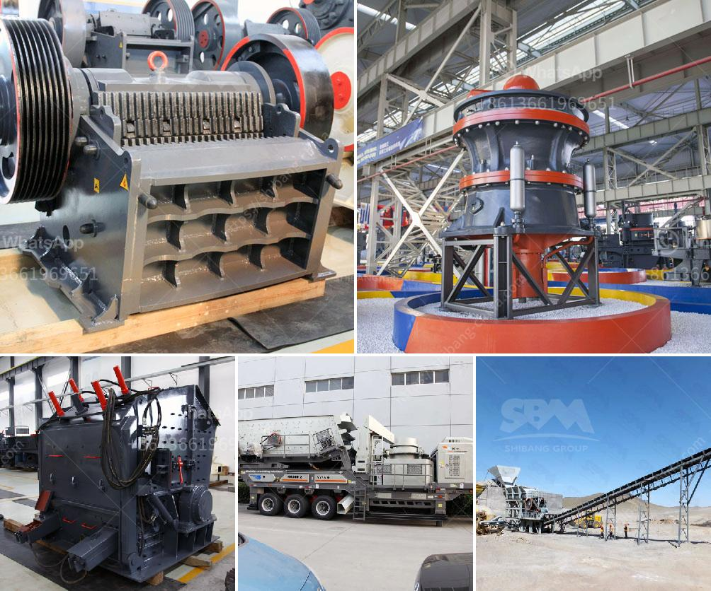

<h3>equipment for gold mining belgium</h3>
Belgium may not be the first country that comes to mind when thinking about gold mining. However, this small European nation indeed has a rich history in the gold mining industry. Dating back to the Roman era, Belgium was known to possess extensive gold deposits, leading to a flourishing gold mining sector.

In recent years, the demand for gold has surged worldwide, prompting Belgium to revive its gold mining operations. The success of any gold mining venture depends on the equipment used for extraction and processing. Here, we will delve into the crucial equipment required for gold mining in Belgium.

Excavators form the backbone of any mining operation. These heavy-duty machines are used to blast through layers of rock and soil to reach gold deposits. Equipped with hydraulic systems and large buckets, excavators work efficiently to extract the precious metal.

Bulldozers are essential for clearing the mining site, removing unwanted debris, and creating access roads. These powerful machines feature a large blade at the front that helps in pushing rocks, soil, and unwanted materials away from the mining area.

Trommels are specialized equipment designed for gold mining. These cylindrical drums have screens that allow smaller-sized gold particles to pass through while retaining larger rocks and debris. The rotating motion of the trommel helps separate the valuable gold particles from unwanted materials.

Dredges are vital for mining gold in riverbeds and underwater. These floating devices are equipped with suction pumps that allow miners to extract gold from river bottoms effectively. Dredges are particularly useful in areas where gold deposits have accumulated over centuries, such as in river bends or deep underwater.

Once the gold-bearing ores or rocks are excavated, they need to be processed into a finer form for gold extraction. Crushers and mills break down the larger rocks into smaller particles, making it easier to extract the gold content. This equipment plays a critical role in the gold mining process, ensuring the maximum recovery of the precious metal.

Gold concentrators are used to extract gold from crushed ore or sediment. These devices use gravity and centrifugal force to separate the gold from other minerals. As gold is a heavy metal, it tends to settle at the bottom, making it easier to collect and refine.

After the gold has been extracted, refining equipment is used to purify it further. This equipment includes smelters, furnaces, and chemical processes to remove impurities and create highly pure gold suitable for various industries, including jewelry making and investment purposes.

Gold mining in Belgium has experienced a resurgence in recent years, driven by increasing global demand for this precious metal. The success of these gold mining ventures greatly relies on the quality and efficiency of the equipment being used. From excavators and bulldozers to crushers and concentrators, each piece of equipment has a crucial role to play in the extraction and processing of gold. As Belgium continues to invest in its gold mining industry, the advances in mining equipment will undoubtedly contribute to the sector's growth and success.
<h3>Contact us</h3><ul><li><strong>Whatsapp:&nbsp;<a href="https://wa.me/8613661969651">+8613661969651</a></strong></li><li><a href="https://swt.shibang-china.com/?git&amp;zhl&amp;equipment for gold mining belgium"><strong>Online Service(chat now)</strong></a></li></ul><h3>Related</h3><ul><li><a href='chinese jaw crusher.md'>chinese jaw crusher</a></li><li><a href='south africa manufacturer of mobile gold processing plant.md'>south africa manufacturer of mobile gold processing plant</a></li><li><a href='bentonite crushing manufacturing process.md'>bentonite crushing manufacturing process</a></li><li><a href='cost of a stone crusher machine.md'>cost of a stone crusher machine</a></li><li><a href='cone crushers for sale in philippines.md'>cone crushers for sale in philippines</a></li></ul>