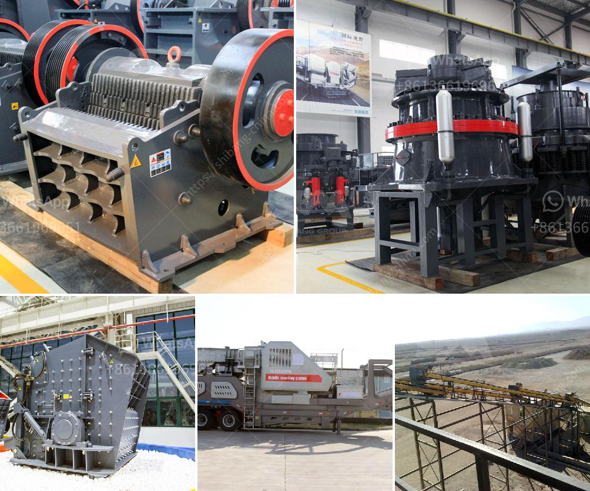

<h3>equipment jaw crusher for sale philippine</h3>
The jaw crusher is a versatile equipment that is widely used in many industries. It is commonly used in the mining, construction, recycling, and demolition industries. In the Philippines, jaw crushers are widely used in the mining and construction industry due to their ability to crush hard and abrasive materials. However, they are also used in other industries such as wastewater treatment, cement production, and chemical industries.

A jaw crusher has a deep crushing chamber, where the rocks are squeezed against a stationary plate. As the rocks pass through the crusher, they are crushed between the two plates. Jaw crushers have a simple design, and they are easy to use and maintain.

One of the most popular jaw crusher models in the Philippines is the PE series jaw crusher. This crusher is widely used in the industries such as mining, metallurgy, building materials, water conservation, chemical industry, and so on. This crusher has a deep crushing chamber, and the rocks can be crushed to a very fine gravel or powder.

When the jaw crusher is in operation, the movable jaw plate moves back and forth against the fixed jaw plate. Under the action of the eccentric shaft and the toggle plate, the material is crushed and discharged through the discharge opening at the bottom of the crusher.

When purchasing a jaw crusher in the Philippines, you need to consider many factors, including the material properties, production requirements, investment costs, and the actual needs of your project. It is important to choose the right equipment that can meet your specific requirements.

There are many different models and sizes of jaw crushers available for sale in the Philippines. The price range of these crushers varies greatly depending on the brand, capacity, and functionality. As a general rule, a jaw crusher with larger capacity and heavier flywheel is more expensive than a crusher with lower capacity and lighter flywheel.

In the Philippines, there are a wide variety of jaw crusher suppliers, offering different types of jaw crushers for sale. Some suppliers offer different types of crushers, such as fixed jaw crushers, mobile jaw crushers, and double toggle jaw crushers.

These crushers are used for crushing various materials ranging from hard rocks to soft ores. The crushers are designed with different jaw profiles and can be fitted with various jaw plates and side liners to suit different crushing applications.

If you are in the market for a jaw crusher in the Philippines, it is essential to find a reputable supplier that offers high-quality products and reliable after-sales services. Look for suppliers that have been in the industry for many years and have a good reputation.

To conclude, the jaw crusher is a versatile equipment that is widely used in many industries. It is commonly used in the mining, construction, recycling, and demolition industries in the Philippines. When purchasing a jaw crusher, it is important to consider various factors such as the material properties, production requirements, and investment costs. There are many different models and sizes of jaw crushers available for sale in the Philippines, so it is crucial to choose the right equipment that can meet your specific needs.
<h3>Contact us</h3><ul><li><strong>Whatsapp:&nbsp;<a href="https://wa.me/8613661969651">+8613661969651</a></strong></li><li><a href="https://swt.shibang-china.com/?git&amp;zhl&amp;equipment jaw crusher for sale philippine"><strong>Online Service(chat now)</strong></a></li></ul><h3>Related</h3><ul><li><a href='crusher manufacturer in pune ie.md'>crusher manufacturer in pune ie</a></li><li><a href='small rock crushers for recreation.md'>small rock crushers for recreation</a></li><li><a href='quartz crusher plant manufacturers in india.md'>quartz crusher plant manufacturers in india</a></li><li><a href='stone crusher pe price.md'>stone crusher pe price</a></li><li><a href='small cement grinding machine.md'>small cement grinding machine</a></li></ul>