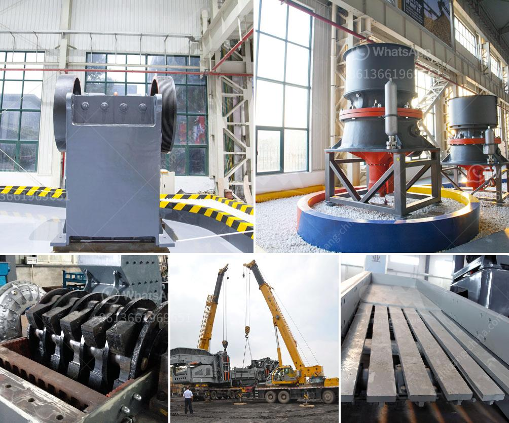

<h3>equipment required for producing lime for new plant</h3>
Lime is a versatile and widely used chemical compound that plays a crucial role in various industries, including construction, agriculture, and manufacturing. It is primarily used for soil stabilization, wastewater treatment, and as a key ingredient in steel production. If you are planning to set up a lime production plant, it is important to have the right equipment in order to ensure a smooth and efficient operation. In this article, we will explore the essential equipment required for producing lime.

A kiln is the heart of any lime production plant. It is a high-temperature furnace used to heat limestone (calcium carbonate) to drive off carbon dioxide and produce quicklime (calcium oxide). There are various types of kilns available, such as vertical shaft kilns and rotary kilns. The choice depends on factors like the scale of production, quality requirements, and cost considerations.

A preheater is an optional piece of equipment that can be used in conjunction with a kiln. It is designed to preheat the limestone feed material before it enters the kiln, thus reducing the energy consumption required to reach the desired temperature. Preheaters can significantly improve the efficiency of the lime production process.

Limestone, the main raw material for producing lime, needs to be crushed and ground into a fine powder before entering the kiln. Various equipment, such as jaw crushers, impact crushers, and ball mills, can be used for this purpose. Crushing and grinding equipment should be chosen based on factors like the size and hardness of the limestone, desired particle size, and production capacity.

Lime production can generate a significant amount of dust and other airborne particles, which can be detrimental to the health of the workers and the surrounding environment. A properly designed dust collection system is essential to capture and remove these particles from the air. It typically includes equipment like cyclone separators, bag filters, and scrubbers.

A lime production plant requires robust material handling equipment to transport limestone, quicklime, and other materials throughout the production process. This may include conveyors, bucket elevators, and storage silos. The equipment must be reliable, efficient, and capable of handling the bulk quantities of materials involved.

To ensure the production of high-quality lime, it is important to have proper quality control equipment in place. This may include instruments for monitoring and analyzing the chemical composition of lime, testing equipment for assessing its physical properties, and online sensors to measure parameters like temperature and gas composition.

In addition to the core equipment, a lime production plant requires various utilities for its operation. This may include power supply systems, water treatment facilities, and fuel storage and handling equipment. The availability and reliability of these utilities are crucial for the uninterrupted operation of the plant.

In conclusion, setting up a lime production plant requires careful planning and selection of the right equipment. The kiln, preheater, crushing and grinding equipment, dust collection system, material handling equipment, quality control equipment, and utilities are some of the key components needed for producing lime. The selection of equipment should be based on factors like production capacity, quality requirements, cost considerations, and environmental compliance. Investing in high-quality and efficient equipment is essential to ensure a successful and sustainable lime production plant.
<h3>Contact us</h3><ul><li><strong>Whatsapp:&nbsp;<a href="https://wa.me/8613661969651">+8613661969651</a></strong></li><li><a href="https://swt.shibang-china.com/?git&amp;zhl&amp;equipment required for producing lime for new plant"><strong>Online Service(chat now)</strong></a></li></ul><h3>Related</h3><ul><li><a href='sand sieve machine.md'>sand sieve machine</a></li><li><a href='looking for kaolin processing price.md'>looking for kaolin processing price</a></li><li><a href='quartz crusher plant manufacturers in india.md'>quartz crusher plant manufacturers in india</a></li><li><a href='discharge chute for ball mill.md'>discharge chute for ball mill</a></li><li><a href='gold stone crusher machine south africa.md'>gold stone crusher machine south africa</a></li></ul>