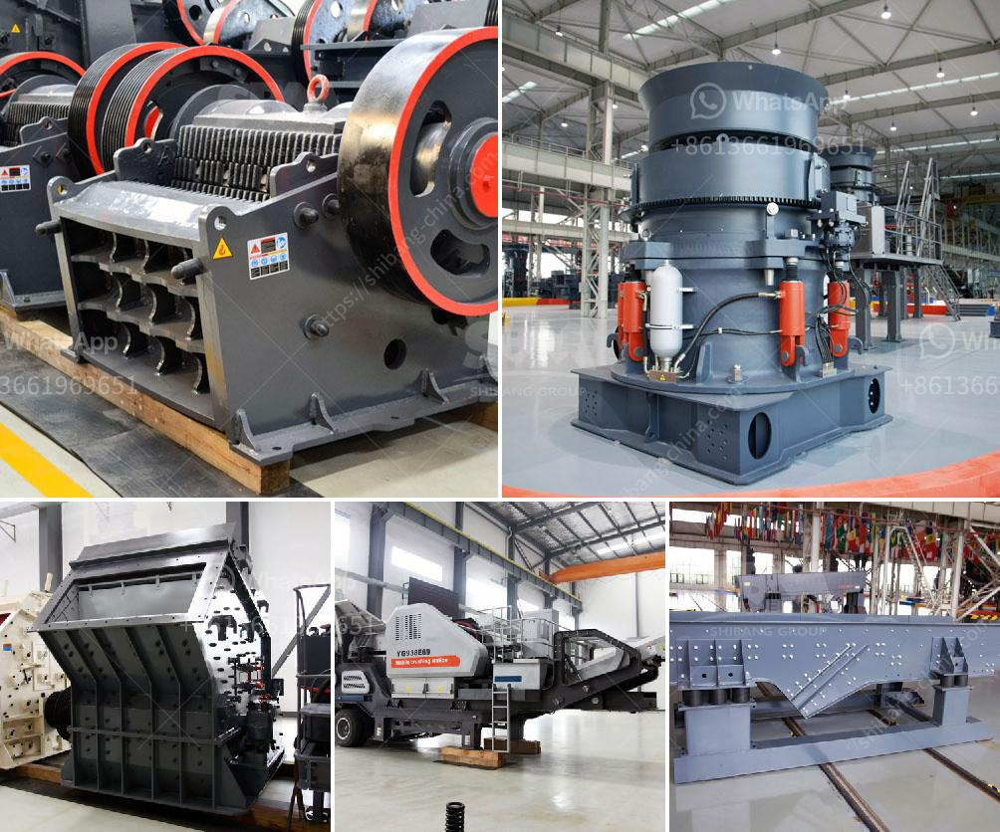

<h3>equipment roller mill</h3>
In the field of grain processing, the equipment roller mill plays a crucial role. With its innovative design and remarkable efficiency, it has become one of the most sought-after tools for crushing and grinding operations. This article will delve into the essential aspects of the equipment roller mill, outlining its features, applications, and advantages.

The equipment roller mill consists of two or more heavy-duty rollers that revolve around parallel axes. These rollers are typically made of durable materials such as steel or cast iron and are mounted on strong frames. The grain, or any other material to be processed, is fed between the rollers, which crush and grind it into the desired consistency.

One of the primary advantages of the equipment roller mill is its versatility. It can handle a wide range of materials, including grains, oilseeds, legumes, and even fibrous materials like wood chips. This flexibility makes it an indispensable tool in various industries, such as agriculture, food processing, and mining.

In the agricultural sector, the equipment roller mill is commonly used for processing grains like wheat, barley, corn, and oats. It efficiently crushes them into fine particles, enabling better digestion for livestock or providing a key ingredient for food production. Moreover, it removes impurities such as husks and stalks, ensuring a higher quality end product.

The food processing industry also benefits from the equipment roller mill. It enables the production of various flours and meals used in baking, pasta making, and other culinary applications. By controlling the gap between the rollers, the mill can effectively grind the grains to the desired size and consistency, ensuring uniformity and quality in the final product.

In mining and mineral processing, the equipment roller mill is employed for crushing and grinding ores. This process is crucial for liberating valuable minerals from their ores, allowing for easier extraction. The mill's robust construction and ability to handle high-pressure grinding make it ideal for challenging tasks in this industry.

Apart from its diverse range of applications, the equipment roller mill boasts several advantages over other crushing and grinding methods. Firstly, its simple yet effective design minimizes maintenance requirements, reducing downtime and maximizing productivity. Additionally, the mill's adjustable gap allows for precise control over the final product's particle size and texture, ensuring consistency and meeting specific requirements.

Moreover, the equipment roller mill offers energy efficiency, reducing energy consumption compared to other grinding methods. This makes it an environmentally friendly choice, contributing to sustainable practices in various industries. Furthermore, its compact size and ease of installation make it suitable for both large-scale operations and smaller facilities with limited space.

In conclusion, the equipment roller mill is a versatile tool that revolutionizes the crushing and grinding processes across various industries. Its ability to handle a wide range of materials, coupled with its numerous advantages, makes it an essential piece of equipment for any processing facility. Whether in the agriculture, food processing, or mining sector, the roller mill provides efficiency, precision, and versatility that cannot be matched by alternative methods.
<h3>Contact us</h3><ul><li><strong>Whatsapp:&nbsp;<a href="https://wa.me/8613661969651">+8613661969651</a></strong></li><li><a href="https://swt.shibang-china.com/?git&amp;zhl&amp;equipment roller mill"><strong>Online Service(chat now)</strong></a></li></ul><h3>Related</h3><ul><li><a href='buyers ball mill process.md'>buyers ball mill process</a></li><li><a href='mobile screen and crushing.md'>mobile screen and crushing</a></li><li><a href='kenya roller mill.md'>kenya roller mill</a></li><li><a href='aggregate washing machine.md'>aggregate washing machine</a></li><li><a href='coal crusher types.md'>coal crusher types</a></li></ul>