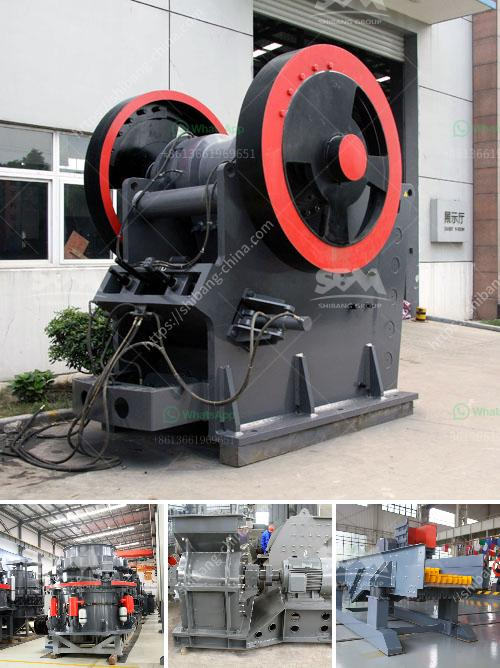

<h3>europe conveyor belts manufacturer</h3>
Europe has always been at the forefront of industrial innovation, and when it comes to conveyor belts, it is no different. With a long history of manufacturing excellence and a commitment to quality, Europe has become a global leader in conveyor belt production.

One of the key factors that sets European conveyor belt manufacturers apart is their dedication to producing high-quality products. These manufacturers adhere to strict safety and environmental standards, ensuring that their belts are not only reliable but also sustainable. This commitment is particularly important in today's world, where sustainability and eco-friendliness are increasingly valued.

In addition to their focus on quality, European conveyor belt manufacturers are also known for their innovative designs. They continuously invest in research and development, driving the industry forward with new materials, technologies, and improved performance. Whether it's reducing energy consumption, increasing durability, or enhancing product flow, these manufacturers are always pushing the boundaries of what is possible.

Furthermore, European conveyor belt manufacturers offer a wide range of options to meet the diverse needs of various industries. From food processing and pharmaceuticals to automotive and logistics, their belts are designed to withstand the unique challenges of each sector. This flexibility has made European conveyor belts highly sought after by companies around the world, solidifying their reputation as a reliable choice no matter the application.

Moreover, Europe's strong network of manufacturers and suppliers ensures that customers have access to prompt and efficient product delivery and after-sales services. This, combined with their comprehensive product warranties, allows businesses to operate with peace of mind, knowing that their conveyor belts are supported by a reliable and responsive support team.

In conclusion, Europe is home to some of the world's leading conveyor belt manufacturers. Their commitment to quality, innovation, and sustainability have positioned them as a go-to choice for industries worldwide. With a wide range of options, excellent customer service, and a drive for continuous improvement, European conveyor belts continue to set the standard for the industry.
<h3>Contact us</h3><ul><li><strong>Whatsapp:&nbsp;<a href="https://wa.me/8613661969651">+8613661969651</a></strong></li><li><a href="https://swt.shibang-china.com/?git&amp;zhl&amp;europe conveyor belts manufacturer"><strong>Online Service(chat now)</strong></a></li></ul><h3>Related</h3><ul><li><a href='cone crusher manufacturers in usa.md'>cone crusher manufacturers in usa</a></li><li><a href='mobile jaw crushers.md'>mobile jaw crushers</a></li><li><a href='small superfine grinder price malaysia.md'>small superfine grinder price malaysia</a></li><li><a href='used crusher plants canada.md'>used crusher plants canada</a></li><li><a href='rock crusher plants in germany.md'>rock crusher plants in germany</a></li></ul>