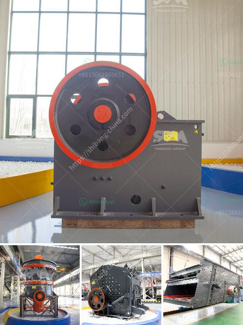

<h3>european manufacturer mining equipment crusher screens</h3>
European Manufacturer Mining Equipment Crusher Screens: Leading the Industry with Quality and Innovation

Mining plays a crucial role in the global economy, providing essential raw materials for various industries such as construction, manufacturing, and energy. In order to extract minerals from the earth efficiently, mining equipment must be reliable, durable, and efficient. European manufacturers have long been at the forefront of producing high-quality and innovative mining equipment, including crusher screens.

Crusher screens are vital components of the crushing process in mines and quarries. They separate the final product into different sizes for further processing or sale. European manufacturers are renowned for their expertise in designing and manufacturing robust, reliable, and efficient screens that can withstand the demanding conditions of mining operations.

One of the key advantages of European manufacturer mining equipment crusher screens is their commitment to quality. European manufacturers adhere to strict quality control measures throughout the manufacturing process, ensuring that each screen meets the highest industry standards. This commitment to quality translates into screens that are built to last, minimizing downtime and maximizing productivity for mining operations.

In addition to their focus on quality, European manufacturers are also leading the industry in terms of innovation. They invest heavily in research and development to continuously improve their products and stay ahead of the competition. This dedication to innovation has led to the development of advanced features and technologies in crusher screens, such as improved screening efficiency, self-cleaning mechanisms, and remote monitoring capabilities.

Moreover, European manufacturers prioritize environmental sustainability in their design and manufacturing processes. They strive to minimize the environmental impact of their equipment by utilizing energy-efficient technologies, reducing emissions, and implementing recycling programs.

European manufacturer mining equipment crusher screens are trusted by mining companies around the world for their performance, reliability, and durability. Their screens are designed to handle heavy loads, resist abrasion, and withstand harsh operating conditions. With a keen focus on quality, innovation, and environmental sustainability, European manufacturers are driving the industry forward and setting new standards for mining equipment.

In conclusion, European manufacturers are leading the way in producing high-quality and innovative mining equipment crusher screens. Their commitment to quality, focus on innovation, and dedication to environmental sustainability set them apart from the competition. Mining companies can rely on European manufacturers to provide screens that are built to last, improve productivity, and minimize environmental impact. As the mining industry continues to evolve, European manufacturers will undoubtedly continue to shape its future through their expertise and technological advancements.
<h3>Contact us</h3><ul><li><strong>Whatsapp:&nbsp;<a href="https://wa.me/8613661969651">+8613661969651</a></strong></li><li><a href="https://swt.shibang-china.com/?git&amp;zhl&amp;european manufacturer mining equipment crusher screens"><strong>Online Service(chat now)</strong></a></li></ul><h3>Related</h3><ul><li><a href='hammer crusher parts.md'>hammer crusher parts</a></li><li><a href='ball and pebble mills.md'>ball and pebble mills</a></li><li><a href='stone crusher usa.md'>stone crusher usa</a></li><li><a href='fly ash grinding mill.md'>fly ash grinding mill</a></li><li><a href='mobile jaw crusher for sale in pakistan.md'>mobile jaw crusher for sale in pakistan</a></li></ul>