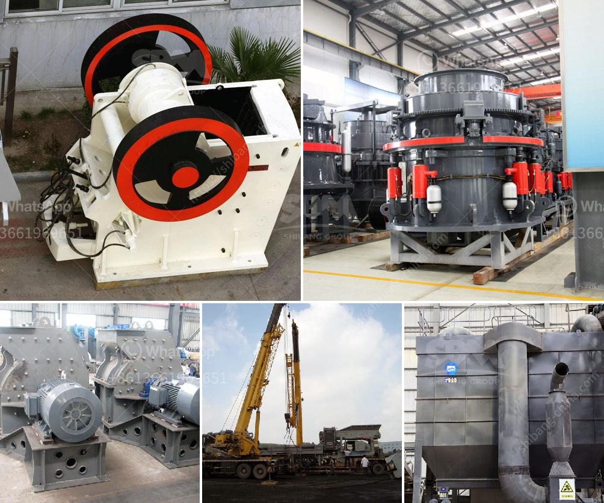

<h3>feasibility study of cement plant</h3>
A feasibility study is conducted to determine the viability of a project or business venture. In the case of establishing a cement plant, it involves assessing various factors such as the availability of raw materials, market demand, economic conditions, and other technical and financial aspects. This article aims to explore the key considerations involved in conducting a feasibility study for a cement plant project.

One critical aspect of a cement plant's feasibility study is the availability of raw materials such as limestone, clay, and gypsum. The proximity and quantity of these materials directly impact the feasibility and economics of cement production. The study aims to assess the quality, quantity, and logistics associated with procuring these materials, considering both conventional and alternative sources.

Understanding the market demand for cement is crucial in determining the feasibility of a cement plant. A comprehensive market analysis is conducted to identify the current and projected demand, competition, and consumer preferences. Factors such as population growth, infrastructure development, construction activities, and urbanization play a significant role in determining market potential.

The feasibility study also evaluates the economic aspects of establishing a cement plant. This includes assessing the capital investment required, operational costs, revenue projections, and the overall financial viability of the project. Economic factors such as labor costs, energy prices, taxes, and government incentives are analyzed to determine the project's profitability.

The technical feasibility study involves evaluating the technology, equipment, and processes required for cement production. Factors such as the type of cement to be produced, production capacity, environmental impact, and adherence to regulatory requirements are considered during this phase. Additionally, an analysis of the plant layout, machinery, and resource allocation is conducted to ensure technical feasibility.

A feasibility study also involves identifying and assessing potential risks associated with establishing a cement plant. This may include factors such as political instability, regulatory changes, commodity price fluctuations, environmental challenges, and economic uncertainties. Risk mitigation measures and contingency plans are developed to minimize the impact of these risks.

A thorough and well-executed feasibility study plays a crucial role in determining the viability of a cement plant project. It provides critical insights into the availability of raw materials, market demand, economic considerations, technical feasibility, and risk assessment. By conducting a comprehensive study, stakeholders can make informed decisions and ensure the successful implementation of a cement plant project.
<h3>Contact us</h3><ul><li><strong>Whatsapp:&nbsp;<a href="https://wa.me/8613661969651">+8613661969651</a></strong></li><li><a href="https://swt.shibang-china.com/?git&amp;zhl&amp;feasibility study of cement plant"><strong>Online Service(chat now)</strong></a></li></ul><h3>Related</h3><ul><li><a href='crusher manufacturers in south africa.md'>crusher manufacturers in south africa</a></li><li><a href='iron ore processing equipment cost.md'>iron ore processing equipment cost</a></li><li><a href='rock crusher plants in germany.md'>rock crusher plants in germany</a></li><li><a href='gypsum powder equipment in turkey.md'>gypsum powder equipment in turkey</a></li><li><a href='puzzolana jaw crusher price in india.md'>puzzolana jaw crusher price in india</a></li></ul>