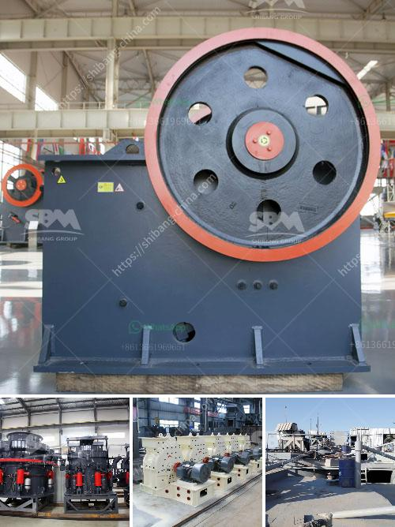

<h3>feasiblity study of a fero chrome crushing plant</h3>
In the ever-evolving world of industrial development, the demand for ferrochrome is witnessing exponential growth. With the increasing need for stainless steel and chromium alloys across various sectors, a feasibility study is essential to evaluate the viability of establishing a ferrochrome crushing plant. This article will delve into the key factors to consider, including market analysis, technical advancements, and the economic outlook.

To assess the sustainability of a ferrochrome crushing plant, it is crucial to analyze the current and projected market demand. The stainless steel industry predominantly drives the demand for ferrochrome, with applications ranging from construction to automotive parts. Analyzing market trends, such as the growth of upcoming infrastructure projects, expanding transportation networks, and rising consumer preferences for stainless steel products, will provide valuable insights into the plant's viability.

Advancements in technology play a vital role in ensuring the feasibility of a ferrochrome crushing plant. Implementing cutting-edge crushing machinery and equipment can enhance operational efficiency, reduce downtime, and support higher production capacities. It is imperative to evaluate the availability of advanced crushers, screening systems, and automated material handling solutions that can optimize the entire production process, from mining to final product distribution.

Furthermore, conducting a thorough review of environmental regulations and their impact on the plant's operations is crucial. Employing environmentally sustainable technologies and adhering to strict emission standards will not only ensure compliance but also enhance the credibility and reputation of the plant.

Assessing the economic viability of a ferrochrome crushing plant requires a comprehensive financial analysis. Factors such as initial investment, operational costs, revenue estimation, and potential profitability need to be carefully evaluated. The availability of necessary resources, including raw materials, skilled labor, and energy sources, must also be considered.

In addition to financial considerations, evaluating the impacts of political stability, government policies, and taxation regimes is essential. Local regulations and incentives for industrial development, as well as potential risks associated with market fluctuations, currency exchange rates, and global competition, must all be factored into the feasibility study.

Conducting a thorough feasibility study is crucial when considering the establishment of a ferrochrome crushing plant. By analyzing the market demand, technological advancements, and economic outlook of the industry, stakeholders can make informed decisions. This analysis should include a comprehensive evaluation of the market potential, availability of advanced technology, and the economic viability of the project. Considering these factors will help determine whether a ferrochrome crushing plant is feasible and sustainable in the long term, ensuring its success in the dynamic industrial landscape.
<h3>Contact us</h3><ul><li><strong>Whatsapp:&nbsp;<a href="https://wa.me/8613661969651">+8613661969651</a></strong></li><li><a href="https://swt.shibang-china.com/?git&amp;zhl&amp;feasiblity study of a fero chrome crushing plant"><strong>Online Service(chat now)</strong></a></li></ul><h3>Related</h3><ul><li><a href='argentine hammer mill.md'>argentine hammer mill</a></li><li><a href='conveyor belt design manual pdf.md'>conveyor belt design manual pdf</a></li><li><a href='mobile crusher sales in nairobi.md'>mobile crusher sales in nairobi</a></li><li><a href='3 roller raymond mill.md'>3 roller raymond mill</a></li><li><a href='large scale mining vs small scale mining.md'>large scale mining vs small scale mining</a></li></ul>