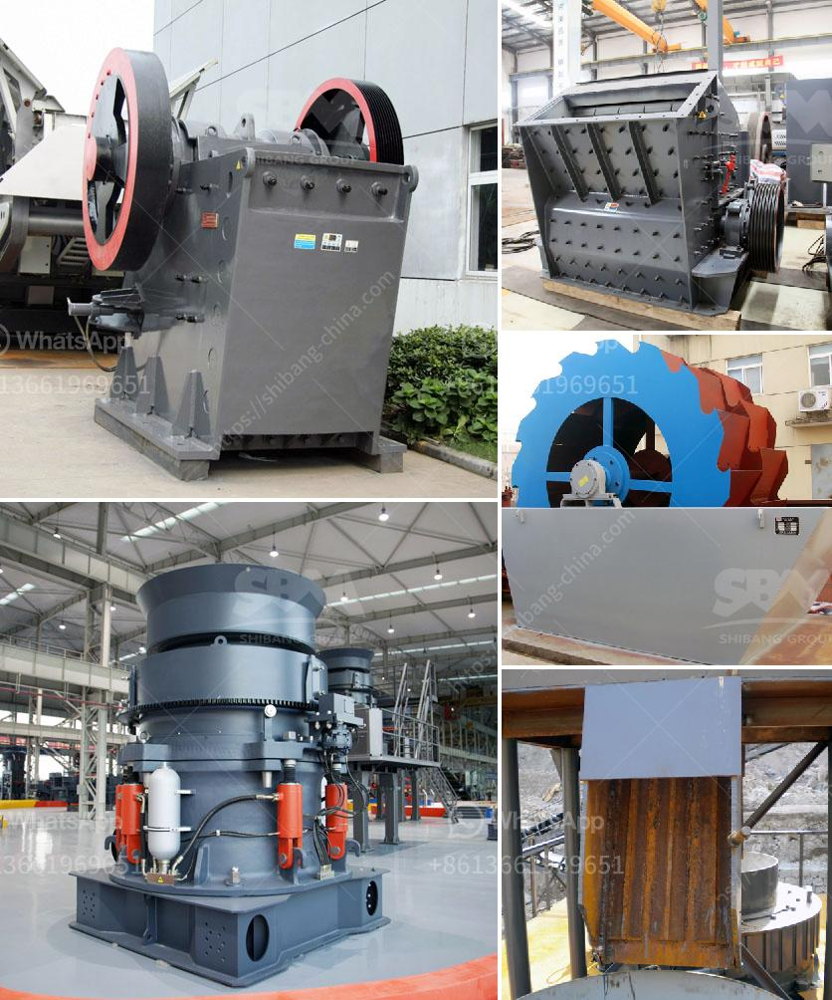

<h3>feed product size of cone crushers</h3>
When it comes to cone crushers, many people tend to overlook the importance of the feed product size. However, this is a critical factor that significantly impacts the performance and efficiency of the crusher. In this article, we will delve into why the feed product size matters and how it can affect the overall operation of cone crushers.

Firstly, it is essential to understand what feed product size refers to in the context of cone crushers. Simply put, it is the size of the material that is being fed into the crusher. The feed product size plays a crucial role in determining the crushing capacity, power consumption, and product quality of the cone crusher.

The crushing capacity of a cone crusher is directly influenced by the feed product size. A larger feed size allows for more material to be crushed at once, boosting the overall productivity of the crusher. On the other hand, if the feed size is too small, the cone crusher may not be able to handle the material efficiently, resulting in a lower capacity and decreased production. Therefore, it is important to ensure that the feed product size is optimized for maximum productivity.

Additionally, the power consumption of a cone crusher is also affected by the feed product size. A larger feed size requires more energy to crush the material, resulting in higher power consumption. Conversely, a smaller feed size requires less energy, leading to reduced power consumption. By optimizing the feed product size, operators can minimize energy consumption and achieve more efficient operation of the cone crusher.

Moreover, the feed product size has a significant impact on the product quality of the cone crusher. Different applications require different product sizes, and the cone crusher plays a crucial role in achieving the desired end product. If the feed size is too large, the final product may contain an excessive amount of oversized material, leading to a lower-quality product. Conversely, if the feed size is too small, the cone crusher may not be able to produce the desired product size, resulting in a compromised end product quality. Maintaining an optimal feed product size is therefore vital to ensuring a high-quality final product.

In conclusion, the feed product size of cone crushers is an important factor that directly affects their performance and efficiency. Optimizing the feed size allows for increased crushing capacity, reduced power consumption, and improved product quality. Therefore, operators should carefully consider the feed product size and ensure that it aligns with the desired objectives of their specific applications. By doing so, they can maximize the operational effectiveness of cone crushers and achieve optimal results.
<h3>Contact us</h3><ul><li><strong>Whatsapp:&nbsp;<a href="https://wa.me/8613661969651">+8613661969651</a></strong></li><li><a href="https://swt.shibang-china.com/?git&amp;zhl&amp;feed product size of cone crushers"><strong>Online Service(chat now)</strong></a></li></ul><h3>Related</h3><ul><li><a href='mobile screen and crushing.md'>mobile screen and crushing</a></li><li><a href='mobile coal crusher for sale in south africa.md'>mobile coal crusher for sale in south africa</a></li><li><a href='small crusher machine.md'>small crusher machine</a></li><li><a href='marbel grinding machine.md'>marbel grinding machine</a></li><li><a href='high pressure roller mill.md'>high pressure roller mill</a></li></ul>