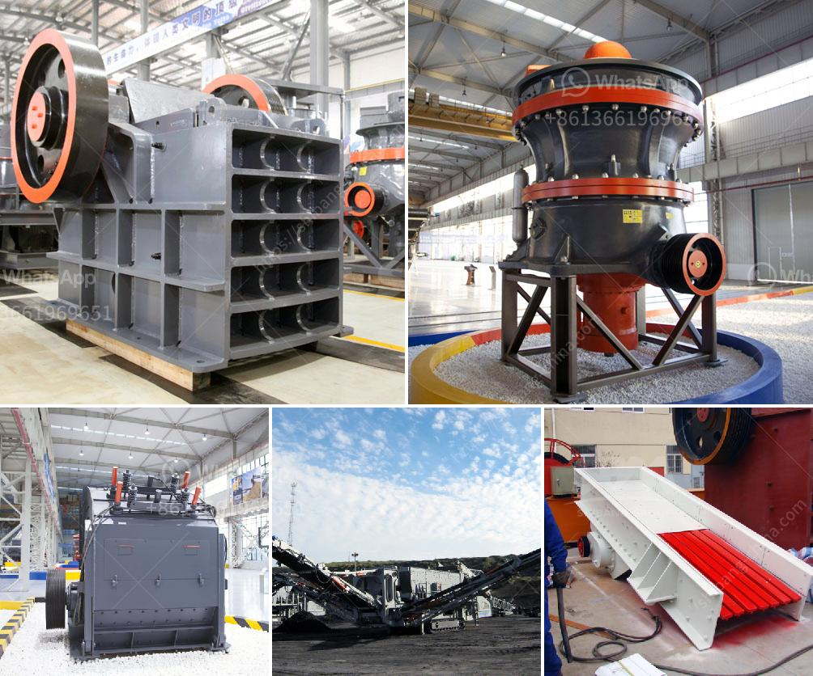

<h3>feldspar crusher arabia</h3>
The mining industry plays a vital role in the economic development of any nation. It provides essential raw materials for various industries, including construction, manufacturing, and agriculture. One of the most critical minerals in the mining industry is feldspar. Feldspar is a group of rock-forming minerals that make up about 41% of the Earth's crust. It is a versatile mineral used in a wide range of applications, making it an indispensable resource.

Saudi Arabia, known for its abundant oil reserves, is now making immense strides in the mining sector. The Kingdom has recognized the potential of its mineral resources and is actively promoting investment opportunities. In this context, the introduction of the feldspar crusher in Saudi Arabia is revolutionizing the mining industry.

Feldspar exists naturally in the earth's crust and is a crystalline mineral. It is generally extracted through open-pit mining, which involves removing the layers of earth, rock, and vegetation overlying the mineral deposit. Depending on the geological and topographic conditions, the mining activity may vary.

Once the feldspar ore is extracted from the earth, it is transported to the primary crusher for crushing. The feldspar crusher breaks large pieces of raw material into smaller particle sizes. Thus, it plays a crucial role in the size reduction process. Feldspar crushing can be processed in three stages: primary crushing, secondary crushing, and tertiary crushing.

The material is crushed into smaller pieces at each stage until reaching the desired size. Afterward, the crushed feldspar material is fed into the vibrating screen for separation. Eventually, the end product is obtained, and the feldspar crusher in Saudi Arabia is identified as a key process in the mining and mineral industry.

The feldspar crusher market report provides a detailed analysis of the emerging trends, opportunities, and challenges in the market. It also covers recent developments, key players, and strategies adopted by prominent players to strengthen their presence in the market. Moreover, the report presents a comprehensive overview of the various factors influencing the growth of the global feldspar crusher market.

The feldspar crusher market is segmented into jaw crusher, impact crusher, cone crusher, and others based on the product type. The key players operating in this market include Sandvik, Metso, Terex, Astec Industries, Weir, WIRTGEN GROUP, ThyssenKrupp, and FL Smidth. These players are focusing on strategic collaborations and mergers and acquisitions to expand their product offerings and strengthen their position in the market.

With the increasing demand for feldspar in various industries, the feldspar crusher market is expected to witness significant growth in the coming years. The rise in infrastructure development, construction activities, and urbanization will drive the demand for feldspar crushers in Saudi Arabia. Additionally, the government's initiatives and support to the mining industry will contribute to the growth of the market.

In conclusion, the feldspar crusher in Saudi Arabia has shown immense potential in the mining industry and is expected to flourish in the coming years. It plays a crucial role in the side reduction process in mining operations, contributing to the market growth. With the increasing demand for feldspar, the market is witnessing significant growth, further complemented by government support. The key players in the market are adopting various strategies to capitalize on the emerging opportunities and enhance their market presence.
<h3>Contact us</h3><ul><li><strong>Whatsapp:&nbsp;<a href="https://wa.me/8613661969651">+8613661969651</a></strong></li><li><a href="https://swt.shibang-china.com/?git&amp;zhl&amp;feldspar crusher arabia"><strong>Online Service(chat now)</strong></a></li></ul><h3>Related</h3><ul><li><a href='stone crusher manufacturers.md'>stone crusher manufacturers</a></li><li><a href='cost of granite crusher.md'>cost of granite crusher</a></li><li><a href='conical ball mill manufacturers in india.md'>conical ball mill manufacturers in india</a></li><li><a href='stone crusher machine price for plant.md'>stone crusher machine price for plant</a></li><li><a href='american stone crusher price.md'>american stone crusher price</a></li></ul>