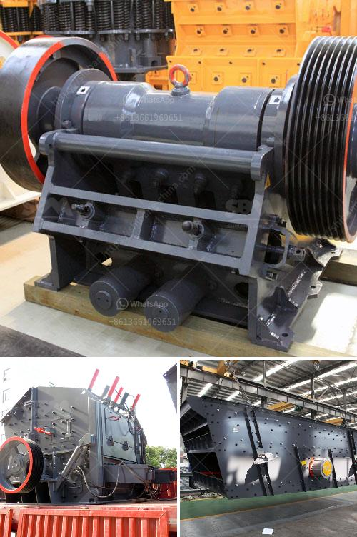

<h3>feldspar milling market</h3>
Feldspar is a widely used industrial mineral and is one of the most abundant minerals found on Earth. It is a group of aluminum silicate minerals that are commonly found in igneous, metamorphic, and sedimentary rocks. Feldspar is primarily used in the production of ceramics, glass, and as a filler in various products. The global feldspar milling market is expected to witness significant growth in the coming years due to the increasing demand for these applications.

One of the major factors driving the growth of the feldspar milling market is the growing construction industry. Feldspar is an essential component in the production of ceramics and glass, which are widely used in the construction sector. Ceramics and glass are used for various applications such as tiles, sanitaryware, kitchenware, and glass windows. With the increasing population and urbanization, the demand for construction materials is also rising, thereby fueling the growth of the feldspar milling market.

Moreover, the growing automotive industry is also contributing to the growth of the feldspar milling market. Feldspar is used in the production of automotive glass and ceramics, which are essential for the manufacturing of automobiles. With the increasing demand for automobiles across the globe, the demand for feldspar is also expected to rise significantly in the coming years.

In addition, the increasing use of feldspar as a filler in various products is also driving the market growth. Feldspar is widely used as a filler in polymers, paints, and coatings, as it provides improved strength and durability to these materials. Feldspar also helps in reducing the production costs of these products, making them more economical. With the rising demand for these products in various industries, the demand for feldspar as a filler is also expected to grow, thereby boosting the feldspar milling market.

However, there are certain challenges that may hinder the growth of the feldspar milling market. One of the major challenges is the environmental concerns associated with feldspar mining and milling. The extraction and processing of feldspar can have adverse effects on the environment, including air and water pollution. Therefore, stringent regulations and guidelines are being implemented by various governments to minimize the environmental impact of feldspar mining and milling operations.

Furthermore, the availability of substitutes for feldspar in some applications can also hamper the market growth. For instance, in the ceramics industry, there are alternative materials available that can replace feldspar, such as zirconium silicate and alumina. These substitutes offer similar properties and are often preferred due to their lower cost. Therefore, the availability of substitutes can pose a challenge for the feldspar milling market.

To conclude, the feldspar milling market is expected to witness significant growth in the coming years due to the increasing demand from the construction and automotive industries. However, environmental concerns and the availability of substitutes can pose challenges for the market. It is crucial for the industry players to adopt sustainable mining and milling practices and focus on product innovation to stay competitive in the market.
<h3>Contact us</h3><ul><li><strong>Whatsapp:&nbsp;<a href="https://wa.me/8613661969651">+8613661969651</a></strong></li><li><a href="https://swt.shibang-china.com/?git&amp;zhl&amp;feldspar milling market"><strong>Online Service(chat now)</strong></a></li></ul><h3>Related</h3><ul><li><a href='coal screening equipment price.md'>coal screening equipment price</a></li><li><a href='quarry machine and crusher plant sale in australia.md'>quarry machine and crusher plant sale in australia</a></li><li><a href='turkey cone crusher.md'>turkey cone crusher</a></li><li><a href='vertical cement mill.md'>vertical cement mill</a></li><li><a href='aggregate crusher plant.md'>aggregate crusher plant</a></li></ul>