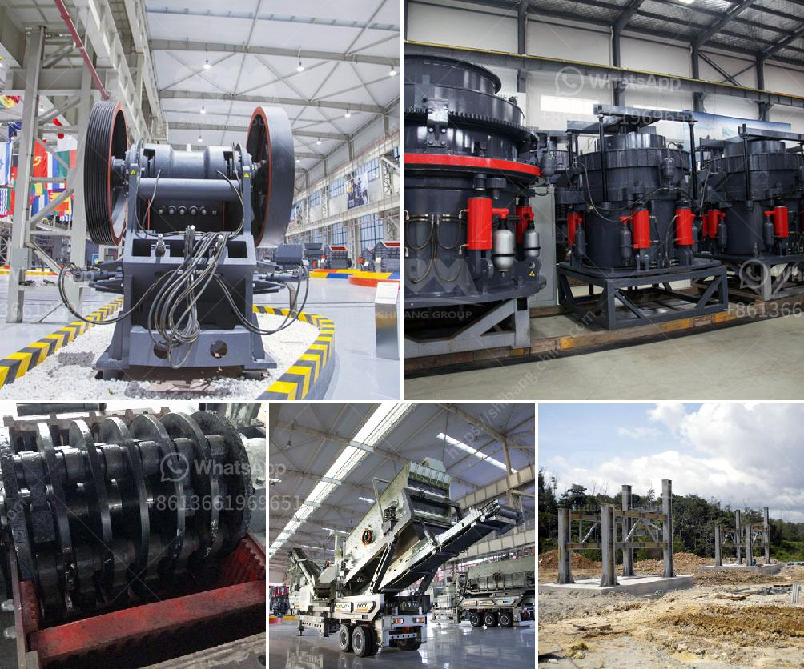

<h3>feldspar powder ball mill</h3>
Feldspar is a mineral commonly found in nature, and it is one of the most abundant minerals on earth. Feldspar is classified as a group of minerals, comprising aluminum silicates mixed with varying percentages of potassium, sodium, and calcium. Feldspar powder is widely used in various industries, especially in ceramic and glassmaking.

To produce high-quality feldspar powder, the mills are essential pieces of equipment. A feldspar ball mill is used for grinding materials such as feldspar, porcelain clay, and glass. The ball mill rotates around a horizontal axis, and the materials grind by impact and friction. The feldspar powder ball mill generates a particle size range of coarse powder to fine powder.

Feldspar powder ball mill mainly consists of feeding part, discharging part, rotary part, transmission part (reducer, small transmission gear, motor, electric control), etc. The hollow shaft is made of cast steel, and the inner lining is detachable. The rotary gear is processed by casting hobbing, and it has wear-resistance lining plate. This machine is a grid type and runs along the outside of the gear. Materials spirally go into the first cabin of the grinding mill through feeding equipment, and there are step liners or corrugated liners inside of them, which have steel balls of different specifications. When the cylinder rotates, centrifugal force produces brings steel balls to a certain height, and impact and grind the materials. After grinding, coarsely in the first chamber, the materials enter into the second chamber through a single-layer compartment board. The chamber is lined with flat lining plate and steel balls tumble and crush the materials again. After the second grinding, the final materials are discharged through the discharge grate plate, and the milling process is over.

The feldspar powder ball mill is easy to operate and can produce high-quality feldspar powder. The fine powder size can be 40-325 mesh, passing rate 98%. The energy-saving ball mill adopts self-aligning rolling bearings and reduces friction losses, making it easy to start and saves 20-30% energy compared with traditional ball mills. Additionally, the machine adopts the oil mist lubrication system, ensuring reliable operation.

The feldspar powder ball mill is a necessary device for the grinding process of feldspar material. It produces high-quality feldspar powder and provides an efficient solution for the grinding of feldspar. The feldspar powder ball mill consists of several main parts, such as feeding part, discharging part, turning part, and driving part (reducer, small gear, electric motor, and electric control). The hollow shaft is made of cast steel, and the lining can be replaced. The big gear is machined by rolling casting, and the wear-resistant lining plate is equipped in the cylinder body.

In conclusion, the feldspar powder ball mill is a high-efficiency fine grinding equipment capable of grinding feldspar into fine powder. The machine has the advantages of high grinding efficiency, large capacity, low energy consumption, easy operation, and stable performance. It is an ideal grinding equipment for grinding feldspar.
<h3>Contact us</h3><ul><li><strong>Whatsapp:&nbsp;<a href="https://wa.me/8613661969651">+8613661969651</a></strong></li><li><a href="https://swt.shibang-china.com/?git&amp;zhl&amp;feldspar powder ball mill"><strong>Online Service(chat now)</strong></a></li></ul><h3>Related</h3><ul><li><a href='quarry crusher machine price.md'>quarry crusher machine price</a></li><li><a href='mobile stone crusher price in zimbabwe.md'>mobile stone crusher price in zimbabwe</a></li><li><a href='feasibility study of cement plant.md'>feasibility study of cement plant</a></li><li><a href='screw conveyor blade calculation.md'>screw conveyor blade calculation</a></li><li><a href='mobile crushing and screening.md'>mobile crushing and screening</a></li></ul>