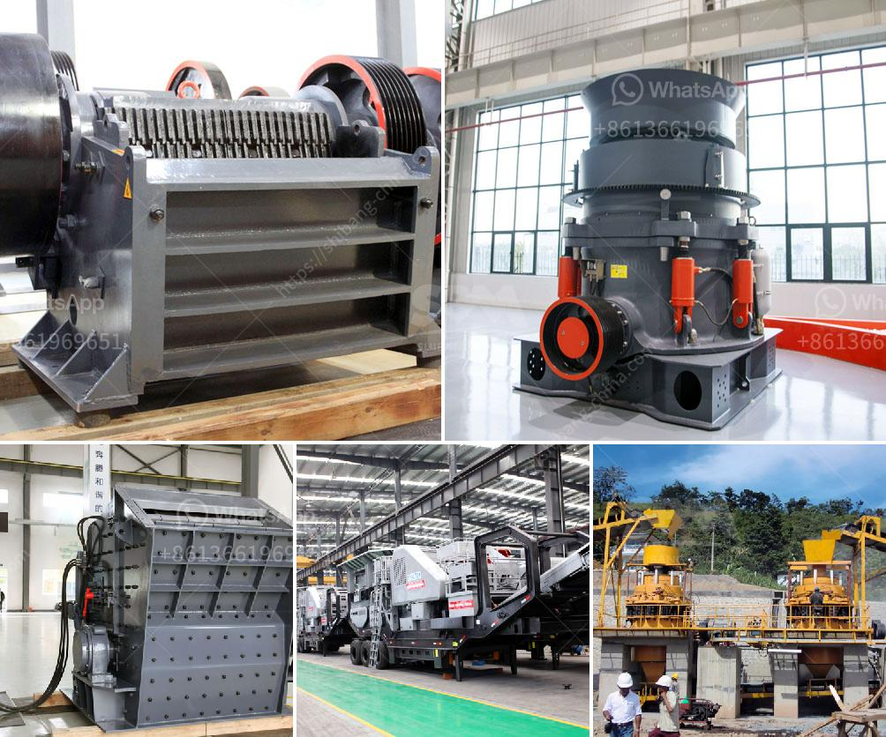

<h3>feldspar powder plants in andhra pradesh</h3>
Feldspar is a widely used mineral in various industries due to its versatility and abundance. It is a group of rock-forming minerals that contain aluminum and silica, making it an essential component for the production of ceramics, glass, and other industrial products. Andhra Pradesh, a state located in the southeastern part of India, is known for its rich reserves of feldspar, making it an ideal location for feldspar powder plants.

Andhra Pradesh is home to numerous feldspar deposits, particularly in the districts of Prakasam, Nellore, and Kurnool. These deposits are known for their high-quality feldspar and are widely used in the production of ceramics and glass. The feldspar powder plants in Andhra Pradesh play a crucial role in meeting the demand for feldspar in various industries.

These plants extract feldspar from the mines and process it into powder form. The process involves various stages, including mining, crushing, grinding, and chemical treatment to remove impurities. The final product is a fine powder with different grades suitable for different applications.

Ceramics is one of the major industries that rely heavily on feldspar powder. The feldspar powder plants in Andhra Pradesh supply high-quality feldspar powder to ceramic manufacturers, who use it as a fluxing agent in the production of ceramic tiles, sanitaryware, and tableware. Feldspar helps reduce the melting temperature of ceramic materials, making them easier to shape and giving them desirable properties such as high strength and low expansion coefficient.

The glass industry is another significant consumer of feldspar powder. Feldspar is added to the glass batch composition to improve its transparency, durability, and thermal shock resistance. The feldspar powder plants in Andhra Pradesh supply feldspar to glass manufacturers, who use it in the production of flat glass, glass containers, and fiberglass. Feldspar also serves as a flux in glass manufacturing, helping the molten glass flow and eliminating air bubbles.

Apart from ceramics and glass, feldspar powder also finds application in other industries such as paint, coatings, and plastics. In the paint industry, feldspar acts as a filler, enhancing the paint's texture, durability, and resistance to cracking. It also helps improve the weather resistance of coatings. In the plastics industry, feldspar is used as a filler and reinforcing agent, improving the strength, impact resistance, and heat stability of plastic products.

The feldspar powder plants in Andhra Pradesh have contributed significantly to the state's economy and employment. These plants provide employment to a large number of skilled and unskilled workers, contributing to the livelihoods of many. Moreover, the export of feldspar powder from Andhra Pradesh to various countries generates foreign exchange, supporting the overall economic growth of the state.

In conclusion, the feldspar powder plants in Andhra Pradesh are vital for meeting the growing demand for feldspar in various industries. These plants supply high-quality feldspar powder that is instrumental in the production of ceramics, glass, paints, coatings, and plastics. With its abundant reserves and strategic location, Andhra Pradesh plays a significant role in the feldspar industry, contributing to the state's economic development and providing employment opportunities for the local population.
<h3>Contact us</h3><ul><li><strong>Whatsapp:&nbsp;<a href="https://wa.me/8613661969651">+8613661969651</a></strong></li><li><a href="https://swt.shibang-china.com/?git&amp;zhl&amp;feldspar powder plants in andhra pradesh"><strong>Online Service(chat now)</strong></a></li></ul><h3>Related</h3><ul><li><a href='usa used equipment grinding mill minerals 3 tph 200 mesh.md'>usa used equipment grinding mill minerals 3 tph 200 mesh</a></li><li><a href='stone crusher 60 to 100 tonnes per hour.md'>stone crusher 60 to 100 tonnes per hour</a></li><li><a href='german sand wash machine.md'>german sand wash machine</a></li><li><a href='land rock crusher sale.md'>land rock crusher sale</a></li><li><a href='coal grinding machine.md'>coal grinding machine</a></li></ul>