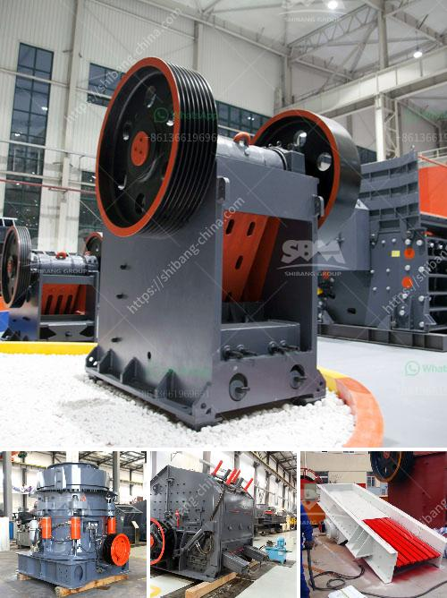

<h3>feldspar stone crushing plant</h3>
Feldspar stone crushing plant is a fruitful business venture for new entrepreneurs. The demand for quality stones is increasing to meet the construction needs of cities and towns globally. It is an essential component in the production of concrete and asphalt. As a result, the market is prosperous and will continue to grow exponentially.

Feldspar is a common mineral found in igneous, metamorphic, and sedimentary rocks. It is widely used in various industries due to its unique properties. The stone is primarily composed of aluminum silicates combined with potassium, sodium, and calcium. The feldspar stone has several colors, including white, pink, and red.

The stone crushing plant with feldspar as the primary material plays a crucial role in manufacturing high-quality aggregate materials such as sand, gravel, and crushed stone. These materials are widely used in construction projects of any scale, ranging from a simple building foundation to large infrastructure developments.

The feldspar stone crushing plant consists of a primary crusher, secondary crusher, vibrating feeder, vibrating screen, and belt conveyor. The primary crusher breaks the raw material into coarse particle size and then the secondary crusher further reduces the size for final crushing. The vibrating feeder ensures a continuous flow of the raw material, while the vibrating screen separates the crushed stones into different sizes. The belt conveyor helps in the transportation of the materials between different stages of the crushing process.

The efficient and automated crushing process provided by the stone crushing plant ensures consistent production of high-quality aggregates. The plant can handle various types of materials, including basalt, granite, limestone, and feldspar. This versatility makes it an ideal choice for construction companies, as they can use the same plant for crushing different types of stones.

Investing in a feldspar stone crushing plant offers numerous benefits. Firstly, it helps meet the increasing demand for quality stones, allowing entrepreneurs to tap into a profitable market. Secondly, the plant operates with low noise and dust emissions, ensuring a healthy work environment. Moreover, the plant requires minimal maintenance and can be operated with relatively low manpower, reducing operational costs.

Collaborating with reputable suppliers and manufacturers is essential when setting up a feldspar stone crushing plant. These suppliers provide high-quality equipment and can assist in the installation and maintenance of the plant. Additionally, keeping up with technological advancements in the industry is crucial to staying competitive and maximizing the plant's efficiency.

In conclusion, the feldspar stone crushing plant is a lucrative business venture that offers immense opportunities for entrepreneurs in the construction industry. The increasing demand for quality stones and the plant's ability to process various types of materials make it a profitable investment. By collaborating with reliable suppliers and manufacturers, entrepreneurs can set up a successful stone crushing plant and contribute to the growth of the construction sector.
<h3>Contact us</h3><ul><li><strong>Whatsapp:&nbsp;<a href="https://wa.me/8613661969651">+8613661969651</a></strong></li><li><a href="https://swt.shibang-china.com/?git&amp;zhl&amp;feldspar stone crushing plant"><strong>Online Service(chat now)</strong></a></li></ul><h3>Related</h3><ul><li><a href='ball mill cost for 100ton cement plant.md'>ball mill cost for 100ton cement plant</a></li><li><a href='crusher for sale kenya.md'>crusher for sale kenya</a></li><li><a href='companies that sell industrial ball mills in malaysia.md'>companies that sell industrial ball mills in malaysia</a></li><li><a href='gold stone crusher machine south africa.md'>gold stone crusher machine south africa</a></li><li><a href='stone crusher machine uk.md'>stone crusher machine uk</a></li></ul>