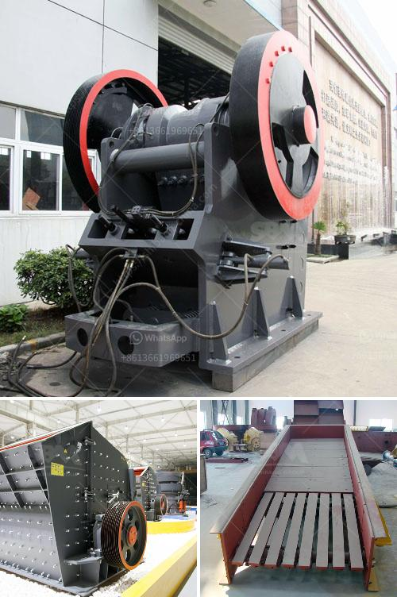

<h3>feldspar stone for sale india</h3>
India, known for its rich cultural heritage, vibrant colors, and intricate craftsmanship, is also home to a wide variety of precious gemstones and minerals. One such gemstone that has captured the attention of both locals and international buyers is feldspar. With its mystical allure and fascinating properties, feldspar stone has become highly sought after in the Indian market.

Feldspar, also known as moonstone, is a mineral that can be found in several parts of India, including Rajasthan, Tamil Nadu, and Karnataka. It is categorized into two main types: orthoclase and albite. These two types exhibit different colors and properties, making them suitable for various applications in the jewelry and construction industries.

One of the main reasons for the growing popularity of feldspar stone in India is its aesthetic appeal. With a mesmerizing play of iridescent colors, feldspar stones are known for their unique adularescence effect, which creates a stunning shimmer similar to that of moonlight. This enchanting feature makes feldspar an ideal choice for jewelry designers, who often incorporate it into necklaces, bracelets, earrings, and rings.

Not only do these stones showcase remarkable beauty, but they also possess powerful metaphysical properties. Feldspar is believed to have healing energy that promotes emotional stability and harmony in relationships. It is also considered a protective stone, shielding its wearer from negative energies and enhancing intuitive abilities. Many spiritual enthusiasts and alternative healers seek out feldspar to tap into its positive energy and balance their chakras.

Due to its versatility and wide range of applications, feldspar stone for sale in India has become a thriving business. From jewelry stores to gemstone wholesalers, the demand for feldspar is ever-increasing. Rudraksha Ratna is one of the leading suppliers of feldspar in India, offering a diverse collection of high-quality stones sourced directly from mines. They cater to both domestic and international buyers, ensuring that the stones they offer are authentic and ethically sourced.

Apart from its use in jewelry, feldspar stone is also highly valued in the construction industry. Its hardness and durability make it a popular choice for countertops, flooring, and wall cladding. Architects and interior designers often incorporate feldspar into their projects, adding a touch of elegance and sophistication to any space.

For those looking to acquire feldspar stone in India, it is essential to understand its grading system and quality parameters. The value of feldspar is determined by various factors, including color, transparency, and overall condition. Buyers should consider seeking advice from gemstone experts or certified gemologists to ensure they select the best stones that meet their specific requirements.

In conclusion, feldspar stone for sale in India offers a unique opportunity for gemstone enthusiasts and industry professionals to acquire these exquisite treasures. With its enchanting beauty, powerful energy, and multifaceted applications, feldspar continues to captivate hearts and minds around the world. Whether it is used to create stunning jewelry or to enhance the aesthetic appeal of architectural projects, feldspar stone remains a true gem in India's treasure trove.
<h3>Contact us</h3><ul><li><strong>Whatsapp:&nbsp;<a href="https://wa.me/8613661969651">+8613661969651</a></strong></li><li><a href="https://swt.shibang-china.com/?git&amp;zhl&amp;feldspar stone for sale india"><strong>Online Service(chat now)</strong></a></li></ul><h3>Related</h3><ul><li><a href='economic analysis of conveyor system.md'>economic analysis of conveyor system</a></li><li><a href='crusher peru price.md'>crusher peru price</a></li><li><a href='iron ore smelter equipment.md'>iron ore smelter equipment</a></li><li><a href='grinder mill in bolivia.md'>grinder mill in bolivia</a></li><li><a href='chrome ore crushers for hire in south africa.md'>chrome ore crushers for hire in south africa</a></li></ul>