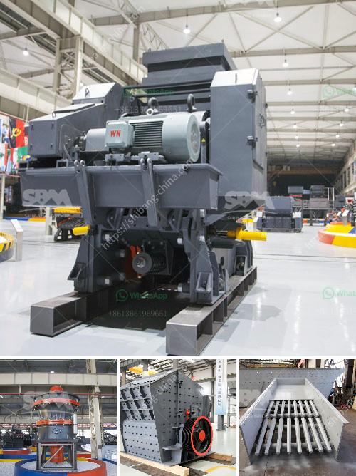

<h3>fine grinding equipment</h3>
Fine grinding equipment is an essential component in various industries that require high-quality and precise finishes. Whether it is for pharmaceuticals, cosmetics, or food processing, fine grinding ensures that the end product meets the desired specifications and satisfies consumers' expectations. 

One of the key benefits of using fine grinding equipment is its ability to produce highly uniform and consistent results. Unlike conventional grinding equipment, which can sometimes lead to variations in particle sizes, fine grinding machines provide a much tighter particle size distribution. This allows for better control over the product's properties, such as color, taste, and texture.

Another advantage of fine grinding equipment is its efficiency. By reducing the particle size to a finer level, the surface area of the material increases, enabling faster and more effective dissolution, extraction, or reaction processes. This not only saves time but also enhances the overall productivity of the manufacturing process.

The design and technology behind fine grinding equipment have also evolved significantly over the years. Nowadays, these machines are equipped with advanced features like automated controls, cooling systems, and precision motors, ensuring optimal performance and minimizing the risk of product contamination or damage.

When choosing a fine grinding equipment, it is essential to consider factors such as the material to be processed, desired particle size distribution, and production capacity. There is a wide range of options available, including ball mills, jet mills, stirred media mills, and impact mills, each designed for specific applications and materials.

In conclusion, fine grinding equipment plays a crucial role in producing high-quality products across various industries. Its ability to provide uniform particle size distribution, increase surface area, and enhance product properties sets it apart from conventional grinding methods. With continuous advancements in technology, fine grinding equipment is becoming even more efficient, helping businesses achieve superior results and meet consumers' ever-growing expectations.
<h3>Contact us</h3><ul><li><strong>Whatsapp:&nbsp;<a href="https://wa.me/8613661969651">+8613661969651</a></strong></li><li><a href="https://swt.shibang-china.com/?git&amp;zhl&amp;fine grinding equipment"><strong>Online Service(chat now)</strong></a></li></ul><h3>Related</h3><ul><li><a href='trackmounted mobile crusher.md'>track-mounted mobile crusher</a></li><li><a href='iron ore smelter equipment.md'>iron ore smelter equipment</a></li><li><a href='gypsum board crusher machine.md'>gypsum board crusher machine</a></li><li><a href='conical ball mill manufacturers in india.md'>conical ball mill manufacturers in india</a></li><li><a href='quarring of building stones crusher in pakistan.md'>quarring of building stones crusher in pakistan</a></li></ul>