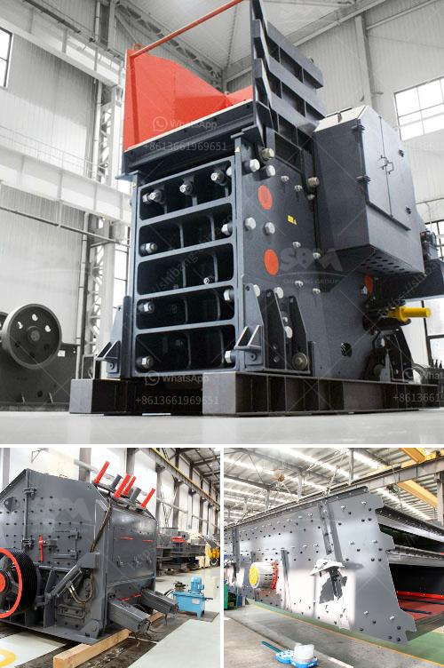

<h3>fine powder grinder commercial</h3>
Grinding is an essential process in various industries, ranging from pharmaceuticals to food processing. However, achieving the desired particle size can be a challenging task. This is where a fine powder grinder commercial comes into play, offering an efficient solution for companies looking to enhance productivity and precision.

A fine powder grinder commercial is a cutting-edge machine that enables businesses to grind materials into fine powders with exceptional precision. This powerful equipment can handle a wide array of materials, including herbs, spices, grains, and even minerals. With its state-of-the-art design and advanced technology, it revolutionizes the grinding process, making it quicker, more efficient, and cost-effective.

One of the key advantages of a fine powder grinder commercial is its ability to produce consistent particle sizes. This is crucial in industries such as pharmaceuticals, where the quality and effectiveness of medications depend on the uniformity of particle sizes. By achieving a precise particle size distribution, businesses can ensure the reliability and efficacy of their products, leading to improved customer satisfaction and trust.

Moreover, a fine powder grinder commercial offers immense versatility. It can be easily adjusted to grind various materials to specific particle sizes, catering to the unique requirements of different industries. This adaptability allows businesses to produce powders that meet their customers' exact specifications, opening doors to new market opportunities and expansion.

In addition to its efficiency and versatility, a fine powder grinder commercial also enhances workplace safety. Its advanced design incorporates multiple safety features, preventing accidents or injuries during operation. This ensures the well-being of employees and reduces the risk of potential liabilities for businesses.

Overall, investing in a fine powder grinder commercial is a game-changer for companies involved in grinding processes. It elevates productivity and precision, allowing businesses to streamline their operations and deliver high-quality products. With innovations in technology, the future of the grinding industry looks brighter than ever, with fine powder grinder commercials serving as the catalyst for growth and success.
<h3>Contact us</h3><ul><li><strong>Whatsapp:&nbsp;<a href="https://wa.me/8613661969651">+8613661969651</a></strong></li><li><a href="https://swt.shibang-china.com/?git&amp;zhl&amp;fine powder grinder commercial"><strong>Online Service(chat now)</strong></a></li></ul><h3>Related</h3><ul><li><a href='sand making machine.md'>sand making machine</a></li><li><a href='vibrating vibrating grizzly feeder capacity.md'>vibrating vibrating grizzly feeder capacity</a></li><li><a href='kaolin portable crusher provider in nigeria.md'>kaolin portable crusher provider in nigeria</a></li><li><a href='density of conveyor belts for mining.md'>density of conveyor belts for mining</a></li><li><a href='gravel crushing equipment.md'>gravel crushing equipment</a></li></ul>