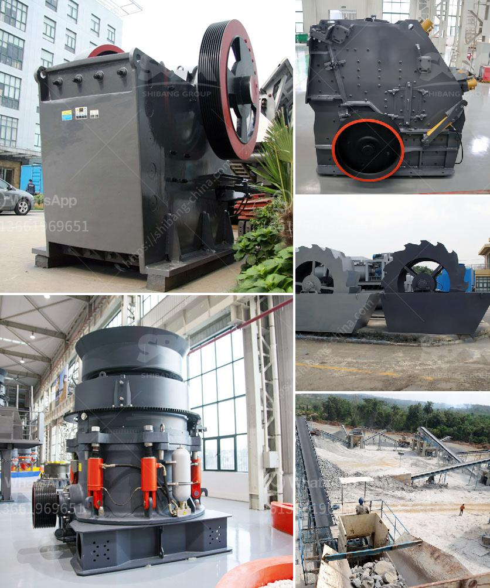

<h3>fine powder grinding machine philippines</h3>
Fine powder grinding machine is a versatile and efficient machine that is capable of grinding a wide range of materials into fine powder. The machine uses a mechanical alloying process to grind various types of material into fine powder. It can grind materials such as limestone, gypsum, coal, dolomite, talc, clinker, bentonite, and other materials. This machine is ideal for producing fine powder for use in various industries such as pharmaceuticals, chemicals, food processing, and many more.

One of the best places to find a fine powder grinding machine in the Philippines is from a reputable manufacturer. These manufacturers have the expertise and experience to design and produce high-quality machines that are capable of delivering optimal performance. They use advanced technology and high-quality components to ensure that their machines can withstand the demands of daily operations in various industries.

A fine powder grinding machine in the Philippines is equipped with powerful motors that are designed for continuous operation. These motors can grind materials efficiently and quickly, allowing for higher productivity. The machine also features an adjustable grinding disc that can be adjusted to grind different materials to the desired fineness. This adjustable feature makes it possible to produce different types of fine powder for various applications.

In addition to its high productivity and efficiency, a fine powder grinding machine in the Philippines is also designed for easy maintenance and cleaning. The machine is made from durable materials that can withstand harsh operating conditions. It also has safety features that ensure the operator's safety during operation.

Overall, a fine powder grinding machine in the Philippines is a valuable investment for businesses in various industries. It offers efficiency, productivity, and versatility in grinding a wide range of materials into fine powder. With the right machine from a reputable manufacturer, businesses can enjoy long-term benefits and achieve their production goals more effectively.
<h3>Contact us</h3><ul><li><strong>Whatsapp:&nbsp;<a href="https://wa.me/8613661969651">+8613661969651</a></strong></li><li><a href="https://swt.shibang-china.com/?git&amp;zhl&amp;fine powder grinding machine philippines"><strong>Online Service(chat now)</strong></a></li></ul><h3>Related</h3><ul><li><a href='difference between chain and belt conveyors.md'>difference between chain and belt conveyors</a></li><li><a href='stone crushing machine factories.md'>stone crushing machine factories</a></li><li><a href='stone crusher for sale.md'>stone crusher for sale</a></li><li><a href='talc powder plant.md'>talc powder plant</a></li><li><a href='gold sand processing technology.md'>gold sand processing technology</a></li></ul>