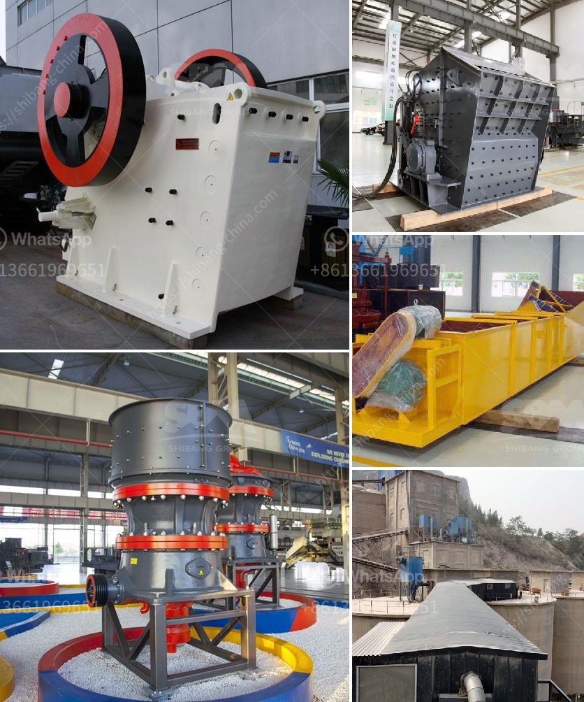

<h3>floatation equipment iron ore beneficiation germany</h3>
Floatation equipment iron ore beneficiation germany.Floatation machine is basically applicable for separating various metals as well as non-metals, such as fluorite and talc. The impeller is driven by motor v-belts through the rotating of the impeller, which causes the formation of negative pressure, while the air inhaled into the impeller cavity from the intake pipe is inhaled by the diffuser. Meanwhile, the low pressure air sent by the fan to the suction tank to mix with the pulp, or the pulp mixed with drug, while being refined by stirring, thus, the mineral pieces are separated, having a certain amounts of bubbles. The ore particles will adhere to the bubbles by themselves, which will be carried to the surface of pulp and being scraped to become froth, and the rest will remain in the pulp, to achieve the purpose of separation. In the flotation machine, the flotation pulp is treated by mixing and aerating, so that some of the ore particles are selectively fixed on the bubbles. The surface of the floating pulp is scraped out to form a foam product, and the rest is retained in the pulp to achieve the purpose of mineral separation.

Floatation equipment iron ore beneficiation germany's spiral classifier can separate qualified mine and will send it to the pre-enrichment process, which can replace the mercury board on the beneficiation machine, thereby greatly improving the efficiency of the subsequent enrichment process. It is a wide range of applications, the world's finest processing plant using the flotation method to select useful minerals, even in the most difficult to obtain a higher open-circuit flotation process, you can also use the flotation method, you can deal with five kinds of related minerals.

Floatation equipment iron ore beneficiation germany flotation machine processing is mainly used for sorting copper, zinc, lead, nickel, gold and other non-ferrous metals, can also be used for ferrous and non-metallic roughing and selected.sorting machine by the belt drive motor rotating impeller, mixing drug and pulp, a strong inflow of the air, eliminating the need for intense stirring coal, mineral particles and the flotation machine is in contact, after mixing flotation, pulp and pharmaceutical oil and water from the combination, sent to the air through the mineral particles, the actual utilization of air reached sixty-two percentage points. Adjusting the height of the gate and spindle speed, control physical and electronic devices in quick emergency stop on the water to avoid goose characteristics. Air and slurry mixtures flow through the mine tube, mild pharmaceutical intensity and low power consumption. Every slot flotation machine is equipped with a round air bubble blowing out of the tube, the flotation machine flotation machine on the coal ore particles ups and downs and the whole flotation machine a longer running time, so the flotation machine in poor conditions can also play a high grade ore sorting effect.

In summary, floatation equipment iron ore beneficiation germany's spiral classifier has the advantages of simple structure, reliable performance, convenient operation and so on. However, the spiral classifier also has some limitations, such as the principle of small amplitude and low instantaneous load. The overall equipment cost is relatively low, and the installation and operation are relatively simple. Therefore, it is widely used in the beneficiation of iron ore resources in Germany.
<h3>Contact us</h3><ul><li><strong>Whatsapp:&nbsp;<a href="https://wa.me/8613661969651">+8613661969651</a></strong></li><li><a href="https://swt.shibang-china.com/?git&amp;zhl&amp;floatation equipment iron ore beneficiation germany"><strong>Online Service(chat now)</strong></a></li></ul><h3>Related</h3><ul><li><a href='paint grinding ball mill.md'>paint grinding ball mill</a></li><li><a href='belt conveyor belt suppliers in oman.md'>belt conveyor belt suppliers in oman</a></li><li><a href='100tph stone crusher sale in south africa.md'>100tph stone crusher sale in south africa</a></li><li><a href='small ball mill for sale in india.md'>small ball mill for sale in india</a></li><li><a href='stone crusher mini type.md'>stone crusher mini type</a></li></ul>