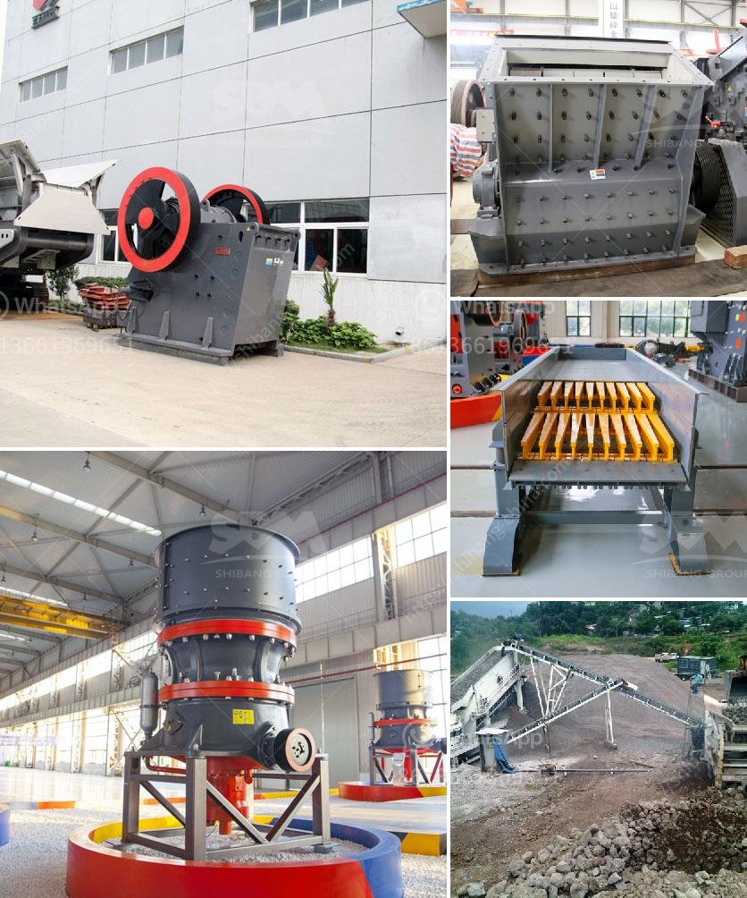

<h3>fly ash grinding mill</h3>
Fly ash, also known as pulverized fuel ash, is a byproduct of coal combustion and is widely used as an additive for cement, concrete, and various construction applications. However, the limited availability of high-quality fly ash and the increasing demand for this material have led to the need for efficient fly ash grinding mills that can produce fine particles with a narrow particle size distribution.

One of the most commonly used grinding mills for fly ash is the ball mill. In the ball mill, the fly ash is finely ground in a continuous operation using grinding balls that have a high abrasion resistance. This ensures efficient and consistent grinding throughout the operation.

The fly ash is fed into the ball mill at a constant rate and is ground for a specific period of time until the desired fineness is achieved. The ground fly ash is then discharged from the ball mill in the form of a slurry, which is pumped to a storage tank for further processing.

Another type of grinding mill that can be used for fly ash grinding is the vertical roller mill. This mill is specifically designed for grinding fly ash and is equipped with a vertical mill body consisting of grinding discs, rollers, and a separator. This combination allows for faster and more efficient grinding of fly ash compared to traditional ball mills.

The fly ash is fed into the vertical roller mill through a rotary feeder and is then ground and dried using hot air that is generated by a hot gas generator. The ground fly ash is then collected in a cyclone separator and is discharged from the bottom of the separator.

Overall, the use of a fly ash grinding mill is essential for efficient processing and utilization of fly ash. These grinding mills can produce fine particles with a narrow particle size distribution, which is crucial for its various applications. Whether it is used as an additive for cement or concrete, or as a filler material in construction, the quality of the fly ash is greatly enhanced by proper grinding.

In conclusion, fly ash grinding mills play a crucial role in the efficient processing and utilization of this widely used byproduct. They offer a cost-effective solution for producing high-quality fly ash with a narrow particle size distribution. As the demand for fly ash continues to grow, it is important to invest in reliable grinding mills that can meet the requirements of various applications.
<h3>Contact us</h3><ul><li><strong>Whatsapp:&nbsp;<a href="https://wa.me/8613661969651">+8613661969651</a></strong></li><li><a href="https://swt.shibang-china.com/?git&amp;zhl&amp;fly ash grinding mill"><strong>Online Service(chat now)</strong></a></li></ul><h3>Related</h3><ul><li><a href='rotary grinder machine thailand.md'>rotary grinder machine thailand</a></li><li><a href='density of fine aggregate granite.md'>density of fine aggregate granite</a></li><li><a href='setting up of a stone quarry plant in nigeria.md'>setting up of a stone quarry plant in nigeria</a></li><li><a href='vibrating screen for silica sand.md'>vibrating screen for silica sand</a></li><li><a href='second hand cement mill in india.md'>second hand cement mill in india</a></li></ul>