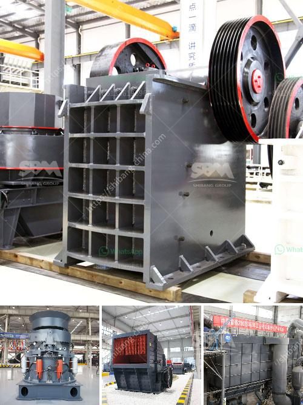

<h3>formato de la planta de trituracion de mantenimiento</h3>
El formato de la planta de trituración de mantenimiento es un documento que contiene los procedimientos y actividades necesarias para asegurar el correcto funcionamiento y conservación de las máquinas utilizadas en una planta de trituración. Este formato es esencial para garantizar la eficiencia, seguridad y durabilidad de la maquinaria, lo que a su vez contribuye al éxito y rentabilidad de la producción.

El formato de mantenimiento debe incluir un programa regular de revisiones y chequeos de rutina que se deben llevar a cabo en cada equipo de la planta de trituración. Estas revisiones deben abarcar desde inspecciones visuales como el estado de las correas y las poleas, hasta pruebas más exhaustivas como la revisión de la lubricación de los rodamientos y la medición de la presión de aceite.

Además de las revisiones de rutina, el formato de mantenimiento también debe incluir las actividades de limpieza y lubricación adecuadas para cada equipo de la planta de trituración. Es importante mantener todos los componentes limpios y lubricados correctamente para reducir el desgaste y evitar posibles averías o paradas no programadas. Los lubricantes utilizados deben cumplir con las recomendaciones del fabricante y ser aplicados en las cantidades adecuadas.

Otro aspecto clave en el formato de mantenimiento es la planificación y ejecución de las reparaciones necesarias. En caso de que se detecte algún fallo o avería en la maquinaria, es importante contar con un procedimiento claro y detallado de cómo llevar a cabo la reparación. Esto incluye la identificación de las piezas o componentes que necesitan ser reemplazados, así como el tiempo estimado de reparación y el presupuesto necesario.

El formato de mantenimiento también debe tener en cuenta la formación del personal encargado de la operación y mantenimiento de la planta de trituración. Es esencial que los empleados estén debidamente capacitados y actualizados en los procedimientos de mantenimiento, así como en el manejo seguro de la maquinaria. Esto contribuirá a reducir el riesgo de accidentes y a maximizar la eficiencia y productividad del equipo.

En resumen, el formato de la planta de trituración de mantenimiento es un documento esencial para mantener la maquinaria de la planta en óptimas condiciones de funcionamiento. Esta herramienta ayuda a planificar y llevar a cabo las actividades de revisión, limpieza, lubricación y reparación necesarias, así como a capacitar al personal encargado de su mantenimiento. Con un formato de mantenimiento adecuado, se puede garantizar una operación segura, eficiente y rentable de la planta de trituración.
<h3>Contact us</h3><ul><li><strong>Whatsapp:&nbsp;<a href="https://wa.me/8613661969651">+8613661969651</a></strong></li><li><a href="https://swt.shibang-china.com/?git&amp;zhl&amp;formato de la planta de trituracion de mantenimiento"><strong>Online Service(chat now)</strong></a></li></ul><h3>Related</h3><ul><li><a href='stone crushing machine in zambia.md'>stone crushing machine in zambia</a></li><li><a href='double stage hammer crusher for stone.md'>double stage hammer crusher for stone</a></li><li><a href='sand washing plant saudi arabia.md'>sand washing plant saudi arabia</a></li><li><a href='pyrite coal mill pakistan.md'>pyrite coal mill pakistan</a></li><li><a href='stone crusher mesh size.md'>stone crusher mesh size</a></li></ul>