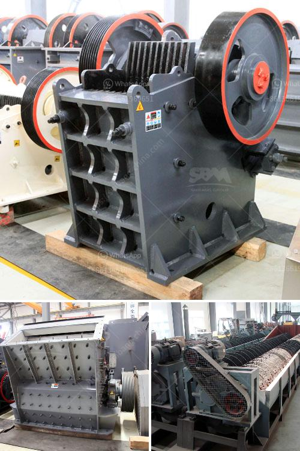

<h3>frac sand processing plants for sale</h3>
Frac sand, also known as hydraulic fracturing sand or silica sand, plays a crucial role in the oil and gas industry. With the increasing demand for energy, especially in North America, the demand for frac sand has witnessed substantial growth in recent years. This has led to the establishment of numerous frac sand processing plants across the region.

Frac sand processing plants are dedicated facilities used to wash, dry, and screen sand to meet the stringent specifications required for hydraulic fracturing. These plants typically consist of various stages of crushing, sieving, and washing to produce high-quality frac sand that meets the standards set by the industry. 

Given the booming market for frac sand, there is an increasing number of frac sand processing plants for sale. These plants come in different sizes, ranging from small-scale operations suitable for local markets to larger facilities capable of catering to the needs of major oil and gas producers. 

Investing in a frac sand processing plant offers several advantages. Firstly, it provides an opportunity to tap into a lucrative market with a high demand for frac sand. Secondly, as the oil and gas industry continues to grow, the demand for frac sand is expected to increase, ensuring a consistent customer base. Additionally, these plants can generate significant revenue by supplying frac sand to a wide range of customers, including oil and gas companies, as well as construction and foundry industries.

However, potential buyers should consider several factors before purchasing a frac sand processing plant. These include the plant's production capacity, equipment quality, operating costs, environmental compliance, and proximity to sand reserves. Conducting thorough due diligence and engaging expert advice can help ensure a successful investment.

In conclusion, the sale of frac sand processing plants provides an excellent opportunity for investors looking to capitalize on the growing demand for frac sand. By investing in a well-designed and efficient facility, buyers can establish a profitable business in the booming oil and gas industry.
<h3>Contact us</h3><ul><li><strong>Whatsapp:&nbsp;<a href="https://wa.me/8613661969651">+8613661969651</a></strong></li><li><a href="https://swt.shibang-china.com/?git&amp;zhl&amp;frac sand processing plants for sale"><strong>Online Service(chat now)</strong></a></li></ul><h3>Related</h3><ul><li><a href='the best crusher machines.md'>the best crusher machines</a></li><li><a href='mobile mining processing plant services.md'>mobile mining processing plant services</a></li><li><a href='process of making silica sand.md'>process of making silica sand</a></li><li><a href='hammer crusher buhler miag titan.md'>hammer crusher buhler miag titan</a></li><li><a href='jaw crusher each equipment.md'>jaw crusher each equipment</a></li></ul>