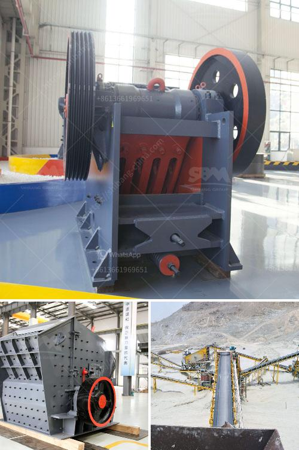

<h3>fuel consumption of stone crushers</h3>
Stone crushers are heavy-duty machines that reduce the size of raw material by breaking it into smaller pieces. The crushers have an important role in the production of aggregates and other materials used in the construction industry. Although fuel consumption of stone crushers varies widely, the factors influencing fuel efficiency include the size of the stone, feedstock moisture content, lower wear parts lifespan, and load and motor efficiency. 

In general, stone crushers require a good amount of fuel and lubricants for their operation. The diesel engines are the most commonly used power source for many applications, especially in areas where electricity is not available. Diesel engines are renowned for their fuel efficiency and power, allowing optimal performance of the crushers. However, fuel consumption still often plays a significant role in the overall operating costs of the crushers.

One of the major factors affecting fuel consumption is the size of the stone being crushed. Larger stones require more energy to crush, resulting in higher fuel consumption. Additionally, the feedstock moisture content also affects fuel efficiency. Wet or moist materials tend to stick to the crushers' inner walls, leading to a decrease in efficiency and an increase in fuel consumption.

Another crucial aspect to consider is the wear parts lifespan. The wear parts of a stone crusher, such as the jaws or hammers, undergo a lot of wear and tear during the crushing process. This wear leads to a decrease in crushing efficiency and an increase in fuel consumption. Regular maintenance and timely replacement of these wear parts are essential to maintain fuel efficiency.

Furthermore, the load and motor efficiency also impact fuel consumption. Stone crushers often operate under heavy load conditions and the motors used in these crushers must be able to handle the load fluctuations resulting from crushing different types of stones. As a result, motor inefficiencies and variable load conditions can contribute to increased fuel consumption.

To overcome these challenges and reduce fuel consumption, manufacturers have introduced advanced technologies and designs. For instance, some crushers utilize advanced motor control systems that optimize the energy consumption based on the load and material being crushed. This type of technology allows for better fuel efficiency and reduced operating costs.

In conclusion, fuel consumption of stone crushers can vary widely depending on factors such as the size and moisture content of the stone, wear parts lifespan, and load and motor efficiency. It is essential for operators to regularly maintain the crushers and replace worn-out parts to ensure optimal fuel efficiency. Additionally, advancements in technology and design have allowed for the introduction of more efficient crushers that can help reduce fuel consumption. By understanding these factors and utilizing the available technology, the construction industry can make strides towards more sustainable and cost-effective operations.
<h3>Contact us</h3><ul><li><strong>Whatsapp:&nbsp;<a href="https://wa.me/8613661969651">+8613661969651</a></strong></li><li><a href="https://swt.shibang-china.com/?git&amp;zhl&amp;fuel consumption of stone crushers"><strong>Online Service(chat now)</strong></a></li></ul><h3>Related</h3><ul><li><a href='small scale gold mining plant in zimbabwe.md'>small scale gold mining plant in zimbabwe</a></li><li><a href='quartz stone machine of india.md'>quartz stone machine of india</a></li><li><a href='quarry crusher equipment supplier.md'>quarry crusher equipment supplier</a></li><li><a href='price conveyor price rock crusher.md'>price conveyor price rock crusher</a></li><li><a href='stone crushing machine factories.md'>stone crushing machine factories</a></li></ul>