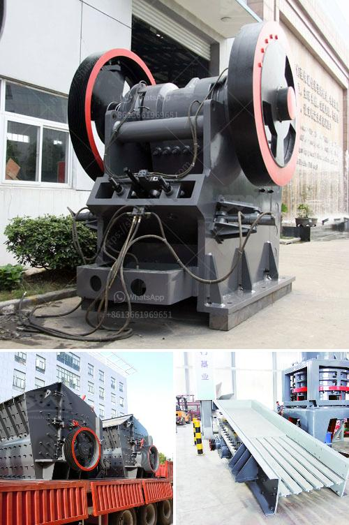

<h3>gemstone mining crusher in zambia</h3>
Gemstone mining in Zambia has been a widespread phenomenon since the late 19th century. It is estimated that there are over 4,000 individual gemstone mines in the country, yet only a fraction of them are currently active. Many small-scale and artisanal miners in Zambia rely on gemstones such as amethyst, aquamarine, emerald, and garnet as their primary source of income.

One crucial step in gemstone mining is the process of crushing the ore extracted from the mines. The main objective of this process is to reduce the size of the ore rock particles and facilitate further processing. Crushing typically consists of two or three stages, depending on the desired size of the final product.

In Zambia, jaw crusher is used for crushing various gemstones, such as emerald, quartz, jade, ruby, sapphire, topaz, tourmaline, and many more. These gemstones are mainly mined in the Zambian Copperbelt region.

Currently, Zambia is the world's fourth largest producer of emeralds, accounting for about 20% of the global supply. Gemstone mining in Zambia is concentrated in the Ndola Rural Emerald Restricted Area, where approximately 350 large-scale commercial miners operate.

The significant increase in gemstone mining activities in recent years has led to the need for more advanced crushing machines. As a result, the mining industry in Zambia has experienced investment from both foreign and local operators.

One of the leading players in the mining equipment and machinery sector in Zambia is Oriental Quarries, a company that offers a range of crushing solutions for gemstone mining. Their jaw crushers are specifically designed to process gemstones efficiently and economically.

Oriental Quarries' jaw crushers are equipped with manganese steel jaws, which have a higher longevity compared to other materials. This ensures that the crushers can withstand the tough conditions of gemstone mining operations.

Furthermore, Oriental Quarries' jaw crushers are designed to have a high feed capacity and an adjustable closed side setting, allowing miners to produce the desired crushed gemstone sizes for their customers.

The use of advanced technology in gemstone mining crusher machines has led to an increase in efficiency and effectiveness in the mining industry. With the right equipment and expertise, miners in Zambia can achieve higher gemstone yields, reduced operation costs, and increased profitability.

Gemstone mining crusher in Zambia plays a crucial role in modernizing the mining sector and establishing Zambia as a global gemstone hub. The crushers provided by Oriental Quarries are not only efficient but also environmentally friendly, as they minimize dust and noise pollution.

However, challenges still exist in the gemstone mining industry in Zambia. Illegal mining practices and the lack of proper regulation continue to hinder the growth and development of this sector. The Zambian government is taking steps to address these issues by implementing stricter mining regulations and offering support to small-scale miners.

In conclusion, gemstone mining crusher in Zambia has witnessed a considerable rise in recent years due to increased investments and advancements in mining technology. With the right equipment and knowledge, miners can extract gemstones efficiently and sustainably, contributing to the country's economic growth and development.
<h3>Contact us</h3><ul><li><strong>Whatsapp:&nbsp;<a href="https://wa.me/8613661969651">+8613661969651</a></strong></li><li><a href="https://swt.shibang-china.com/?git&amp;zhl&amp;gemstone mining crusher in zambia"><strong>Online Service(chat now)</strong></a></li></ul><h3>Related</h3><ul><li><a href='crusher peru price.md'>crusher peru price</a></li><li><a href='south africa mobile crusher.md'>south africa mobile crusher</a></li><li><a href='quarry crusher machine price.md'>quarry crusher machine price</a></li><li><a href='vsi crusher for crush sand.md'>vsi crusher for crush sand</a></li><li><a href='used roller mills for sale.md'>used roller mills for sale</a></li></ul>