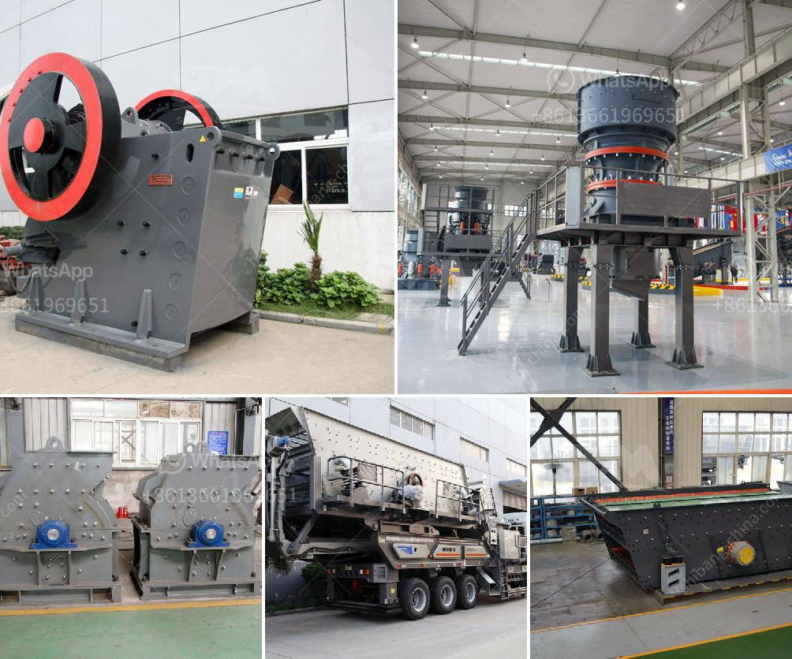

<h3>german sand wash machine</h3>
The German sand wash machine is a revolutionary piece of machinery that has completely transformed the sand washing process. This state-of-the-art equipment is designed to clean and eliminate impurities from sand particles, making them suitable for use in various industries such as construction and concrete production.

What sets the German sand wash machine apart from its competitors is its exceptional quality and efficiency. Made with precision engineering and using only the highest quality materials, this machine is built to withstand the rigors of heavy-duty usage. Whether it's removing clay, dirt, or other debris from sand, this machine delivers outstanding results with every cycle.

One of the key features of the German sand wash machine is its advanced washing technology. The machine agitates the sand particles, ensuring that all unwanted impurities are dislodged and removed. Additionally, the machine uses powerful jets of water to thoroughly clean the sand, leaving it in pristine condition. This not only enhances the quality of the sand but also improves its overall usability in various applications.

Furthermore, the German sand wash machine is designed for maximum efficiency. It boasts a large capacity, allowing for bulk washing of sand in a single cycle. This saves both time and energy, increasing productivity and reducing operational costs. With its robust performance and user-friendly interface, this machine offers a seamless and hassle-free sand washing experience.

Moreover, the German sand wash machine incorporates several smart features to enhance its functionality. It is equipped with sensors and monitoring systems to ensure optimal performance and prevent any potential issues. Additionally, the machine is designed with safety features in mind, prioritizing the well-being of operators and minimizing accidents.

In conclusion, the German sand wash machine is a game-changer in the sand washing industry. Its exceptional quality, efficiency, and smart features make it the preferred choice for businesses involved in sand processing. From construction sites to concrete plants, this machine guarantees clean and high-quality sand, thereby contributing to superior end products. Investing in the German sand wash machine is a wise decision for any industry that values efficiency, productivity, and superior results.
<h3>Contact us</h3><ul><li><strong>Whatsapp:&nbsp;<a href="https://wa.me/8613661969651">+8613661969651</a></strong></li><li><a href="https://swt.shibang-china.com/?git&amp;zhl&amp;german sand wash machine"><strong>Online Service(chat now)</strong></a></li></ul><h3>Related</h3><ul><li><a href='conveyor belt setup china.md'>conveyor belt setup china</a></li><li><a href='crusher manufacturers in south africa.md'>crusher manufacturers in south africa</a></li><li><a href='feldspar powder ball mill.md'>feldspar powder ball mill</a></li><li><a href='program to simulate conveyor belts.md'>program to simulate conveyor belts</a></li><li><a href='diamond stone crusher mumbai.md'>diamond stone crusher mumbai</a></li></ul>