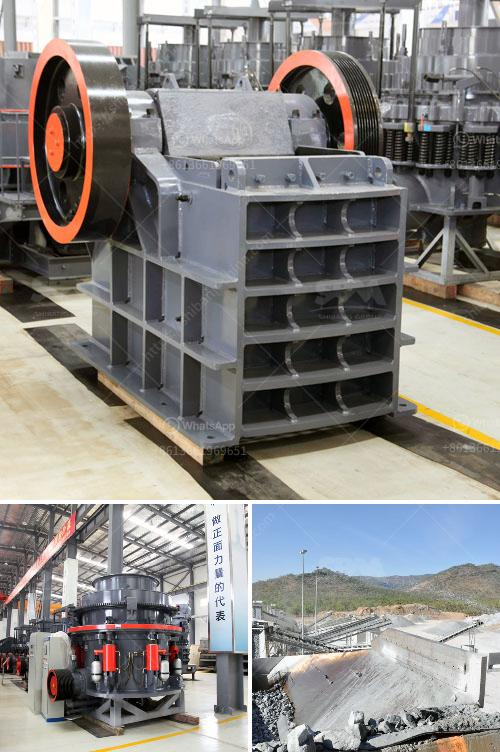

<h3>german technology ball grinding machine</h3>
In the realm of industrial machinery, German technology has always been held in high regard for its precision engineering and superior quality. Among the many innovations that have contributed to Germany's reputation, the ball grinding machine stands as an exemplary piece of engineering.

The ball grinding machine, also known as a ball mill, is a staple in the modern manufacturing industry. With advancements in technology, this equipment has been able to meet the growing demand for precision and productivity in various industries such as automotive, aerospace, electronics, and more. German technology has played a crucial role in the development of these grinding machines, ensuring their unparalleled performance and reliability.

One of the key features that sets German technology ball grinding machines apart is their exceptional precision. The ability to grind balls to extremely tight tolerances is essential in industries that rely on precise sizes and shapes, such as ball bearings. German manufacturers have mastered the art of precision engineering, enabling them to produce ball grinding machines that consistently deliver the desired results.

These machines are also known for their versatility and flexibility. They can grind a wide range of materials, including metals, ceramics, and composites, making them ideal for various applications. Whether it's grinding hardened steel balls or delicate glass spheres, German technology ball grinding machines can handle the task with ease and efficiency.

Another aspect that distinguishes German technology ball grinding machines is their advanced automation and control systems. These machines are equipped with state-of-the-art sensors, actuators, and software that enable precise control over the grinding process. By ensuring optimal speeds, feeds, and coolant flow, German technology machines maximize productivity while minimizing errors and waste.

German technology also prioritizes the durability and longevity of their machines. The ball grinding machines are built to withstand heavy usage and harsh environments, ensuring they can function flawlessly for prolonged periods. This reliability is a testament to the German commitment to producing high-quality machinery that delivers exceptional performance year after year.

Moreover, German technology ball grinding machines are designed with the operator in mind. Safety features, ergonomic design, and user-friendly interfaces are incorporated to enhance the operator's experience and minimize the risk of accidents or injuries. This focus on human-machine interaction sets German technology machines apart from their competitors.

In conclusion, German technology ball grinding machines are a testament to Germany's engineering prowess and dedication to excellence. These machines offer unparalleled precision, versatility, and reliability, making them indispensable in industries that demand high-quality grinding solutions. With advanced automation and control systems, German technology machines set new standards for productivity and efficiency. Whether it's the automotive industry, electronics sector, or any other industry requiring precision-ground balls, German technology ball grinding machines are the go-to choice for superior performance.
<h3>Contact us</h3><ul><li><strong>Whatsapp:&nbsp;<a href="https://wa.me/8613661969651">+8613661969651</a></strong></li><li><a href="https://swt.shibang-china.com/?git&amp;zhl&amp;german technology ball grinding machine"><strong>Online Service(chat now)</strong></a></li></ul><h3>Related</h3><ul><li><a href='cement production procedure in vertical mill.md'>cement production procedure in vertical mill</a></li><li><a href='ballast crusher cost.md'>ballast crusher cost</a></li><li><a href='coal mining equipment south africa for sale.md'>coal mining equipment south africa for sale</a></li><li><a href='ore crusher copper ore crusher.md'>ore crusher copper ore crusher</a></li><li><a href='used small gold processing plant from dubai.md'>used small gold processing plant from dubai</a></li></ul>