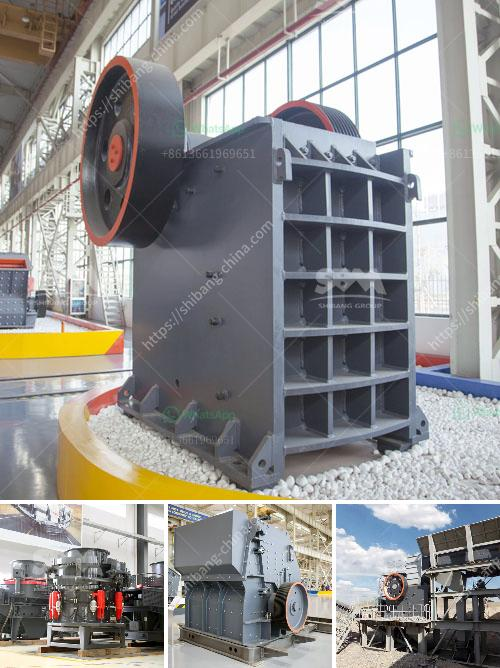

<h3>germany hammer crusher</h3>
Germany Hammer Crusher is a Hammer Crusher adopted with Germany crushing technology and Germany advanced processing equipment. It has features of simple structure, broken rate, even particle size, low operation cost, convenient maintenance, and easy to use, etc. It can crush the medium hardness and brittle materials in the mining, cement, coal, metallurgy, building materials, highway, and other industries.

The Germany Hammer Crusher is suitable for crushing the medium hardness and brittle materials, such as limestone, coal, salt, gypsum, alum, brick, tile, etc. It can not only be used as a crushing equipment alone but also can combine with other mining equipment to form a complete crushing production line.

Compared with traditional hammer crushers, Germany Hammer Crusher has the advantages of high crushing efficiency, low energy consumption, low operation cost, impact resistance, and wear resistance, etc. The hammer head of the crusher adopts the advanced design technology of hammer casting.

The Germany Hammer Crusher has a smooth operation, low noise, and low vibration during operation. The machine is equipped with an overload protection device to prevent damage to the components caused by materials that are too hard or too large.

The Germany Hammer Crusher is widely used in mining, cement, coal, metallurgy, building materials, highways, and other industries. It is not only used to crush various brittle materials such as limestone, coal, salt, gypsum, alum, brick, tile, etc., but also is an ideal equipment for crushing all kinds of materials with compressive strength less than 150MPa.

In summary, the Germany Hammer Crusher is a high-efficiency and energy-saving crushing equipment that is widely used in mining, cement, coal, metallurgy, building materials, highways, and other industries. It is an ideal choice for crushing materials with medium hardness and brittle materials. With its excellent performance and advanced technology, the Germany Hammer Crusher has become an important equipment in the mining machinery industry.
<h3>Contact us</h3><ul><li><strong>Whatsapp:&nbsp;<a href="https://wa.me/8613661969651">+8613661969651</a></strong></li><li><a href="https://swt.shibang-china.com/?git&amp;zhl&amp;germany hammer crusher"><strong>Online Service(chat now)</strong></a></li></ul><h3>Related</h3><ul><li><a href='vertical grinder mill price.md'>vertical grinder mill price</a></li><li><a href='rock crushing plant for sale.md'>rock crushing plant for sale</a></li><li><a href='gold stone crusher machine south africa.md'>gold stone crusher machine south africa</a></li><li><a href='copper ore crushing plant brazil.md'>copper ore crushing plant brazil</a></li><li><a href='sell 150 tph stone crusher.md'>sell 150 tph stone crusher</a></li></ul>