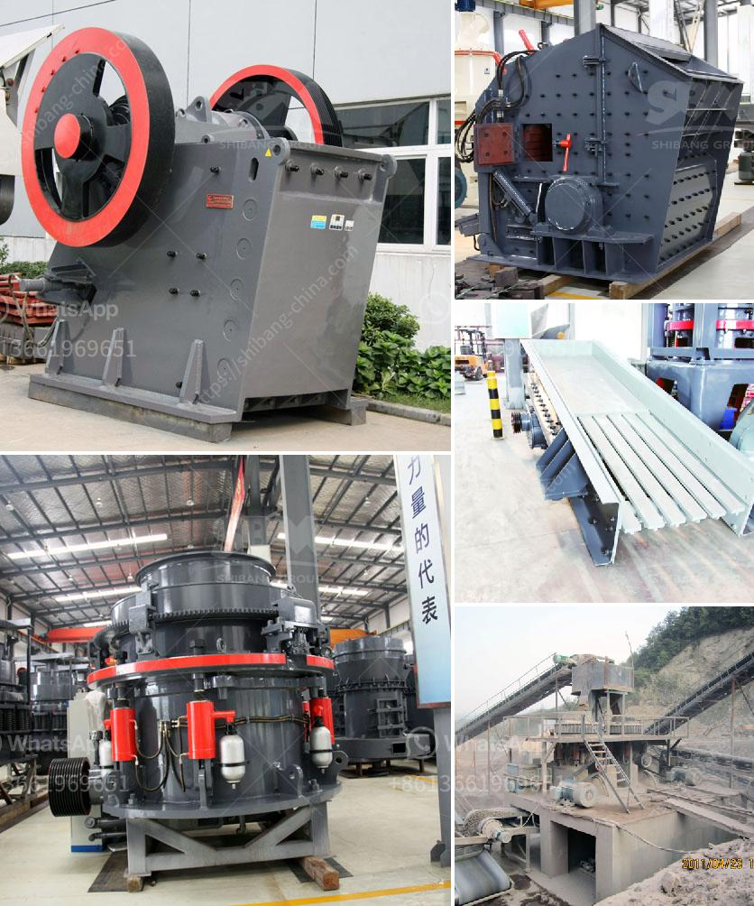

<h3>gold crusher for sale in brazil</h3>
Gold mining in Brazil has a long history and has been producing significant amounts of gold for several decades. Brazil is rich in natural resources and gold mining is one of the most important economic activities contributing to the growth of the country. With the recent increase in gold prices globally, there has been a surge in gold mining activity in Brazil, making it an attractive destination for gold investors.

One important component of the gold mining process is the crushing of the ore. In Brazil, gold ore mining site, the cone crusher machine is widely used. For the hardness of gold is 2.5-3 and the gold ore beneficiation plant need fine size gold ore materials, the gold ore cone crusher is used to break the large scale raw materials into desired size.

Gold ore crusher for sale in Brazil has broad market. In recent years, Brazil's economy has performed well. The export of various minerals, especially iron ore, has driven the overall growth of the country. But gold mining also plays an important role in Brazil's economic prosperity. Gold production in Brazil has increased significantly in the past decade, making it one of the world's largest gold producers.

There are several types of gold crushers available in Brazil. The most common type is jaw crusher, which is usually used as the primary crusher machine. It can break raw gold ore into small pieces. Secondary crusher machines are used to crush the larger gold ore materials into smaller size. The cone crusher is the most widely used crusher equipment for gold ore crushing.

The gold ore crushing process includes primary crushing and secondary crushing. Jaw crusher is used in the primary crushing process, and cone crusher is used for the secondary crushing process. In addition, mobile crusher is also used as the gold ore crusher machine in Brazil.

Gold mining in Brazil involves a number of technical processes, such as exploration, extraction, crushing, grinding, and beneficiation. In order to optimize the gold mining process, it is necessary to design a crushing circuit that suits the characteristics of the ore. In Brazil, gold ore cone crusher is used in small scale gold mining plant. It is mainly used to break the large scale gold ore materials into small size.

Gold ore cone crusher is one of the most widely used and popular machines used to break the larger pieces of raw gold ore into smaller pieces. The gold ore cone crusher is widely used in metallurgical industry, construction industry, chemical industry and phosphate industry. It is suitable for crushing hard and medium-hard ore and rock, such as iron ore, copper ore, limestone, quartz, granite, basalt, diabase, etc.

Gold mining in Brazil is an attractive investment opportunity. With the recent increase in gold prices globally, the gold mining industry in Brazil has experienced significant growth. Among the various gold mining activities, the crushing of gold ore is an important process. Gold ore crusher machines are widely used in Brazil to break the raw gold ore into smaller pieces. The gold crusher for sale in Brazil can process gold ore materials with capacity of 30-300tph.
<h3>Contact us</h3><ul><li><strong>Whatsapp:&nbsp;<a href="https://wa.me/8613661969651">+8613661969651</a></strong></li><li><a href="https://swt.shibang-china.com/?git&amp;zhl&amp;gold crusher for sale in brazil"><strong>Online Service(chat now)</strong></a></li></ul><h3>Related</h3><ul><li><a href='ball mill manufacturers china.md'>ball mill manufacturers china</a></li><li><a href='sand dryer machines suppliers south africa.md'>sand dryer machines suppliers south africa</a></li><li><a href='supplier of vibrating screen in philippines.md'>supplier of vibrating screen in philippines</a></li><li><a href='usa stone crushing machines manufacturers.md'>usa stone crushing machines manufacturers</a></li><li><a href='silica sand washing process.md'>silica sand washing process</a></li></ul>