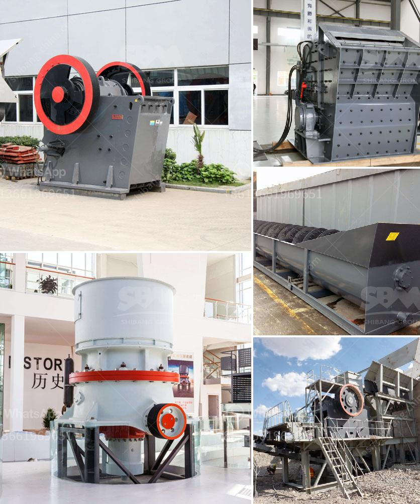

<h3>gold mining crushing and milling machine</h3>
Gold mining refers to the extraction of gold from underground mines or from the surface soil and sediment surrounding the precious metal. With advancements in technology, gold mining techniques have evolved as the years have passed. One crucial aspect of the gold mining process is the crushing and milling machine.

Crushing and milling are generally used for extracting gold from ore or tailings. The process involves first refining large pieces of ore (or tailings) into smaller ones, which are then ground into a fine powder. This powder is subsequently processed to extract the gold.

The crushing and milling machine used in gold mining can be categorized into several types, including jaw crusher, impact crusher, and cone crusher. Depending on the type of machine, it is said to have different advantages when it comes to crushing rocks.

Jaw crushers, for instance, are well-suited for primary crushing purposes. They are widely used in mining and construction industries due to their high efficiency and low operating costs. These machines have a moving or swing jaw that exerts force on the rock, breaking it down into smaller pieces.

On the other hand, impact crushers are ideal for secondary crushing processes. They can crush rocks with a diameter of up to 500mm. These machines use a high-speed impact force to break the rocks and are commonly known for their cubic shape output and low maintenance requirements.

Lastly, cone crushers are often used for finer crushing operations in gold mining. These machines are suitable for crushing hard and medium-hard rocks and ores, thanks to their reliable structure, high efficiency, and adjustable discharge opening size.

But it's not just about the crushing machines alone; gold milling machines also play a significant role in the gold mining process. Once the ore is crushed, it needs to be milled into a fine powder to facilitate the extraction of gold particles. Different types of milling machines are used, including ball mills, stamp mills, and rod mills.

Ball mills are widely used in gold mining due to their simplicity and ease of operation. They use rotating cylinders filled with metallic balls to grind the crushed ore into a fine powder. The powder is then processed further to extract the gold.

Stamp mills, on the other hand, rely on heavy mechanical stamps to crush and grind the ore. These machines are generally preferred for their ability to handle high volumes of ore and their fine crushing capabilities.

Rod mills, similar to ball mills, use metallic rods instead of balls to grind the ore. These machines are often employed in large-scale mining operations due to their efficiency and ability to handle coarse materials.

In conclusion, gold mining involves the use of crushing and milling machines to extract the precious metal from ore or tailings. The choice of crusher type depends on the size of the incoming rocks and the desired output size. Similarly, the type of milling machine used depends on the desired fineness of the final powder. The crushing and milling process plays a vital role in extracting gold efficiently and effectively, contributing to the growth of the gold mining industry.
<h3>Contact us</h3><ul><li><strong>Whatsapp:&nbsp;<a href="https://wa.me/8613661969651">+8613661969651</a></strong></li><li><a href="https://swt.shibang-china.com/?git&amp;zhl&amp;gold mining crushing and milling machine"><strong>Online Service(chat now)</strong></a></li></ul><h3>Related</h3><ul><li><a href='mobile crusher sales in nairobi.md'>mobile crusher sales in nairobi</a></li><li><a href='grinding mill machine price in chennai.md'>grinding mill machine price in chennai</a></li><li><a href='jaw crusher machinery.md'>jaw crusher machinery</a></li><li><a href='bauxite screening machine.md'>bauxite screening machine</a></li><li><a href='coal grinding machine.md'>coal grinding machine</a></li></ul>