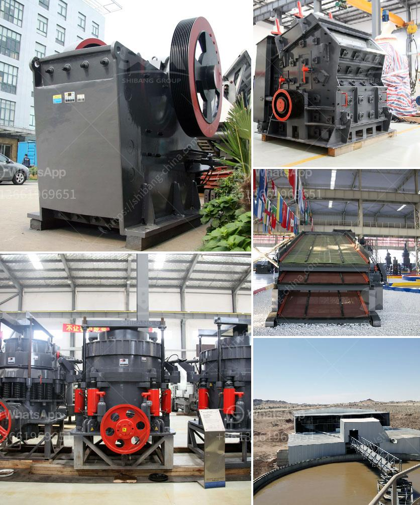

<h3>gold mining equipment for sale in egypt</h3>
Gold has been a valuable resource for centuries. The ancient Egyptians used it to adorn their pharaohs and build extravagant tombs. Today, gold is still highly sought after and plays a significant role in various industries, including jewelry, electronics, and finance. As a result, gold mining continues to be a lucrative and thriving business.

Egypt, known for its rich history and ancient civilization, has a substantial reserve of untapped gold deposits. With the increase in global gold prices, there has been a surge in interest in Egypt's gold mining potential. As a result, the demand for gold mining equipment is on the rise.

Gold mining equipment is essential for anyone involved in the gold mining industry. These tools facilitate the extraction of gold from the earth's surface or its underground reserves. Whether you are mining gold as a professional miner or just an amateur enthusiast, it is crucial to have the right equipment for the job.

There is a wide range of gold mining equipment available for sale in Egypt. Some of the popular options include:

1. Trommel Screen: This equipment is essential for separating large rocks and debris from the gold-bearing ore. The trommel screen rotates, allowing the smaller-sized gold particles to pass through while the larger materials are discarded.

2. Centrifugal Concentrator: This device enables the extraction of fine gold particles that are often missed by other mining methods. It uses centrifugal force to separate the gold from the surrounding materials. This equipment is particularly useful in areas where gold is present in small concentrations.

3. Sluice Box: A sluice box is a long, narrow channel with riffles or bars designed to trap gold particles. It works based on the principle of gravity separation. As water flows through the sluice box, the heavier gold particles settle at the bottom while the lighter materials are flushed out.

4. Dredger: Dredging is a popular method for extracting gold in riverbeds or streams. A dredger is a floating platform equipped with a suction system that sucks up sediment and riverbed materials. The gold particles are then separated from the sediment using specialized equipment.

5. Gold Metal Detectors: Metal detectors are essential tools for prospectors, enabling them to locate buried gold deposits. These devices emit electromagnetic signals and detect changes in the surrounding magnetic field. They are highly sensitive and can detect even small traces of gold.

When considering gold mining equipment for sale in Egypt, it is vital to choose reliable and high-quality equipment from reputable suppliers. Look for equipment that is durable, easy to operate, and suits your specific needs. Additionally, consider the after-sales support and warranty options offered by the supplier.

Gold mining presents an incredible opportunity for individuals and companies to tap into Egypt's vast gold reserves. However, success in this industry heavily relies on having the right equipment. By investing in top-quality gold mining equipment, you can maximize your chances of success and ensure that you extract the most value from Egypt's untapped gold deposits.
<h3>Contact us</h3><ul><li><strong>Whatsapp:&nbsp;<a href="https://wa.me/8613661969651">+8613661969651</a></strong></li><li><a href="https://swt.shibang-china.com/?git&amp;zhl&amp;gold mining equipment for sale in egypt"><strong>Online Service(chat now)</strong></a></li></ul><h3>Related</h3><ul><li><a href='plant for manufacturing of wet ground calcium carbonate.md'>plant for manufacturing of wet ground calcium carbonate</a></li><li><a href='simple gold mining machinery with prices.md'>simple gold mining machinery with prices</a></li><li><a href='nigeria jaw crusher.md'>nigeria jaw crusher</a></li><li><a href='mobile crusher in fiji.md'>mobile crusher in fiji</a></li><li><a href='mobile quarry plant.md'>mobile quarry plant</a></li></ul>