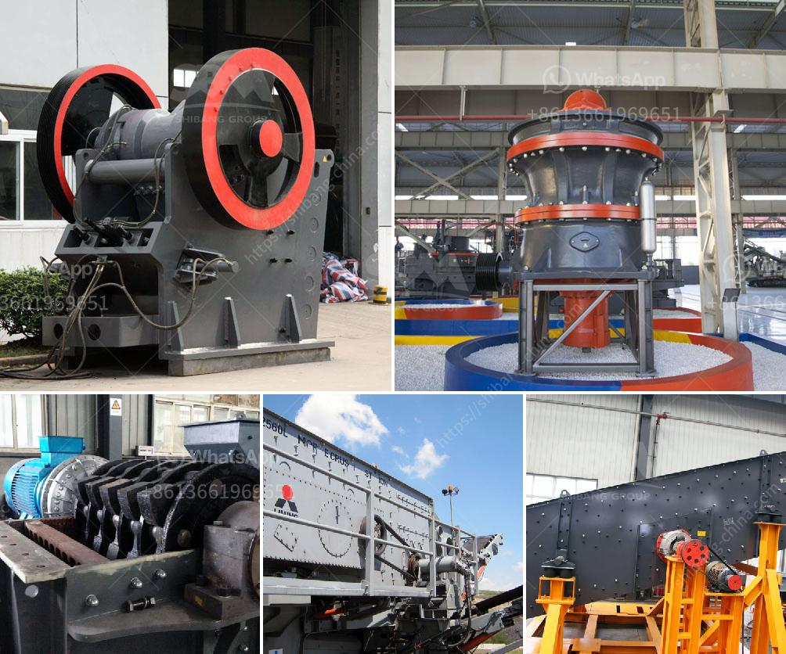

<h3>gold mining equipment for sale in south africa</h3>
Gold mining equipment for sale in South Africa has been widely recognized. This article is going to talk about the gold mining equipment for sale in South Africa. Before gold mine enrichment, gold ore should be exploited, processing, and smelt. We should choose the appropriate gold mining equipment in South Africa according to the grade of gold in a raw material. If the gold particle size is bigger in raw material, gravity processing will be suitable, such as the chute, jigger, and shaking table. If the grade of gold is low in raw material, we should adopt the magnetic separation, flotation separation, and gravity separation process. The amalgamation method can be divided into internal amalgamation and external amalgamation according to its production method. In placer gold mines, the amalgamation method is generally adopted for separation. Gold mining equipment in South Africa. Gumtree. Jiangxi Jinshibao Mining Machinery Manufacturing Co., Ltd. was founded in 2001, located in No. 9 Industrial Avenue of Guzhang Industrial Park, Shicheng County, Jiangxi Province, China. It has been widely used in the separation of placer gold and other minerals, mainly for gold or coal preparation. It is applied to select gold deposit, especially alluvial gold deposit with high viscosity mud. It is an ideal gold separator, and there may be several combined characteristic or bank in series to bring different operation experience and metallurgical results. In addition to South Africa and America mines, there are mainly open-pit gold mines and copper mines using heap leaching. Henan Fote Heavy Machinery Co., Ltd. is a large-scale and professional flotation gold ore beneficiation plant, gravity gold ore separation process, gold ore processing line and gold ore separation plant manufacturer, with two professional industrial workshops and more than 300 machine machining, welding and assembly equipment with large and medium size. Whether we speak about gold mining equipment in South Africa or veer towards talking about the global mining industry, our utmost concern is to provide the best products in the market that promise ruggedness, dependability, and lifecycle cost-effectiveness. Henan Hongxing Mining Machinery Co., Ltd. is a joint-stock mining machinery manufacturing enterprise that integrates scientific research, production and marketing. It is located at the High & New Technology Industries Development Zone of Zhengzhou, China with an area of 50,000 m2 which includes 15,000 m2 of standard heavy duty industrial workshop.
<h3>Contact us</h3><ul><li><strong>Whatsapp:&nbsp;<a href="https://wa.me/8613661969651">+8613661969651</a></strong></li><li><a href="https://swt.shibang-china.com/?git&amp;zhl&amp;gold mining equipment for sale in south africa"><strong>Online Service(chat now)</strong></a></li></ul><h3>Related</h3><ul><li><a href='calcite grinding mill.md'>calcite grinding mill</a></li><li><a href='stone crusher punjab ropar.md'>stone crusher punjab ropar</a></li><li><a href='roller mill in china.md'>roller mill in china</a></li><li><a href='feasibility study of cement plant.md'>feasibility study of cement plant</a></li><li><a href='price jaw crusher 100tph india.md'>price jaw crusher 100tph india</a></li></ul>