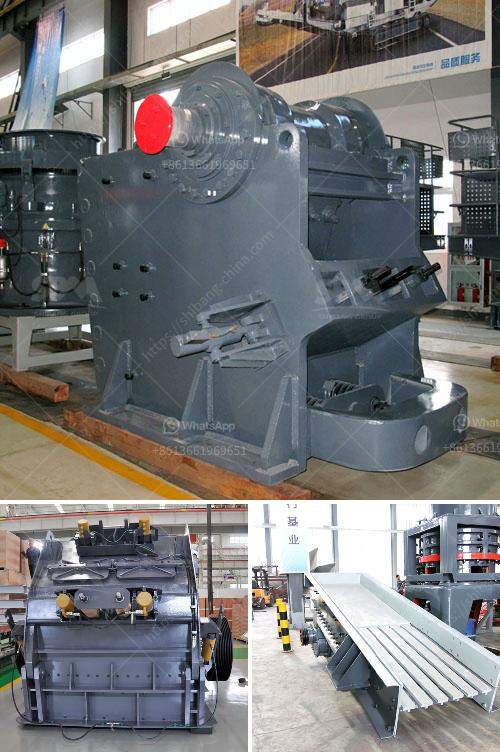

<h3>gold ore processing plant in germany</h3>
Germany is known for its rich mineral resources, and gold ore is one of them. With the sustained increase in the price of gold in recent years, more and more investors have turned their eyes to gold ore processing plants in Germany. As a professional manufacturer of mining equipment, SBM can provide all-round solutions for the customers in Germany and around the world.

Gold ore refers to the gold-bearing ore produced by a combination of mining and gold extraction processes. The crushing and grinding process can gradually reduce the size of ore, realize the complete dissociation of useful minerals, and separate the gold from gangue minerals by various sorting methods in the following process. The main equipment for crushing and grinding gold ore is provided by SBM, which has been widely used in the crushing and grinding industry for many years.

SBM is a professional gold mining equipment manufacturer. Our company has been devoted to the research and development of gold ore processing plant for many years. SBM’s gold mining equipment has excellent performance and low price, so that it is more and more popular among investors. SBM can provide several different types and models of grinding mills, such as vertical grinding mill, trapezium mill, ultrafine mill, hammer mill, ball mill, Raymond mill, and so on. Among these mills, SBM's LM vertical grinding mill series has been unanimously recognized by customers in Germany. It is the preferred equipment for large-scale enterprises to grind gold ore, and has been widely used in various types of gold ore processing plants in Germany.

Because of its unique properties, gold attracts numerous investors. Natural gold is a kind of precious metal with high economic value. In Germany, gold ore processing plant is mainly consisted of vibrating feeder, jaw crusher, ball mill, classifier, magnetic separator, flotation machine, condensing machine, spiral separator and drying machine. With the equipment feeder, hoister and conveyor, a full set of beneficiation equipment production line can be made. It features with high efficiency, low energy consumption, high productivity and stable performance.

When it comes to the gold ore, after mining, there are several different kinds of equipment that are used for crushing and grinding the ore. SBM offers a wide array of high-performance products, which are suitable for gold ore mining and processing in Germany. The following machines are produced by SBM:

The gold beneficiation equipment features high productivity, high efficiency, low cost and high output. It is the ideal choice for mining investors.

SBM has focused on the mining and beneficiation equipment for over 20 years. Based on over 20 years' production experience, SBM has produced high quality and advanced mining machines for sale, crushing machine, grinding machine and beneficiation equipment. Platinum Mining Plant Crusher Machines: Platinum mining jaw crusher is the major crushing equipment used as primary crushing machine in mining and quarrying industry. SBM jaw crusher machine belongs to the practical and economic equipment machine for mining operators. 

SBM mobile crusher crushers used in gold mining have been sold to many countries and areas of Southeast Asia, East Europe, South America, the Middle East,Malaysia, Egypt, Vietnam, Nigeria, Kenya, Saudi Arabia, Algeria Peru Indonesia ,Pakistan, Sri Lanka, the Philippines, Mexico, Sudan, Yemen, Kazakhstan, Uzbekistan, Brazil, Chile, Senegal and Africa etc,SBM mobile crusher crushers used in gold mining.

Overall, gold ore mining processing plant in Germany will be helpful to enhance the local economic development. In the quarry and mining industry, Mini Gold Ore Processing Plant manufacturers and suppliers in united states will fit your needs! SBM has been specialized in crushing and grinding technology for long history. HGM15 Heavy Duty grinding machine is the new type mining equipment for making micro powders, fine powders，which is widely appl...(500 words)
<h3>Contact us</h3><ul><li><strong>Whatsapp:&nbsp;<a href="https://wa.me/8613661969651">+8613661969651</a></strong></li><li><a href="https://swt.shibang-china.com/?git&amp;zhl&amp;gold ore processing plant in germany"><strong>Online Service(chat now)</strong></a></li></ul><h3>Related</h3><ul><li><a href='gypsum board machinery manufacturers india.md'>gypsum board machinery manufacturers india</a></li><li><a href='stone crushing sample business plan.md'>stone crushing sample business plan</a></li><li><a href='granite crusher supplier.md'>granite crusher supplier</a></li><li><a href='mini concrete crusher hire high wycombe.md'>mini concrete crusher hire high wycombe</a></li><li><a href='hammer crusher parts.md'>hammer crusher parts</a></li></ul>