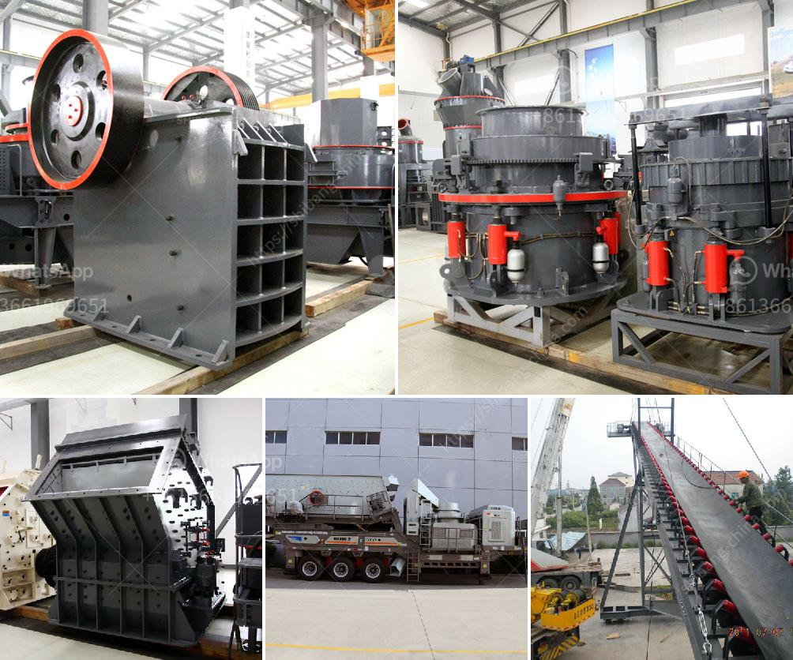

<h3>gold sand processing technology</h3>
Gold sand processing technology refers to the extraction of gold from beach or river sand. The presence of gold particles and their high density makes separation methods relatively easy, resulting in gold-rich concentrates. These concentrates can then be further processed to obtain pure gold.

One of the commonly used techniques for gold sand processing is gravity separation. This method exploits the difference in density between gold particles and other materials present in the sand. To achieve this, the sand is mixed with water, creating a slurry. Various equipment such as sluice boxes, jigs, or shaking tables are then used to separate the heavier gold particles from the lighter materials. This process is effective in recovering coarse gold particles.

Another widely used technique is gold cyanidation. This involves dissolving the gold particles in a solution of sodium cyanide. The gold molecules form a complex with the cyanide ions, allowing them to be easily separated. However, gold cyanidation can be environmentally harmful if not managed properly, as cyanide is toxic to many living organisms.

More advanced gold sand processing technologies involve flotation and leaching. Flotation is a process in which gold particles are selectively attached to air bubbles, allowing for their separation from other materials. Leaching involves treating the gold-rich concentrate with chemicals such as cyanide or thiosulfate, which dissolve the gold particles for further extraction.

In recent years, advancements in technology have led to the development of more sustainable and environmentally friendly gold sand processing methods. For example, researchers have explored the use of bioleaching, in which bacteria or fungi are used to dissolve gold particles from the sand. This eliminates the need for harsh chemicals and reduces the impact on the environment.

In conclusion, gold sand processing technology has evolved over the years, providing various methods for extracting gold from beach or river sand. These methods include gravity separation, cyanidation, flotation, and leaching. The choice of technique depends on factors such as the size of the gold particles, environmental considerations, and the level of purity desired. As technology continues to advance, it is expected that more efficient and sustainable methods will be developed, further improving the gold sand processing industry.
<h3>Contact us</h3><ul><li><strong>Whatsapp:&nbsp;<a href="https://wa.me/8613661969651">+8613661969651</a></strong></li><li><a href="https://swt.shibang-china.com/?git&amp;zhl&amp;gold sand processing technology"><strong>Online Service(chat now)</strong></a></li></ul><h3>Related</h3><ul><li><a href='talcum powder grinding machine in kerala.md'>talcum powder grinding machine in kerala</a></li><li><a href='usa used equipment grinding mill minerals 3 tph 200 mesh.md'>usa used equipment grinding mill minerals 3 tph 200 mesh</a></li><li><a href='gypsum production equipments in philippines.md'>gypsum production equipments in philippines</a></li><li><a href='aggregate washing machine.md'>aggregate washing machine</a></li><li><a href='gold sand processing technology.md'>gold sand processing technology</a></li></ul>