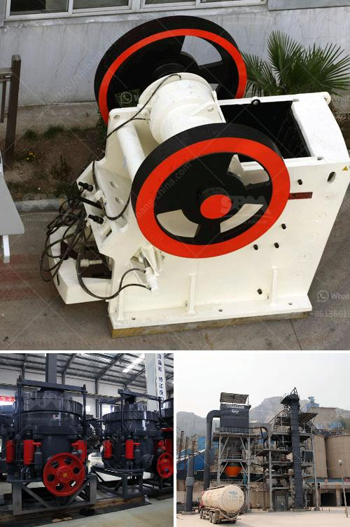

<h3>gold screening equipment</h3>
Gold mining has been a highly sought-after industry for hundreds of years, with people venturing into remote regions in search of this precious metal. However, with the increase in demand and the depletion of easily accessible deposits, mining companies have had to develop innovative methods to extract gold efficiently. One such method is the use of gold screening equipment, which has revolutionized the industry by improving gold recovery rates and reducing the environmental impact of mining.

Gold screening equipment is specifically designed to separate gold particles from dirt, rocks, and other materials found in mining sites. This equipment is not only crucial for the efficient extraction of gold but also ensures that no gold is wasted during the process. There are several types of gold screening equipment available in the market, each offering unique features and advantages.

One commonly used equipment is the trommel screen, which consists of a cylindrical drum with perforated walls. As the drum rotates, the material to be screened is fed into it, and the gold particles are separated from the larger rocks and debris. The trommel screen is highly efficient, producing large quantities of screened material in a short amount of time. It is particularly useful in alluvial gold mining, where gold particles are usually found in riverbeds or stream sediments.

Another popular type of gold screening equipment is the vibrating screen. This equipment utilizes vibrations to separate gold particles from other materials. The vibrating screen consists of multiple layers of screens with different-sized openings, allowing the gold particles to pass through while the larger rocks and debris are retained. Vibrating screens are versatile and can be used in various mining environments, including both alluvial and hard rock mining.

Gold screening equipment can also come in the form of sluice boxes or gold pans. These traditional tools have been used for centuries and are still widely used today due to their simplicity and effectiveness. Sluice boxes consist of a long trough-like box with riffles or grooves along the bottom. Water is continuously flowing through the box, washing away dirt and rocks while allowing gold particles to settle in the riffles. Gold pans, on the other hand, are handheld shallow pans that are manually agitated to separate gold particles from dirt.

Modern gold screening equipment often incorporates advanced features to enhance efficiency and accuracy. Some equipment is equipped with oscillating mechanisms that shake the screens, enabling better separation and preventing blockages. Others are designed with self-cleaning mechanisms that prevent clogging and increase the lifespan of the equipment. Many gold screening equipment manufacturers also provide customizable options to suit specific mining needs.

In addition to the efficiency and effectiveness of gold screening equipment, it is essential to consider the environmental impact of gold mining. The use of screening equipment significantly reduces the need for chemical-intensive processing methods, such as cyanide leaching, which can be harmful to the environment. By using screening equipment to separate gold particles, mining companies can minimize the amount of material sent to processing plants, thereby reducing energy consumption and waste generation.

Gold screening equipment has revolutionized the gold mining industry, allowing for more efficient and sustainable gold extraction. With various types of equipment available, mining companies can choose the most suitable option for their specific needs. By investing in high-quality gold screening equipment, companies can maximize gold recovery rates while minimizing environmental impacts, ensuring a more sustainable and responsible approach to gold mining.
<h3>Contact us</h3><ul><li><strong>Whatsapp:&nbsp;<a href="https://wa.me/8613661969651">+8613661969651</a></strong></li><li><a href="https://swt.shibang-china.com/?git&amp;zhl&amp;gold screening equipment"><strong>Online Service(chat now)</strong></a></li></ul><h3>Related</h3><ul><li><a href='cebu supplier of disposable jaw crusher.md'>cebu supplier of disposable jaw crusher</a></li><li><a href='gemstone mining crusher in zambia.md'>gemstone mining crusher in zambia</a></li><li><a href='ballast processing machine.md'>ballast processing machine</a></li><li><a href='hammer crusher buhler miag titan.md'>hammer crusher buhler miag titan</a></li><li><a href='crusher type 600 tph.md'>crusher type 600 tph</a></li></ul>