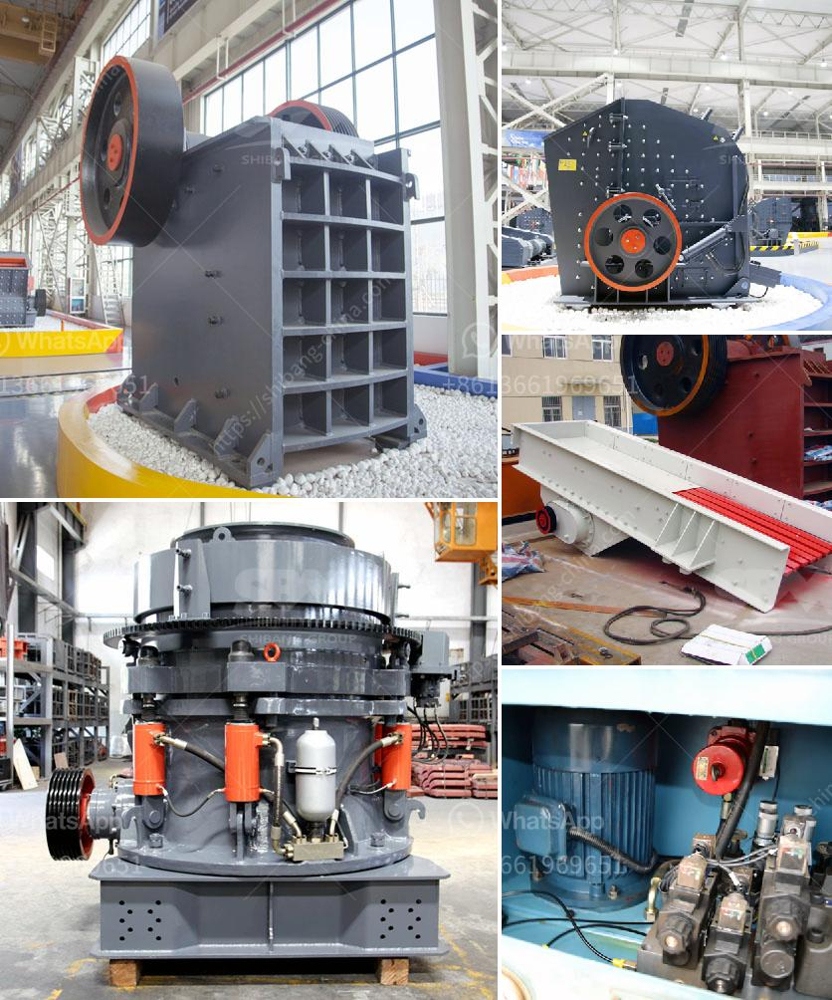

<h3>gold screening plant</h3>
In the world of mining, gold holds a special place due to its rarity, beauty, and high value. As one of the most sought-after precious metals, the process of extracting gold demands reliable and effective machinery. Among the vital pieces of equipment used in the mining industry is the gold screening plant. This plant plays a critical role in efficiently processing and separating gold-bearing materials, ensuring maximum productivity and profitability for mining operations.

A gold screening plant is designed to sift and separate different sizes of materials. It is typically used in the early stages of gold extraction processes, where raw ore from mines is first broken down into smaller particles. These particles are then transported to the screening plant, where specialized machinery efficiently separates gold-bearing materials from unnecessary rocks, gravel, and other debris. The screened materials can then be transported to other processing units or allocated for further extraction processes, such as milling or leaching.

One of the primary benefits of a gold screening plant is its ability to enhance efficiency in mining operations. By eliminating unnecessary materials, such as rocks and debris, the plant speeds up the process of gold extraction. This ensures that valuable gold particles are swiftly identified and separated for further processing, while undesired materials are discarded. By streamlining this separation process, mining operations can significantly increase their overall productivity, resulting in higher gold yields and profitability.

Another advantage of utilizing a gold screening plant is its versatility. These plants are capable of screening various types of materials, including gravel, sand, and ore. This versatility is crucial for managing different mining sites, each with its own unique geological characteristics. With the ability to adapt to diverse materials, a gold screening plant becomes an invaluable asset for mining operations, regardless of their scale or location.

Moreover, a gold screening plant is designed to withstand harsh environmental conditions often encountered in mining sites. Built with sturdy construction materials, it can endure extreme temperatures, heavy loads, and relentless vibrations. This durability ensures that the plant operates reliably, minimizing downtime and maintenance costs. Additionally, some screening plants can be mounted on wheeled or tracked frames, enabling easy mobility between mining sites, further optimizing the functionality and efficiency of the machinery.

In conclusion, a gold screening plant is an essential piece of equipment for efficient mining operations. Its primary role in separating gold-bearing materials from unwanted particles significantly enhances the productivity and profitability of mining ventures. Through its ability to adapt to various materials and withstand harsh mining conditions, a screening plant becomes a valuable asset for the extraction of gold. Thus, investing in a reliable and advanced gold screening plant is a wise choice for both large-scale mining companies and individual miners aiming to optimize their operations and maximize their gold yields.
<h3>Contact us</h3><ul><li><strong>Whatsapp:&nbsp;<a href="https://wa.me/8613661969651">+8613661969651</a></strong></li><li><a href="https://swt.shibang-china.com/?git&amp;zhl&amp;gold screening plant"><strong>Online Service(chat now)</strong></a></li></ul><h3>Related</h3><ul><li><a href='nigeria portable crushers.md'>nigeria portable crushers</a></li><li><a href='caterpillar stone crusher.md'>caterpillar stone crusher</a></li><li><a href='tertiary stone crusher.md'>tertiary stone crusher</a></li><li><a href='crusher philippines.md'>crusher philippines</a></li><li><a href='stone crushers in belen.md'>stone crushers in belen</a></li></ul>