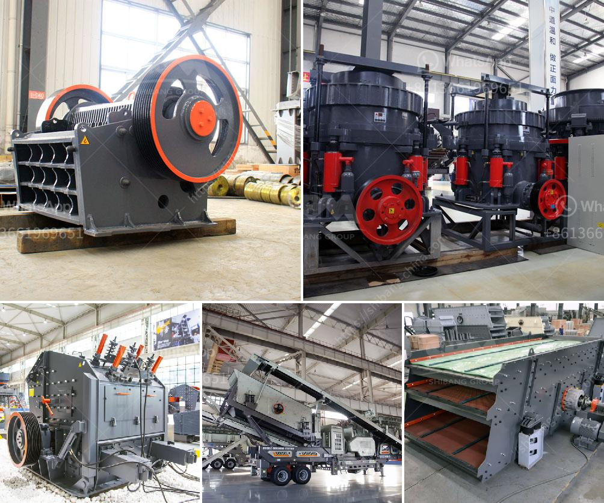

<h3>gold shaker wash plant trommel for sale used new</h3>
Gold mining is a lucrative business that attracts many investors, both big and small, from around the world. While gold deposits can be found in various locations, extracting this precious metal requires specialized equipment and techniques. One such equipment is the gold shaker wash plant trommel.

A gold shaker wash plant trommel is designed to separate gold particles from other materials such as sand, gravel, and clay. It has different sections, including a hopper, a drum with a screen, and an outlet for collecting the gold. The trommel is powered by a motor, which rotates the drum, allowing the water and materials to mix.

One significant advantage of using a gold shaker wash plant trommel is its ability to process large volumes of materials quickly. The hopper at the beginning of the trommel allows users to dump a significant amount of materials at once, saving time and effort. Additionally, the rotating drum agitates the mixture, ensuring an efficient separation of gold particles from the rest.

The trommel's screen is an essential component that classifies the materials based on their size. The screen's holes are strategically positioned to allow smaller materials, such as gold particles, to pass through while larger particles are retained. This step ensures that only desirable materials are collected at the outlet, reducing wastage.

Investing in a used or new gold shaker wash plant trommel can be a cost-effective solution for gold miners. Used trommels can be significantly cheaper compared to buying new ones, allowing miners to save on equipment costs. However, it is important to thoroughly inspect the used trommel to ensure that it is in good condition and capable of performing efficiently. Working with reputable sellers or dealers can help minimize the risks associated with purchasing used equipment.

On the other hand, buying a new gold shaker wash plant trommel guarantees the latest technological features and improvements. Manufacturers constantly innovate to enhance the efficiency and effectiveness of their trommels. Investing in a new trommel can provide peace of mind regarding its reliability and performance, especially for miners who heavily rely on this equipment.

When purchasing a gold shaker wash plant trommel, it is crucial to consider the specific needs and requirements of the mining operation. Factors such as the site's geology, expected production volume, and budget should be taken into account. Additionally, considering the ease of maintenance and availability of spare parts is essential to ensure uninterrupted operation.

In conclusion, a gold shaker wash plant trommel is an essential piece of equipment for gold miners. Its ability to quickly process large volumes of materials and efficiently separate gold particles makes it an invaluable tool in gold mining operations. Whether purchasing a used or new trommel, miners should thoroughly evaluate their options and consider their specific needs to make an informed decision.
<h3>Contact us</h3><ul><li><strong>Whatsapp:&nbsp;<a href="https://wa.me/8613661969651">+8613661969651</a></strong></li><li><a href="https://swt.shibang-china.com/?git&amp;zhl&amp;gold shaker wash plant trommel for sale used new"><strong>Online Service(chat now)</strong></a></li></ul><h3>Related</h3><ul><li><a href='dolomite stone crusher plant.md'>dolomite stone crusher plant</a></li><li><a href='crossley economy x ball mill.md'>crossley economy x ball mill</a></li><li><a href='marble powder 100 mesh grinding machine.md'>marble powder 100 mesh grinding machine</a></li><li><a href='ball mill design calculation pdf.md'>ball mill design calculation pdf</a></li><li><a href='fly ash grinding mill.md'>fly ash grinding mill</a></li></ul>