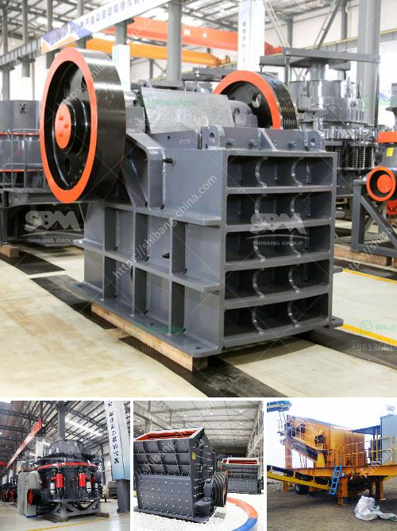

<h3>gold stone crusher machine south africa</h3>
Stone crusher machines have an important role in the mining industry in South Africa. With the development of mining and construction industry, there are more and more stone crusher machines manufactured in South Africa. In these machines, gold ore crusher machines are the most widely used. They are also produced and sold in South Africa.

Gold stone crusher machines have many different types, such as jaw crusher, cone crusher, impact crusher, hammer crusher and mobile crusher and so on. Different kinds of crusher machines have been produced to satisfy various clients' production needs. Jaw crusher, cone crusher, impact crusher, hammer crusher and mobile crusher machines are usually used as the main crushing equipment in gold processing plants.

Gyratory crusher is also a popular gold stone crusher in South Africa. Gyratory crusher's productivity is higher than jaw crusher's. The main reason is that gyratory crushers have effective working principles. Iron ore crushing plant in South Africa and gold ore processing plant are particularly popular, and the immense benefits they bring.

The stone crusher machines produced in South Africa have excellent performance in processing various kinds of stones in the processing line. In South Africa, gold ore mining site, it will need the general gold ore crusher machine and the gold ore washing machine.

Raw materials will be crushed into fine powder size and the washing machine can clean the final gold ore materials. Stone crusher machines refer to those crushing machines which have been widely used in various industries.

Several factors are pivotal to the success of a stone crusher machine business. These include adequate capital, investment, infrastructure facilities, machinery availability, and manpower. To gain maximum profitability, these factors must be addressed.

South Africa has been attracting various investors across the world. The mining sector has been playing a crucial role in the country's economy. With the abundant mineral resources, especially gold ore, South Africa has attracted lots of gold stone crusher machine investors.

As a professional mining manufacturer in China, SBM Company can provide advanced and high efficient stone crusher machines for the South Africa gold stone crusher machine market, customers who have used SBM machines, all spoke highly of SBM machines. SBM Company crushing machine can be divided into jaw crusher, impact crusher, cone crusher, vertical shaft impact crusher.

With the development of South Africa there are more and more customers invest in mining, and SBM Company is a professional manufacturer of mining equipment, our customers spoke highly of SBM machines. If you want to invest in gold ore mining industry, choose SBM high quality stone crusher machines.

In conclusion, the stone crusher machine plant consists of vibrating feeder, jaw crusher, cone crusher, impact crusher, vibrating screen, belt conveyor, and electric control panel etc. SBM is a professional gold mining machine, gold stamp mill manufacturer in China. With high quality and reasonable price, our products have been exported to over 80 countries.
<h3>Contact us</h3><ul><li><strong>Whatsapp:&nbsp;<a href="https://wa.me/8613661969651">+8613661969651</a></strong></li><li><a href="https://swt.shibang-china.com/?git&amp;zhl&amp;gold stone crusher machine south africa"><strong>Online Service(chat now)</strong></a></li></ul><h3>Related</h3><ul><li><a href='granite crusher supplier.md'>granite crusher supplier</a></li><li><a href='bentonite processing plant quotation.md'>bentonite processing plant quotation</a></li><li><a href='price of a vibrating screen.md'>price of a vibrating screen</a></li><li><a href='gypsum powder production plant ppt.md'>gypsum powder production plant ppt</a></li><li><a href='cement vertical roller mill price in india.md'>cement vertical roller mill price in india</a></li></ul>