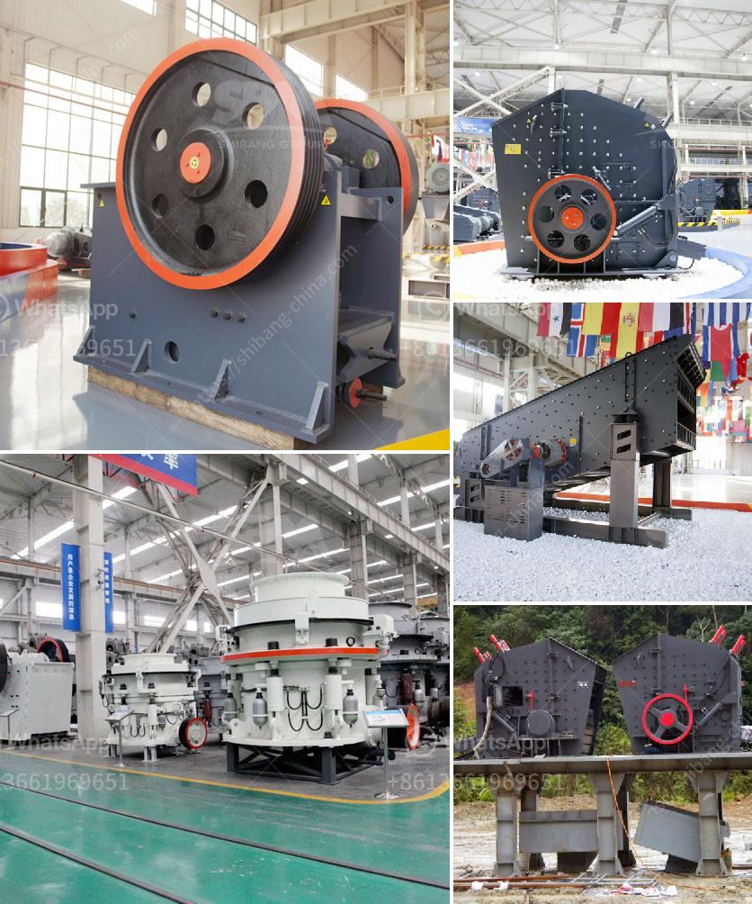

<h3>gold wash plant trommel for sale in dubai</h3>
Gold mining in Dubai has been on the rise in recent years, with both small-scale mining and large-scale mining operations finding success in the region. The gold wash plant trommel is widely considered to be a popular gold washing and concentration machine, allowing small-scale and large-scale miners alike to efficiently extract gold from placer deposits.

Dubai, known for its modern skyline and luxurious lifestyle, might not be the first place that comes to mind when thinking about gold mining. However, the United Arab Emirates, of which Dubai is a part, has a rich history of gold mining dating back to ancient times. Today, gold mining in Dubai is a thriving industry, contributing significantly to the country's overall economy.

One of the key pieces of equipment used in gold mining operations is the gold wash plant trommel. This machine is designed to wash and separate the gold-bearing gravel from the rest of the material, allowing miners to recover gold particles of varying sizes. The Trommel screen consists of a revolving cylindrical drum that is tilted slightly at an angle. As the material enters the drum, it is spun and the water and wetted material are washed through the screen, leaving the gold particles to be collected in a sluice box or pan.

The gold wash plant trommel for sale in Dubai is mainly composed of a motor, a reducer, a drum assembly, a frame, a sealing cover, and an inlet and outlet. The drum assembly is mounted on the frame at an inclined angle and can be rotated around its axis. The motor and reducer are connected by a coupling, which drives the drum assembly to rotate.

The drum assembly of the trommel has various sizes of perforated screens, which can be changed to suit different gold recovery requirements. When the gold-bearing gravel enters the drum, it is washed and classified by size. The smaller particles pass through the screens and are collected in a sluice box or pan, while the larger particles are discharged at the end of the drum.

In Dubai, where gold mining has become a lucrative business, the gold wash plant trommel is in high demand. Both small-scale miners and large-scale mining companies rely on this machine to efficiently extract gold from placer deposits. The trommel's ability to wash and separate gold particles of varying sizes makes it an essential tool in gold recovery operations.

As the demand for gold continues to rise, the gold wash plant trommel for sale in Dubai provides an excellent opportunity for those interested in investing in the gold mining industry. With its efficient gold recovery capabilities and robust construction, this machine is designed to withstand the rigors of gold mining, ensuring a reliable and profitable operation.

In conclusion, the gold wash plant trommel for sale in Dubai is a valuable asset in the gold mining industry. Its ability to wash and separate gold particles of varying sizes makes it an essential tool for any gold recovery operation. Whether you are a small-scale miner or a large-scale mining company, investing in a gold wash plant trommel can help maximize your gold extraction and ensure a profitable venture in the gold mining industry.
<h3>Contact us</h3><ul><li><strong>Whatsapp:&nbsp;<a href="https://wa.me/8613661969651">+8613661969651</a></strong></li><li><a href="https://swt.shibang-china.com/?git&amp;zhl&amp;gold wash plant trommel for sale in dubai"><strong>Online Service(chat now)</strong></a></li></ul><h3>Related</h3><ul><li><a href='list of used machines coal mining.md'>list of used machines coal mining</a></li><li><a href='lime and dolomite plant division.md'>lime and dolomite plant division</a></li><li><a href='smallest mobile jaw crusher for sale south africa.md'>smallest mobile jaw crusher for sale south africa</a></li><li><a href='ballast crusher cost.md'>ballast crusher cost</a></li><li><a href='ball crusher gold machine.md'>ball crusher gold machine</a></li></ul>