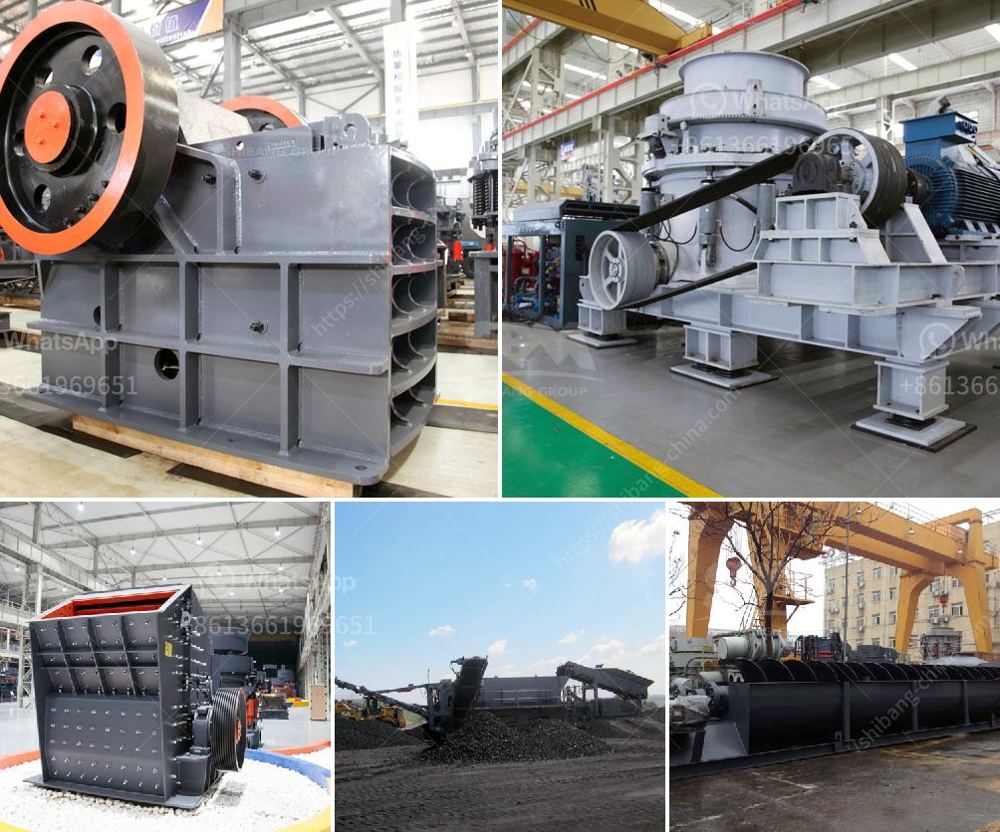

<h3>gold wash plants for sale in south africa</h3>
Gold mining in South Africa has been the main driving force behind the history and development of Africa's most advanced and richest economy. Large scale and profitable mining started with the discovery of a diamond on the banks of the Orange River in 1867 by Erasmus Jacobs and the subsequent discovery and exploitation of the Kimberley pipes, a few years later.

Gold mining in South Africa typically involves methods such as panning, sluicing, dredging, hard rock mining, and by-product mining. For most effective gold mining in South Africa, the method used is hard rock mining, since reserves are typically fully encased in rock deep underground. The invention of industrial air cooling and air quality control systems saw gold mines reach unprecedented depths. Now, gold mining in South Africa is done by the underground mining method, and gold mining in general requires several processes to be carried out, such as crushing, grinding, screening, washing, and separating.

Gold wash plants for sale in South Africa, also known as a trommel scrubber, is critical for gold processing. It is used to remove impurities such as dust and mud, resulting in a higher gold recovery rate. The trommel scrubber is also known as a washing trommel, scrubber trommel, or drum scrubber trommel.

Trommel gold wash plant for sale is the main equipment used in the whole gold ore processing line in South Africa. The machine is designed for mining, crushing, screening, and washing of gold-bearing minerals. And the compact structure of the trommel gold wash plant makes it quite easy to operate and maintain.

Gold wash plants for sale in South Africa are widely used in highway, railway, mineral, hydropower engineering, building materials, municipal waste treatment and other industries. They are ideal equipment for gold mining and beneficiation operations.

Gold wash plants for sale in South Africa has a large production capacity, processing capacity of gold-bearing minerals of 50-500 tons/hour, and the feed size of 0-850mm. The device has a reliable performance, high working efficiency, and convenient operation, which is the ideal equipment for the beneficiation of alluvial gold ore and fine-grained gold ore.
<h3>Contact us</h3><ul><li><strong>Whatsapp:&nbsp;<a href="https://wa.me/8613661969651">+8613661969651</a></strong></li><li><a href="https://swt.shibang-china.com/?git&amp;zhl&amp;gold wash plants for sale in south africa"><strong>Online Service(chat now)</strong></a></li></ul><h3>Related</h3><ul><li><a href='philippine limestone crusher for calcium carbonate.md'>philippine limestone crusher for calcium carbonate</a></li><li><a href='impact crushers nigeria.md'>impact crushers nigeria</a></li><li><a href='raymond mill for sale second hand.md'>raymond mill for sale second hand</a></li><li><a href='mini concrete crusher.md'>mini concrete crusher</a></li><li><a href='mining equipment for sale zimbabwe.md'>mining equipment for sale zimbabwe</a></li></ul>