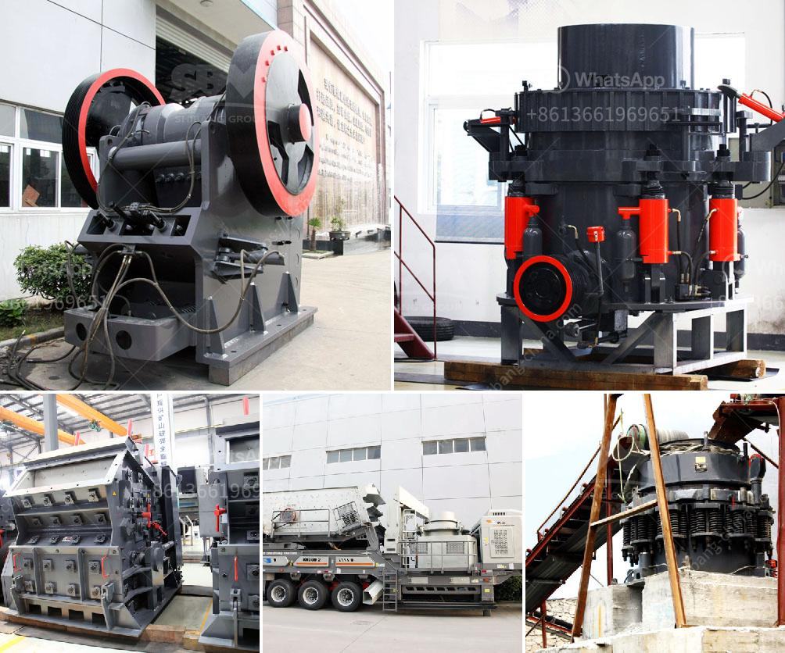

<h3>granite crusher in kenya</h3>
Granite is a common type of volcanic rock that is found in abundance in many parts of Kenya. It forms through the slow crystallization of magma below the Earth's surface. Granite is known for its durability, strength, and aesthetic appeal, making it a popular choice for construction purposes.

In Kenya, granite countertops are one of the most sought-after features in modern homes. They add elegance and a touch of luxury to any space, whether it's a kitchen island, bathroom vanity, or bar counter. However, to achieve the perfect granite countertops, one needs to invest in a reliable and efficient granite crusher.

A granite crusher is one of those important pieces of equipment in the construction industry that plays a vital role in transforming large rocks into small particles, which are then used in various construction projects. Granite crusher acts as a powerful source of innovation and facilitates the processing of raw granite quickly and efficiently.

One of the outstanding granite crushers in Kenya is the hydraulic granite crusher. It comes in a unique design that allows for easy operation and maintenance, making it a favorite choice among various construction professionals. The hydraulic granite crusher also boasts a high crushing capacity, reducing the amount of time and energy required to break down granite rocks.

Another popular granite crusher in Kenya is the jaw crusher. This type of crusher is commonly used in primary crushing and is capable of crushing large rocks into small particles. Jaw crushers are often used in construction projects due to their ability to crush tough and abrasive materials.

Additionally, the cone crusher is also widely used when it comes to crushing granite rocks. Its design allows for a steady and efficient crushing process, delivering optimal results in terms of particle size and overall quality. Cone crushers are often preferred for their ability to produce finely crushed granite that can be used in various construction applications.

Apart from these types of crushers, there are also other equipment, such as impact crushers and vertical shaft impact crushers, which are efficient in crushing granite into smaller particles. These crushers are known for their strong impact force, making them suitable for breaking down even the toughest granite rocks.

In conclusion, granite crushers in Kenya play a crucial role in the construction industry. They enable the processing of raw granite into smaller particles, which can be used in various construction projects such as building foundations, road construction, and decorative stone applications. The availability of different types of granite crushers, such as hydraulic crushers, jaw crushers, and cone crushers, ensures that construction professionals can find the most suitable equipment for their specific needs. With the help of these efficient and powerful crushers, Kenya can continue to benefit from the abundance of granite resources and create beautifully crafted, durable, and elegant structures.
<h3>Contact us</h3><ul><li><strong>Whatsapp:&nbsp;<a href="https://wa.me/8613661969651">+8613661969651</a></strong></li><li><a href="https://swt.shibang-china.com/?git&amp;zhl&amp;granite crusher in kenya"><strong>Online Service(chat now)</strong></a></li></ul><h3>Related</h3><ul><li><a href='looking for hammer mill.md'>looking for hammer mill</a></li><li><a href='mobile crusher machine.md'>mobile crusher machine</a></li><li><a href='grinding machine specification india price.md'>grinding machine specification india price</a></li><li><a href='suppliers of conveyor belts in south africa.md'>suppliers of conveyor belts in south africa</a></li><li><a href='cost of crusher machine in ethiopia.md'>cost of crusher machine in ethiopia</a></li></ul>