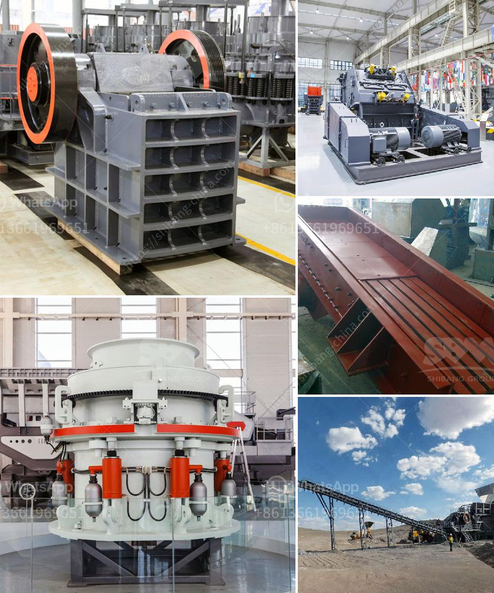

<h3>granite crusher supplier</h3>
Granite is an igneous rock formed from the slow cooling of magma beneath the Earth's surface. Its unique patterns and durability make it a popular choice for countertops, flooring, and other decorative purposes. However, to transform raw granite into usable construction material requires the expertise and assistance of a reliable granite crusher supplier.

A granite crusher supplier plays a vital role in the granite quarrying and mining industry. There are various types of crushers used in the granite crushing process, including jaw crushers, cone crushers, vertical shaft impact crushers, and hammer crushers. Each type of crusher has different specifications and can be used to crush different types of granite.

When selecting a granite crusher supplier, it is important to consider factors such as the company's reputation, experience in the industry, and the quality of their crushers. A reputable supplier will have a proven track record of providing reliable and efficient crushers that can withstand the demands of granite crushing.

One such reputable granite crusher supplier is XYZ Company. With over a decade of experience in the industry, XYZ Company has established itself as a trusted name in providing high-quality crushers for granite crushing. Their crushers are built with precision engineering and superior materials to ensure durability and optimal performance.

In addition to high-quality crushers, XYZ Company also offers comprehensive after-sales service, including installation, maintenance, and spare parts support. This ensures that customers can rely on XYZ Company for all their granite crushing needs throughout the lifespan of their crushers.

Furthermore, XYZ Company has a wide range of crushers to meet the specific requirements of different customers. Whether it is a small-scale granite crushing project or a large-scale quarry operation, XYZ Company has the expertise and equipment to meet the needs of every customer.

In conclusion, a granite crusher supplier is essential in the granite quarrying and mining industry. Choosing a reputable supplier like XYZ Company ensures access to high-quality crushers, reliable after-sales service, and a wide range of options. With their expertise and commitment to customer satisfaction, XYZ Company is an ideal choice for anyone in need of a granite crusher supplier.
<h3>Contact us</h3><ul><li><strong>Whatsapp:&nbsp;<a href="https://wa.me/8613661969651">+8613661969651</a></strong></li><li><a href="https://swt.shibang-china.com/?git&amp;zhl&amp;granite crusher supplier"><strong>Online Service(chat now)</strong></a></li></ul><h3>Related</h3><ul><li><a href='quarry stone for sale in malta.md'>quarry stone for sale in malta</a></li><li><a href='jaw and cone crusher.md'>jaw and cone crusher</a></li><li><a href='grinding mill price.md'>grinding mill price</a></li><li><a href='stone crusher kenya.md'>stone crusher kenya</a></li><li><a href='bentonite processing machinery.md'>bentonite processing machinery</a></li></ul>