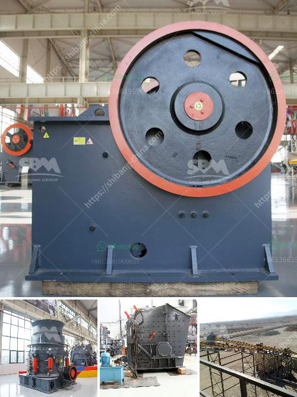

<h3>granite feeding equipment manufacturer</h3>
Granite is one of the most durable and attractive natural stones, making it a popular choice for various applications such as countertops, flooring, and cladding. However, working with granite requires specialized equipment to ensure precision and efficiency in the fabrication process. This is where granite feeding equipment manufacturers play a crucial role in the industry.

A reputable granite feeding equipment manufacturer understands the specific requirements of working with granite and develops state-of-the-art machinery to meet those needs. Their equipment is designed with precision cutting and feeding mechanisms to ensure smooth and accurate operations. From cutting slabs to shaping and polishing, these manufacturers offer a comprehensive range of machinery that enhances productivity and reduces wastage.

One of the key advantages of working with a specialized granite feeding equipment manufacturer is their expertise and knowledge in the field. They understand the unique challenges and complexities involved in granite fabrication, including its hardness, uneven surfaces, and potential for breakage. With this understanding, they can develop innovative solutions that address these issues, resulting in improved efficiency and higher quality end products.

Moreover, a reliable granite feeding equipment manufacturer focuses on durability and safety. They use high-quality materials and cutting-edge technologies to develop robust machinery that can withstand the demands of heavy-duty operations. Safety features such as emergency stop buttons, automated sensors, and protective covers ensure a secure working environment for operators.

In addition to manufacturing top-of-the-line equipment, these companies also provide after-sales support and technical assistance. This ensures that their customers receive ongoing guidance and expertise, maximizing the performance and longevity of their machinery.

In conclusion, a reputable granite feeding equipment manufacturer is an essential partner for any granite fabrication business. Their expertise, quality equipment, and commitment to customer service contribute to the overall success of the industry. By investing in reliable machinery, businesses can enhance their productivity, improve product quality, and ultimately, satisfy their customers' needs.
<h3>Contact us</h3><ul><li><strong>Whatsapp:&nbsp;<a href="https://wa.me/8613661969651">+8613661969651</a></strong></li><li><a href="https://swt.shibang-china.com/?git&amp;zhl&amp;granite feeding equipment manufacturer"><strong>Online Service(chat now)</strong></a></li></ul><h3>Related</h3><ul><li><a href='equipment roller mill.md'>equipment roller mill</a></li><li><a href='mineral mining and processing plant in south africa.md'>mineral mining and processing plant in south africa</a></li><li><a href='small rock crushers in turkey.md'>small rock crushers in turkey</a></li><li><a href='crusher equipment for sale.md'>crusher equipment for sale</a></li><li><a href='chrome beneficiation plant design.md'>chrome beneficiation plant design</a></li></ul>