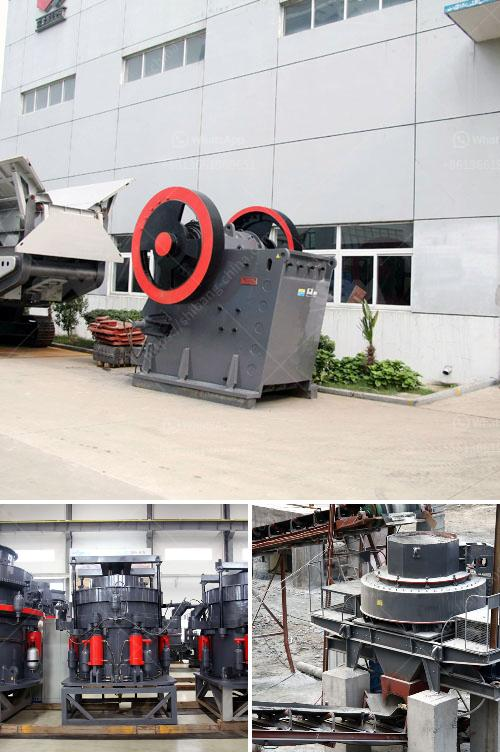

<h3>granite quarry business plan pdf</h3>
Granite quarry business is a lucrative business that needs strategic planning and adequate knowledge about the business. To start this business, you need to understand the operations and processes involved in a quarry. This business requires a considerable amount of capital, and it is also a high-risk venture. Although granite quarrying is a capital-intensive business, the profitability of this business depends on the market demand for granite and the availability of reliable quarrying equipment.

The first step in starting a granite quarry business is to write a comprehensive business plan. A business plan will assist you in understanding all aspects of the business, from identifying your target market to securing financing to operate the business. A business plan not only helps in raising funds but also acts as a blueprint for success.

The business plan for a granite quarry should have a clear and concise executive summary, a description of the company's operations (including quarrying methods and machinery), sales and marketing strategies, production and financial projections, and a detailed analysis of the competitive landscape.

The executive summary should provide a brief overview of the business and its goals. It should highlight the unique selling proposition of your quarry, such as the quality and variety of granite products you offer. Additionally, it should mention the target market and how you plan to capture a significant share of it.

The description of the company's operations should delve into the quarrying methods and machinery you will use. This section should explain how you plan to extract, process, and sell granite. It should highlight the efficiency and cost-effectiveness of your operations. Moreover, it should also mention any environmentally-friendly practices you will adopt to mitigate the impact of quarrying on the environment.

The sales and marketing strategies section should outline how you plan to acquire customers and achieve sales targets. It should identify your target market and demonstrate your understanding of their needs and preferences. Additionally, it should detail your pricing strategy, marketing channels, and promotional activities.

The production and financial projections section is one of the most crucial aspects of the business plan. This section should provide an estimate of the granite production capacity, anticipated sales volume, and projected revenue and expenses. It should also include a detailed cash flow statement and a break-even analysis. This section will enable you to estimate the financial viability of your business and attract potential investors.

Finally, the competitive landscape analysis should provide an in-depth analysis of your competitors. It should identify their strengths and weaknesses and how you plan to differentiate your business. This section will help you position your quarry in the market and develop strategies to gain a competitive edge.

In conclusion, starting a granite quarry business requires a comprehensive business plan that details every aspect of the business, including setting realistic goals, securing funding, acquiring the necessary equipment, and identifying a target market. With careful planning and execution, a granite quarry can be a profitable business venture, providing a valuable and in-demand product to customers in the construction industry.
<h3>Contact us</h3><ul><li><strong>Whatsapp:&nbsp;<a href="https://wa.me/8613661969651">+8613661969651</a></strong></li><li><a href="https://swt.shibang-china.com/?git&amp;zhl&amp;granite quarry business plan pdf"><strong>Online Service(chat now)</strong></a></li></ul><h3>Related</h3><ul><li><a href='tertiary vertical shaft impact crusher.md'>tertiary vertical shaft impact crusher</a></li><li><a href='stone crushing machine factories in shanghai.md'>stone crushing machine factories in shanghai</a></li><li><a href='used quarry machine germany.md'>used quarry machine germany</a></li><li><a href='mobile mining processing plant services.md'>mobile mining processing plant services</a></li><li><a href='talc powder plant.md'>talc powder plant</a></li></ul>