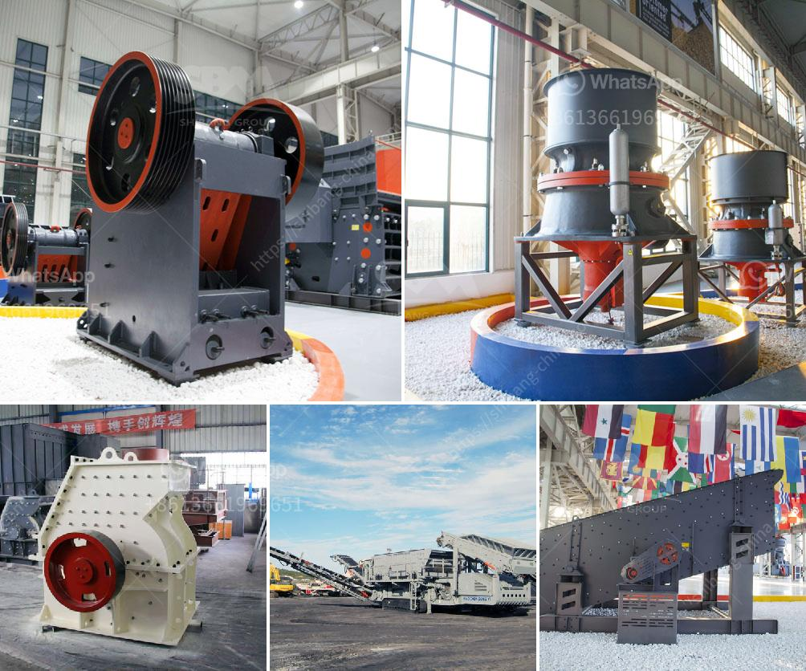

<h3>granite stone quarrying equipment</h3>
Granite stone has been widely used in construction projects for centuries due to its durability, strength, and aesthetic appeal. One of the most important aspects to consider when investing in granite stone quarrying equipment is the capital expenditure required to set up the quarrying operations. However, with advancements in technology and the availability of efficient equipment, granite stone quarrying has become a cost-effective solution for quarry operators.

The first step in quarrying granite stone is to locate a suitable and profitable granite deposit. Once identified, the quarry site needs to be thoroughly examined for its geological composition and the quality of granite present. The extraction of granite from the quarry site is a highly specialized process that requires the use of advanced equipment to extract, cut, and transport the stone.

In recent years, significant advancements have been made in the equipment used for granite stone quarrying operations. These advancements have not only improved the efficiency of the process but also reduced the operational costs associated with quarrying. One such equipment that has gained popularity among quarry operators is diamond wire saws.

Diamond wire saws are used in granite stone quarrying operations to cut through the massive blocks of stone. The wire saws consist of diamond-embedded beads attached to a high-strength cable, which is then guided through the stone. The diamond beads' cutting action allows for precise and efficient cutting through the granite, resulting in clean and smooth blocks of stone. This equipment offers several advantages over traditional hydraulic or pneumatic drills that were previously used for quarrying.

One of the main advantages of diamond wire saws is that they provide greater flexibility in terms of cutting angles and shapes. The wire saws can be easily maneuvered, allowing quarry operators to extract granite blocks of different shapes and sizes efficiently. The ability to cut blocks of specific dimensions is crucial, especially for projects where customized granite elements are required.

Another significant advantage of diamond wire saws is their water consumption. Unlike traditional drilling methods that require a constant water supply to cool down the drill bit and remove debris, wire saws use minimal water. This not only reduces the environmental impact of quarrying but also eliminates the need for costly water management systems.

Additionally, diamond wire saws have a higher cutting speed compared to traditional methods. This results in increased productivity and reduced quarrying time, ultimately lowering operational costs. Moreover, the wire saws' precision and efficiency minimize wastage, allowing quarry operators to extract more usable stone from each block.

In conclusion, investing in granite stone quarrying equipment is a financially viable option for quarry operators. The advancements in diamond wire saw technology have made the process of granite extraction more efficient, cost-effective, and environmentally friendly. The flexibility, precision, and speed offered by wire saws significantly improve the operations' productivity and profitability. As the demand for granite stone continues to rise, quarry operators must embrace these advancements in technology to ensure a competitive edge in the market.
<h3>Contact us</h3><ul><li><strong>Whatsapp:&nbsp;<a href="https://wa.me/8613661969651">+8613661969651</a></strong></li><li><a href="https://swt.shibang-china.com/?git&amp;zhl&amp;granite stone quarrying equipment"><strong>Online Service(chat now)</strong></a></li></ul><h3>Related</h3><ul><li><a href='clay ball mill machine.md'>clay ball mill machine</a></li><li><a href='iron ore upgrading plant equipment.md'>iron ore upgrading plant equipment</a></li><li><a href='copper ore concentrator suppliers india.md'>copper ore concentrator suppliers india</a></li><li><a href='calcium carbonate grinding mill.md'>calcium carbonate grinding mill</a></li><li><a href='lm vertical grinding mill.md'>lm vertical grinding mill</a></li></ul>