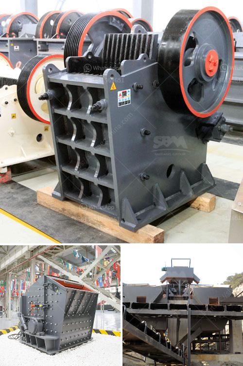

<h3>granulator jaw crusher hadfield</h3>
The Granulator Jaw Crusher Hadfield is a versatile crusher that is ideal for reducing large rocks into smaller granules. Used widely in the mining, quarrying, and construction industries, the Hadfield is renowned for its strength and durability. With its high-quality cast steel components and robust construction, it is capable of crushing even the toughest materials.

The granulator jaw crusher Hadfield works on the principle of a V-shaped chamber with a fixed jaw plate and a moving jaw. The moving jaw swings back and forth, compressing and crushing the larger rocks between itself and the fixed jaw. The crushed material then exits through the bottom of the chamber.

One of the key advantages of the granulator jaw crusher Hadfield is its ability to handle hard and abrasive materials. It is designed to withstand high impact and heavy loads, making it suitable for applications where other crushers may fail. This makes it an ideal choice for mining operations where large rocks need to be broken down into smaller pieces.

Another significant feature of the granulator jaw crusher Hadfield is its adjustable setting. This allows the user to control the size of the output material, making it suitable for a wide range of applications. Whether you need fine granules for road construction or larger rocks for building foundations, the Hadfield can be adjusted to meet your specific requirements.

Furthermore, the granulator jaw crusher Hadfield is easy to maintain and service. With its simple design and minimal moving parts, it requires less maintenance compared to other crushers. It also has easily accessible components, making it quick and straightforward to replace or repair parts when necessary. This reduces downtime, ensuring that your operations can continue without any major interruptions.

In addition to its durable construction and easy maintenance, the granulator jaw crusher Hadfield offers excellent energy efficiency. Its design allows for maximum crushing power while minimizing energy consumption. This not only helps reduce operational costs but also contributes to a more sustainable approach to crushing operations.

Overall, the granulator jaw crusher Hadfield is a reliable and efficient crusher that can handle a variety of materials, making it suitable for various industries. Its robust construction, high-quality components, and adjustable settings make it versatile and adaptable to different applications. Whether you are working in mining, quarrying, or construction, the Hadfield can deliver the performance you need. Its durability, ease of maintenance, and energy efficiency make it a cost-effective and sustainable choice for crushing operations.

With its proven track record and longstanding reputation, the granulator jaw crusher Hadfield is a trusted solution for crushing needs. Whether you are breaking down large rocks in a quarry or processing minerals in a mine, the Hadfield can provide the reliability and performance you require. Invest in this reliable crusher for efficient and effective crushing operations.
<h3>Contact us</h3><ul><li><strong>Whatsapp:&nbsp;<a href="https://wa.me/8613661969651">+8613661969651</a></strong></li><li><a href="https://swt.shibang-china.com/?git&amp;zhl&amp;granulator jaw crusher hadfield"><strong>Online Service(chat now)</strong></a></li></ul><h3>Related</h3><ul><li><a href='crusher price malaysia.md'>crusher price malaysia</a></li><li><a href='jaw crusher company.md'>jaw crusher company</a></li><li><a href='coal crushing and washing plant for sale south africa.md'>coal crushing and washing plant for sale south africa</a></li><li><a href='sayaji jaw crusher x specifiion.md'>sayaji jaw crusher x specifiion</a></li><li><a href='super orion ball mill for mael powder.md'>super orion ball mill for mael powder</a></li></ul>