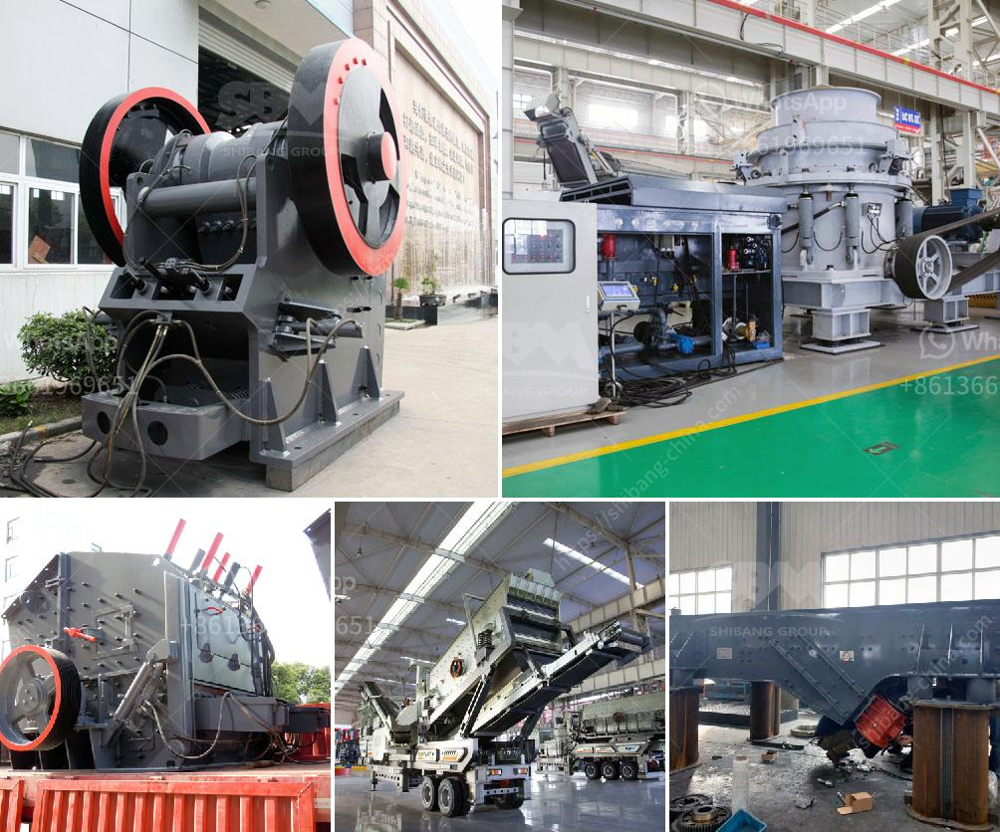

<h3>graphite ore beneficiation</h3>
Graphite is a unique mineral with various exceptional properties. It is well-known for its electrical conductivity, heat resistance, and lubrication properties. However, the market demand for graphite has significantly increased due to its use in lithium-ion batteries and other emerging technologies. As a result, the need for graphite ore beneficiation is becoming more essential.

Graphite ore is typically found in veins or deposits that are highly concentrated and usually originated from metamorphic rocks. The ore is extracted through conventional methods and purified through various techniques to obtain the final high-quality graphite product.

The beneficiation process of graphite ore involves crushing, screening, grinding, flotation, and dewatering. The specific beneficiation steps may vary depending on the ore characteristics and regional regulations. Nonetheless, the overall objective is to remove impurities, increase the carbon content, and optimize the particle size of the graphite.

The first step in graphite ore beneficiation is crushing, where the ore is reduced in size through primary and secondary crushers. This low-cost method helps in reducing the size of the ore and aids in liberation of the graphite flakes. After crushing, the graphite ore is sieved to separate it into different particle sizes for further processing.

The next crucial step in the beneficiation process is grinding. This process involves reducing the particle size through grinding mills, which helps in exposing the graphite flakes and liberating them from the gangue minerals. Grinding also helps in improving the grade and purity of the graphite concentrate.

Following grinding, the ore is subjected to a flotation process, which is important for separating the graphite from the impurities. Flotation utilizes the hydrophobic nature of graphite, allowing it to adhere to air bubbles while repelling the hydrophilic gangue minerals. This separation process enables the collection of a graphite concentrate with high carbon content.

Lastly, the concentrate undergoes a dewatering process to remove excess water content. This is typically achieved through filtration or centrifugation methods, resulting in a dry graphite concentrate ready for further use or refinement.

Graphite ore beneficiation is a crucial and complex process that requires expertise and sophisticated equipment. With the increasing demand for high-quality graphite products, companies specialized in graphite ore beneficiation are experiencing a surge in business opportunities.

One such company that offers an array of services to achieve the best possible graphite concentrates is ABC Company. Their team of experts utilizes advanced techniques and equipment to optimize the beneficiation process. From ore crushing to final dewatering, ABC Company ensures the highest quality graphite concentrate while minimizing environmental impact.

In conclusion, graphite ore beneficiation plays a crucial role in unlocking the full potential of graphite as a valuable resource. By removing impurities, increasing carbon content, and optimizing particle size, the beneficiation process enhances the properties of graphite, making it an invaluable material for various industries.
<h3>Contact us</h3><ul><li><strong>Whatsapp:&nbsp;<a href="https://wa.me/8613661969651">+8613661969651</a></strong></li><li><a href="https://swt.shibang-china.com/?git&amp;zhl&amp;graphite ore beneficiation"><strong>Online Service(chat now)</strong></a></li></ul><h3>Related</h3><ul><li><a href='selling conveyor belts in kenya.md'>selling conveyor belts in kenya</a></li><li><a href='india jaw crusher of small capacity.md'>india jaw crusher of small capacity</a></li><li><a href='small stone crushing machine.md'>small stone crushing machine</a></li><li><a href='formato de la planta de trituracion de mantenimiento.md'>formato de la planta de trituracion de mantenimiento</a></li><li><a href='kenya roller mill.md'>kenya roller mill</a></li></ul>