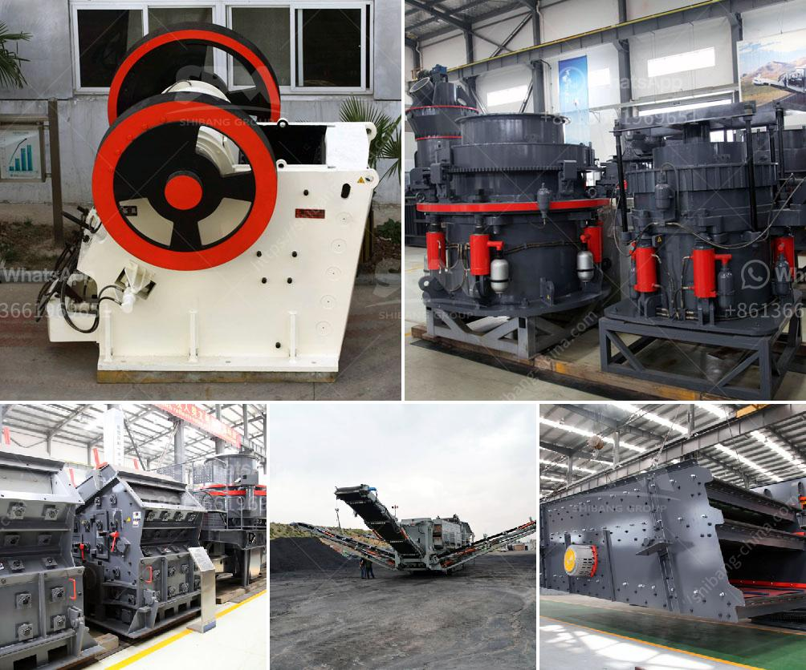

<h3>graphite production machine</h3>
Graphite is a widely used material in various industries, including aerospace, automotive, electronics, and renewable energy. Its exceptional properties, such as high thermal conductivity, low friction, and chemical inertness, make it invaluable for manufacturing various components. To meet the increasing demand for graphite, advanced graphite production machines have been developed, revolutionizing the manufacturing process.

One significant advancement in graphite production technology is the development of high-speed milling machines. These machines are equipped with cutting-edge computer numerical control (CNC) systems, allowing for precise control over the machining process. They utilize advanced cutting tools that can shape graphite blocks into complex components with exceptional accuracy and surface finish.

The primary advantage of using graphite production machines is improved efficiency. These machines can work at high speeds, significantly reducing the production time required to machine graphite components. With their automated processes, they eliminate the need for extensive manual labor, reducing production costs and minimizing human errors. Additionally, they can achieve consistency in the manufactured parts, ensuring every component meets the desired specifications.

Another key feature of graphite production machines is their ability to handle a wide range of graphite materials. Whether it's natural graphite, synthetic graphite, or a mixture of both, these machines can effectively manipulate the material to create intricate structures without any compromise in quality. This versatility empowers manufacturers to explore new possibilities and create highly customized graphite products tailored to their specific requirements.

Furthermore, graphite production machines exhibit enhanced safety features. With advancements in machine design and the integration of safety mechanisms, operators can work in a controlled environment, reducing the risk of accidents and injuries. These safety measures include emergency stops, protective enclosures, and real-time monitoring systems, ensuring a secure working environment for the operators.

In conclusion, the development of graphite production machines has greatly contributed to the graphite manufacturing industry. These machines offer improved efficiency, precision, and versatility in the production process, resulting in high-quality graphite components. As technology continues to advance, we can expect further innovations in graphite production, revolutionizing numerous industries dependent on this exceptional material.
<h3>Contact us</h3><ul><li><strong>Whatsapp:&nbsp;<a href="https://wa.me/8613661969651">+8613661969651</a></strong></li><li><a href="https://swt.shibang-china.com/?git&amp;zhl&amp;graphite production machine"><strong>Online Service(chat now)</strong></a></li></ul><h3>Related</h3><ul><li><a href='feldspar powder plants in andhra pradesh.md'>feldspar powder plants in andhra pradesh</a></li><li><a href='mobile jaw crusher for sale in pakistan.md'>mobile jaw crusher for sale in pakistan</a></li><li><a href='crusher plants in pakistan.md'>crusher plants in pakistan</a></li><li><a href='stone crushers mozambique.md'>stone crushers mozambique</a></li><li><a href='cement mobile laying block making machine.md'>cement mobile laying block making machine</a></li></ul>