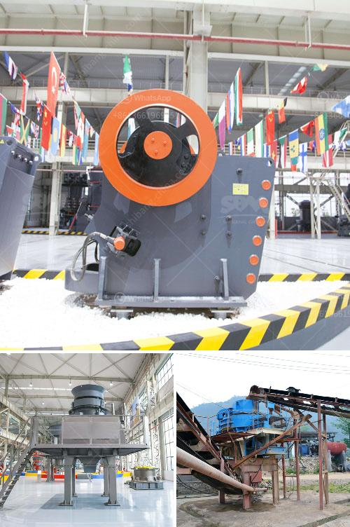

<h3>graphite production machinery</h3>
Graphite, a versatile industrial material known for its exceptional properties, has many applications across diverse industries, ranging from aerospace and automotive to electronics and energy storage. As the demand for high-quality graphite products continues to rise, manufacturers are rapidly adopting advanced machinery to optimize production processes and ensure consistent quality. This article explores the significance of graphite production machinery and its impact on industrial growth.

Graphite production machinery plays a pivotal role in the manufacturing of graphite products, enabling efficient and cost-effective production. These machines are specially designed to handle the unique characteristics of graphite, such as its brittle nature and high melting point. They streamline various production stages, including graphite purification, shaping, and finishing, ensuring optimal efficiency and product quality.

One of the key areas where graphite production machinery excels is in the purification process. Raw graphite ore often contains impurities like sulfur, ash, and silicon, which must be eliminated to achieve high-quality graphite. Sophisticated purification equipment effectively removes these impurities, enhancing the graphite's thermal conductivity and electrical resistivity. By utilizing automated purification machinery, manufacturers can significantly reduce manual labor and increase productivity, resulting in a more cost-effective production process.

Another crucial aspect of graphite production machinery is shaping. Commonly used shaping techniques include extrusion, molding, and isostatic pressing. These techniques require specialized equipment capable of handling the high temperatures and pressures required to shape graphite effectively. Machinery, such as extruders, presses, and molds, precisely shape graphite into desired forms, such as rods, blocks, or sheets. By automating the shaping process, machinery reduces the risk of errors and improves the consistency and accuracy of the final product.

Graphite production machinery also focuses on finishing processes, such as grinding, polishing, and coating. These processes contribute to the overall quality and functionality of graphite products. Grinding machines equipped with diamond-coated wheels are commonly used to achieve precise dimensions and surface finishes. Polishing machinery enhances the smoothness and luster of graphite products, making them suitable for applications that require aesthetic appeal. In addition, advanced coating machinery enables the application of special coatings, such as silicon carbide or resin, to enhance the graphite's performance in specific environments or applications.

The application of graphite production machinery has revolutionized various industries. In the automotive sector, graphite-based composites have been widely adopted for their lightweight and high-strength properties, contributing to fuel efficiency and emission reduction. In the energy storage industry, graphite production machinery has facilitated the mass production of lithium-ion batteries, enabling the rapid growth of electric vehicle and renewable energy markets. The aerospace industry benefits from the versatility of graphite, utilizing it for aircraft components such as structural parts, heat shields, and electrical systems.

In conclusion, graphite production machinery has greatly impacted industrial processes and shaped the growth of numerous industries. Through the effective purification, shaping, and finishing of graphite, these machines enable manufacturers to produce high-quality products with enhanced properties. Furthermore, the automation and optimization of production processes improve efficiency, reduce costs, and promote sustainability. As the demand for graphite continues to surge, the development and utilization of advanced machinery will further revolutionize graphite production, opening up new possibilities for industrial innovation and growth.
<h3>Contact us</h3><ul><li><strong>Whatsapp:&nbsp;<a href="https://wa.me/8613661969651">+8613661969651</a></strong></li><li><a href="https://swt.shibang-china.com/?git&amp;zhl&amp;graphite production machinery"><strong>Online Service(chat now)</strong></a></li></ul><h3>Related</h3><ul><li><a href='stone crusher machine price for plant.md'>stone crusher machine price for plant</a></li><li><a href='150 ton per hour gold wash plant.md'>150 ton per hour gold wash plant</a></li><li><a href='quartz grinding ball mill working.md'>quartz grinding ball mill working</a></li><li><a href='selling conveyor belts in kenya.md'>selling conveyor belts in kenya</a></li><li><a href='stone jaw crusher ppt for seminar.md'>stone jaw crusher ppt for seminar</a></li></ul>