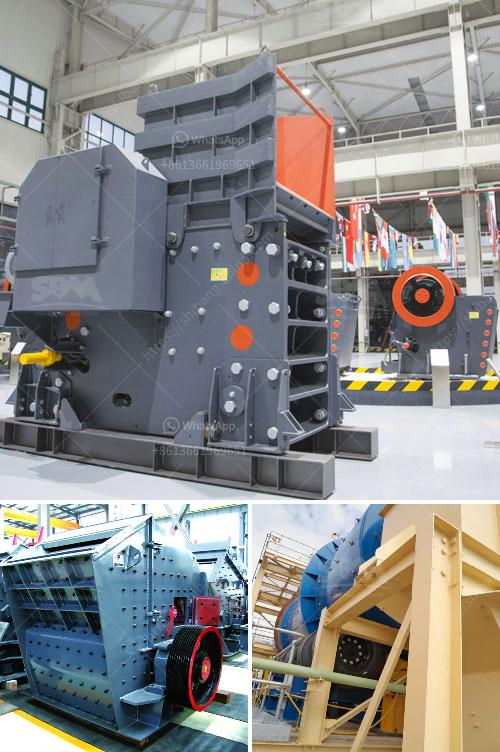

<h3>gravel and sand supply business plan pdf</h3>
Gravel and sand supply business is a lucrative business that needs lots of strategic planning to start and a business coach like Dayo Adetiloye to help you start the Implementation. 

The following includes a concise overview of the business purpose, mission, vision, and core principles of the gravel and sand supply business:

Purpose: Our purpose is to responsibly extract and distribute gravel and sand to various construction sites and businesses across Nigeria, while fostering environmentally friendly practices.

Mission: We aim to become one of the leading suppliers of gravel and sand in the construction industry, providing high-quality products and exceptional customer service.

Vision: Our vision is to contribute to Nigeria's infrastructure development by supplying essential construction materials efficiently and sustainably.

1. Integrity: We commit to conducting our business ethically, prioritizing honesty, and maintaining transparent relationships with customers, suppliers, and employees.

2. Customer Satisfaction: We ensure that our customers are fully satisfied with the quality of our products and the efficiency of our delivery service.

3. Environmental Responsibility: We are committed to minimizing our environmental impact by implementing sustainable extraction and transportation practices.

The gravel and sand supply business plan should cover all the steps you need to get started, such as:

Conducting market research and thoroughly analyzing your potential market is essential. Determine the demand for gravel and sand in your target area and identify potential customers, including construction companies, builders, and contractors.

Register your business with the appropriate government authorities, acquire the necessary permits, and obtain any licenses required to operate legally in your area.

Identify suitable areas for your extraction site and consider factors such as proximity to customers, transportation accessibility, and environmental impacts. Additionally, set up your operational structure, including hiring and training skilled workers.

Invest in equipment and machinery necessary for gravel and sand extraction and processing. Establish relationships with local suppliers of gravel and sand, ensuring a steady supply for your business.

Develop a comprehensive marketing strategy to raise awareness about your gravel and sand supply business. Utilize both online and offline marketing channels, including websites, social media platforms, local advertising, and industry events.

Create a detailed financial plan that includes start-up costs, operating expenses, pricing structures, and projected revenue. Secure appropriate financing options to cover these costs if needed, and regularly monitor and manage your finances.

Implement health and safety protocols to protect your workers and comply with legal requirements. Train your employees on safe handling and transportation practices, as well as on-site and excavation safety.

Starting a gravel and sand supply business can be highly profitable, particularly with the construction industry's continuous demand for these materials. However, careful planning and strategic implementation are crucial for success. By conducting thorough market analysis, adopting environmentally responsible practices, and providing exceptional customer service, your business can thrive in the competitive landscape. Remember, seek the guidance of a business coach or mentor to help you navigate the challenges and complexities of starting and managing your own gravel and sand supply business.
<h3>Contact us</h3><ul><li><strong>Whatsapp:&nbsp;<a href="https://wa.me/8613661969651">+8613661969651</a></strong></li><li><a href="https://swt.shibang-china.com/?git&amp;zhl&amp;gravel and sand supply business plan pdf"><strong>Online Service(chat now)</strong></a></li></ul><h3>Related</h3><ul><li><a href='aggregate washing machine.md'>aggregate washing machine</a></li><li><a href='process of making silica sand.md'>process of making silica sand</a></li><li><a href='calcite crushing machine.md'>calcite crushing machine</a></li><li><a href='kaolin process flow diagram.md'>kaolin process flow diagram</a></li><li><a href='gold shaker wash plant trommel for sale used new.md'>gold shaker wash plant trommel for sale used new</a></li></ul>