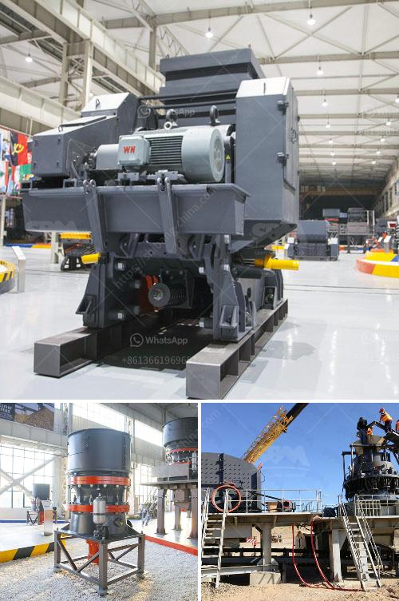

<h3>gravel crushing equipment</h3>
When it comes to crushing gravel, there are various types of equipment to choose from. There are crushers that are used in primary crushing, secondary crushing, and tertiary crushing. And there are also screens, conveyors, and washing equipment that help to process and separate the crushed materials. With so many options available, it can be overwhelming to determine the best equipment for your specific needs. In this article, we will discuss the different types of gravel crushing equipment and factors to consider when making a choice.

One of the most popular types of equipment for gravel crushing is a jaw crusher. This machine uses compressive force to crush the material between two jaws. One jaw is stationary, while the other moves back and forth. Jaw crushers are ideal for various types of gravel, as they can handle both soft and hard materials. They are also known for their high production capacity and low maintenance requirements.

Another commonly used crushing equipment for gravel is an impact crusher. This machine uses the principle of impact to crush the material. It uses a rotor with hammers that strike the material and break it into smaller pieces. Impact crushers are particularly effective for producing high-quality aggregates with good shape. They are also versatile and can be used in both primary and secondary crushing applications.

Cone crushers are also commonly used for gravel crushing. These machines have a conical-shaped bowl lined with manganese steel, and a mantle that rotates eccentrically to crush the material against the concave walls. Cone crushers are known for their ability to produce finely crushed materials and are often used as a secondary or tertiary crusher. They are also suitable for crushing abrasive materials.

In addition to crushers, screens are essential equipment for gravel crushing operations. Screens help to separate the crushed materials into different sizes. This is important because it allows for the production of aggregates with consistent sizes. Vibrating screens are commonly used in gravel crushing operations, as they can efficiently separate the materials while minimizing blockages.

When selecting gravel crushing equipment, there are several factors to consider. Firstly, the type of material you are crushing plays a crucial role. Some materials are more abrasive than others, requiring equipment with greater durability and wear resistance. Additionally, the desired output size and shape of the crushed materials will influence the choice of equipment. Different types of crushers and screens have different capabilities in producing specific sizes and shapes.

Another important factor is the production capacity required for your operation. The size and type of equipment will affect the throughput of materials. It is essential to choose equipment that can handle the expected volume of gravel in your operation.

Lastly, it is crucial to consider the maintenance and operating costs associated with the equipment. Some types of crushers require more frequent maintenance and have higher operational costs. It is important to evaluate these factors to ensure the long-term profitability and efficiency of your crushing operation.

In conclusion, selecting the right gravel crushing equipment is essential for maximizing productivity, efficiency, and profitability. Jaw crushers, impact crushers, and cone crushers are commonly used for gravel crushing, each with its own advantages and considerations. Screens and conveyors also play an important role in separating and processing the crushed materials. By carefully evaluating factors such as material type, desired output size, production capacity, and maintenance costs, you can make an informed decision in choosing the best equipment for your gravel crushing operation.
<h3>Contact us</h3><ul><li><strong>Whatsapp:&nbsp;<a href="https://wa.me/8613661969651">+8613661969651</a></strong></li><li><a href="https://swt.shibang-china.com/?git&amp;zhl&amp;gravel crushing equipment"><strong>Online Service(chat now)</strong></a></li></ul><h3>Related</h3><ul><li><a href='discharge chute for ball mill.md'>discharge chute for ball mill</a></li><li><a href='crusher for stone stone.md'>crusher for stone stone</a></li><li><a href='machine for production of stone gravel crusher.md'>machine for production of stone gravel crusher</a></li><li><a href='vibrating screen for silica sand.md'>vibrating screen for silica sand</a></li><li><a href='copper crusher price.md'>copper crusher price</a></li></ul>